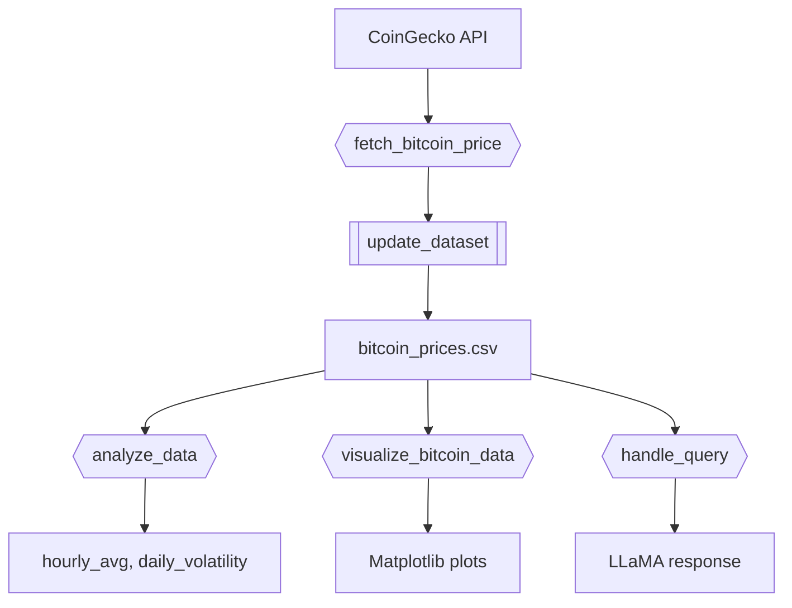
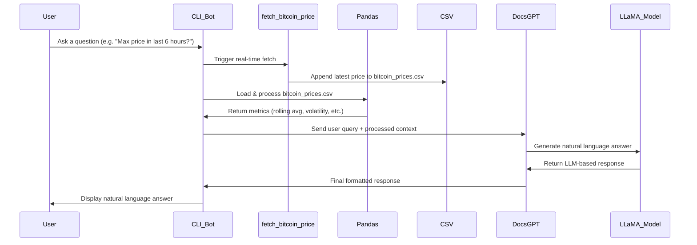

* [Real-Time Bitcoin Data Q\&A Bot with DocsGPT](#real-time-bitcoin-data-qa-bot-with-docsgpt)
  * [What is DocsGPT?](#what-is-docsgpt)
    * [Key Features](#key-features)
  * [Project Overview](#project-overview)
    * [Technologies Used](#technologies-used)
  * [Project Files](#project-files)
  * [Setup & Dependencies](#setup--dependencies)
  * [Environment Setup](#environment-setup)
  * [Building & Running with Docker](#building--running-with-docker)
    - [1. Go to project root](#1-go-to-project-root)
    - [2. Build Thin Client Environment](#2-build-thin-client-environment)
    - [3. Navigate to Project](#3-navigate-to-project)
    - [4. Activate Virtual Environment](#4-activate-virtual-environment)
    - [5. Build Docker Image](#5-build-docker-image)
    - [6. Launch Jupyter Notebook](#6-launch-jupyter-notebook)
  * [Project Architecture](#project-architecture)
  * [Functionality Demonstrated](#functionality-demonstrated)
  * [Real-Time Bitcoin Price Over Time](#real-time-bitcoin-price-over-time)
  * [Workflow Sequence](#workflow-sequence)
  * [Example Queries](#example-queries)
  * [Useful Links](#useful-links)
  * [Is It Free?](#is-it-free)
  * [Future Extensions](#future-extensions)


# Real-Time Bitcoin Data Q&A Bot with DocsGPT

**Author**: Priyanshee Parmar  
**Date**: March 14, 2025  
**Difficulty**: Medium

---

## What is DocsGPT?

[DocsGPT](https://github.com/arc53/DocsGPT) is an open-source AI tool for querying your documents using natural language. Built on top of local LLMs like LLaMA, DocsGPT enables Retrieval-Augmented Generation (RAG) over formats like PDFs, CSVs, and Markdown.

### Key Features

- Ingest and index structured/unstructured files
- Query documents in natural language
- Run locally (no cloud dependency)
- Format support: PDF, DOCX, TXT, CSV, Markdown, HTML

---

## Project Overview

This project implements a **real-time Bitcoin Q&A CLI bot** that combines financial time-series data with natural language querying using **DocsGPT** and a local **LLaMA-2 model**. The goal is to simplify access to complex price analytics by allowing users to ask natural questions like:

- *"What was the highest price in the last 6 hours?"*  
- *"When did Bitcoin drop by more than 2% today?"*

Instead of manually scanning data or writing code, users get immediate, conversational answers from a local language model trained to understand the structure of Bitcoin price data.

---

### Technologies Used
| Technology / Component | Role in Project / Implementation Details                                                 |
| ---------------------- | ---------------------------------------------------------------------------------------- |
| **DocsGPT**            | Core Retrieval-Augmented Generation (RAG) system for Q\&A                                |
| **CoinGecko API**      | Real-time price data ingestion                                                           |
| **LLaMA-2 7B**         | Local LLM for response generation (in `gguf` format)                                     |
| **Pandas / Numpy**     | Time-series analysis & feature engineering                                               |
| **Docker**             | Containerized environment for reproducibility                                            |
| **API Client**         | `requests` library used to call CoinGecko API                                            |
| **Data Handling**      | `pandas`, `datetime`, `numpy` for CSV processing and metric calculations                 |
| **LLM Engine**         | `llama-cpp-python` for running LLaMA model locally                                       |
| **Visualization**      | `matplotlib`, `seaborn` for rendering time series and volatility plots                   |
| **NLP Agent**          | DocsGPT (self-hosted RAG system) for interfacing questions with structured CSV knowledge |


###  Why Each Technology Is Used 


- **CoinGecko API**  
  CoinGecko provides live Bitcoin price data via its REST API. This bot fetches new prices every 5 minutes using simple HTTP requests and appends them to a local CSV. This ensures that the dataset is always up to date and supports real-time querying.

- **Pandas / Numpy**  
  These libraries form the backbone of data processing in the bot. They are used to parse timestamps, compute rolling averages, log returns, and daily volatility—all of which help enrich the raw data with features the bot can talk about meaningfully.

- **Docker**  
  Docker wraps everything—Python, LLaMA, DocsGPT, and scripts—into a self-contained environment. This ensures consistency across systems and removes dependency conflicts. New users or graders can run the project with zero setup effort.

- **API Client (`requests`)**  
  A lightweight Python HTTP client used to fetch data from the CoinGecko API. It is responsible for hitting the endpoint every 5 minutes and storing the price data for further analysis.

- **LLM Engine (`llama-cpp-python`)**  
  This library enables the LLaMA model to run on local hardware efficiently. It supports `gguf` format models and is optimized for low-latency inference, making it ideal for CLI-based interaction with large language models.

- **NLP Agent (DocsGPT)**  
  DocsGPT acts as the query translator. It maps human questions to relevant data slices and constructs prompts that the LLaMA model can understand. This NLP bridge allows structured data to be explored conversationally.


---

## Project Files

| File | Description |
|------|-------------|
| `BitcoinLLMQA.API.ipynb` | Native DocsGPT API usage (document ingestion, prompt querying, manual prompting) |
| `BitcoinLLMQA.API.md` | Markdown tutorial explaining what/why/how for each API step |
| `BitcoinLLMQA.example.ipynb` | Example notebook implementing full Bitcoin Q&A bot pipeline |
| `BitcoinLLMQA.example.md` | Markdown explanation of the project pipeline, architecture, and queries |
| `BitcoinLLMQA_utils.py` | Modular utility script for fetching, updating, analyzing, and visualizing data |
| `bitcoin_prices.csv` | CSV file which stores the real-time data fetched every 5 min from CoinGeko API |

---

## Setup & Dependencies

```bash
git clone <your-repo-url>
cd Real-Time_Bitcoin_Data_QA_Bot_with_DocsGPT
```

Create a virtual environment:

```bash
python -m venv .venv
source .venv/bin/activate
pip install -r requirements.txt
```

OR use [Poetry](https://python-poetry.org/):

```bash
poetry install
```

---


## Environment Setup

```python
import os
os.environ["LLAMA_CPP_LOG_LEVEL"] = "off"
os.environ["OPENAI_API_KEY"] = "<your_openai_key>"  # If using OpenAI fallback
```
---

## Building & Running with Docker
This project provides a fully containerized environment using Docker, making it easy to build and run without worrying about local dependencies or system compatibility.

### Why Docker?
- Ensures environment consistency across machines

- Pre-configures dependencies like Python, LLaMA models, and DocsGPT

- Allows you to launch the full CLI bot or Jupyter notebook interface with minimal setup

> This project uses a **thin client Docker setup**, modeled after the simplified environment used in **DATA605 tutorials**. Scripts like `i docker_jupyter`, `i docker_build_local_image`, and `i docker_bash` encapsulate all steps into easy one-liners.

**Quick Glossary of Commands**  
- `i docker_build_local_image` – Builds the Docker image for the project  
- `i docker_jupyter` – Launches Jupyter Notebook inside the container  
- `i docker_bash` – Opens a terminal session inside the Docker container (optional)


### 1. Go to project root

```bash
cd $GIT_ROOT
```

### 2. Build Thin Client Environment

```bash
./helpers_root/dev_scripts_helpers/thin_client/build.py
```

### 3. Navigate to Project

```bash
cd tutorial_docsgpt
```

### 4. Activate Virtual Environment

```bash
source dev_scripts_tutorial_docsgpt/thin_client/setenv.sh
```

### 5. Build Docker Image

```bash
i docker_build_local_image --version 1.0.0
```

### 6. Launch Jupyter Notebook

```bash
i docker_jupyter --skip-pull --stage local --version 1.0.0 -d
```


---


## Project Architecture




---


## Functionality Demonstrated

#### Real-Time Data Ingestion
- Uses the [CoinGecko API](https://www.coingecko.com/en/api) to fetch Bitcoin price data every 5 minutes.
- Appends new entries to a local CSV file (`bitcoin_prices.csv`) with timestamps and prices.

#### Time-Series Analysis
- Leverages `pandas` and `numpy` to compute core financial metrics:
  - Hourly rolling averages  
  - Daily volatility  
  - Log returns  
  - Price change percentages
- These metrics serve as structured context for LLM-driven answers.

#### DocsGPT Integration
- [DocsGPT](https://github.com/arc53/DocsGPT) ingests the CSV file and indexes it as a document source.
- It retrieves relevant context from the data and constructs a query prompt for the LLaMA model.

#### Local LLM (LLaMA-2 7B)
- Runs the LLaMA-2 7B model locally via `llama-cpp-python` in `gguf` format.
- Ensures privacy, reproducibility, and full offline capability without relying on OpenAI or external APIs.

#### CLI Interface
- Users interact via a terminal-based chatbot.
- Supports multi-turn memory (e.g., follow-ups like “And what was it the day before?”).
- Responds in plain English with precise values, trends, and timestamps from the CSV.

---


## Real-Time Bitcoin Price Over Time


This chart visualizes the real-time price of Bitcoin collected at 5-minute intervals over a 24-hour period.

- The sinusoidal pattern reflects typical simulated trading fluctuations and noise.
- Gaussian noise adds realistic volatility to mimic actual market behavior.
- The data is fetched using `fetch_bitcoin_price()` and stored in `bitcoin_prices.csv`.

**Why It Matters**:  
This time-series trend helps identify key events like price spikes or dips. These trends are then used as context by DocsGPT when answering user queries.

---


## Workflow Sequence


---


## Example Queries


> You: What was the maximum price in the last 6 hours?

Bot: The highest Bitcoin price in the last 6 hours was **$31,994.18**, recorded at **2025-05-09 21:22 UTC**.


> You: What are today's volatility spikes?

Bot: I found **2 major volatility spikes** today:
- Spike 1: **0.393** at **21:22 UTC**
- Spike 2: **0.381** at **18:37 UTC**


> You: Show me the average price in the past 3 hours.

Bot: The 3-hour average price of Bitcoin is **$30,871.65**.


> You: What’s the latest log return?

Bot: The most recent log return is **-0.0023**, indicating a slight price drop compared to the previous interval.

CLI:


---

## Useful Links

- [DocsGPT GitHub](https://github.com/arc53/DocsGPT)
- [CoinGecko API](https://www.coingecko.com/en/api)
- [Pandas Time Series Guide](https://pandas.pydata.org/docs/user_guide/timeseries.html)

---

## Is It Free?

Yes!  
- **DocsGPT** is completely open-source.  
- **CoinGecko API** offers a generous free tier (up to 50 calls/min).

---

## Future Extensions

- Telegram or Slack bot integration
- Multi-asset support (ETH, DOGE, etc.)
- Dashboard or Streamlit web interface
- Scheduled PDF reporting using LLM summaries

---

> This project demonstrates a lightweight but powerful pipeline combining real-time data, statistical analysis, and LLM-based question-answering over structured datasets.
