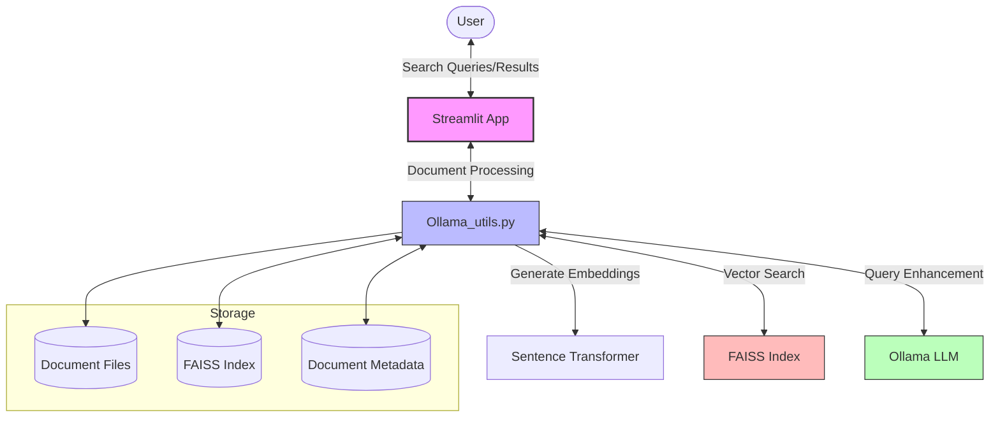
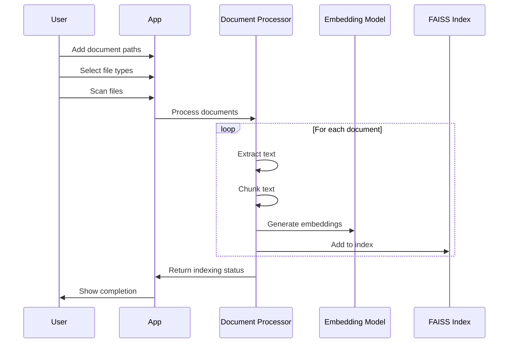
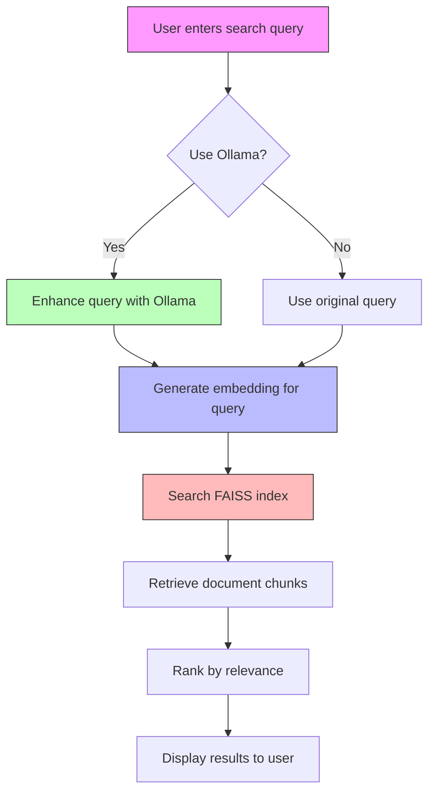
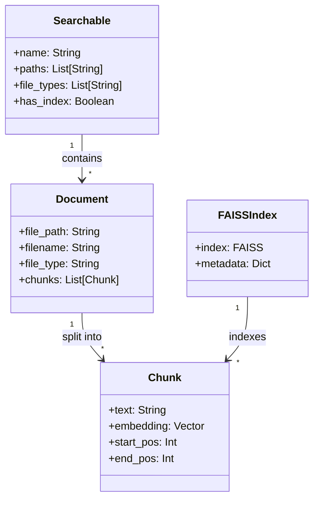

# Local AI-Powered Document Search Engine with Ollama

An intelligent document search engine that uses Ollama and FAISS to power semantic search across your local documents. This application allows you to organize documents into searchable collections, process them using AI embeddings, and search them using natural language queries.

## Features

- **AI-Powered Semantic Search**: Find relevant content based on meaning, not just keywords
- **Multiple Searchable Collections**: Organize documents into different searchable groups
- **Support for Various File Types**: Process PDFs, Word documents (.docx), text files, Markdown, code files, and more
- **Document Preview**: View document content directly within the application
- **Real-time Query Refinement**: Ollama enhances your search queries for better results
- **User-Friendly Interface**: Clean, intuitive Streamlit interface
- **Docker Support**: Easy deployment using Docker

## Architecture Diagrams

### System Architecture



### Document Indexing Process



### Search Process Flow



### Data Structure Schema



## Installation

### Option 1: Local Installation

1. **Prerequisites**:
   - Python 3.10+ 
   - [Ollama](https://ollama.ai/) installed locally

2. **Clone the repository**:
   ```bash
   git clone https://github.com/causify-ai/tutorials.git
   cd tutorials/DATA605/Spring2025/projects/TutorTask125_Spring2025_Local_AI-Powered_Document_Search_Engine_with_Ollama
   ```

3. **Install dependencies**:
   ```bash
   pip install faiss-cpu sentence-transformers streamlit PyMuPDF python-docx requests ollama langchain langchain-community
   ```

4. **Run the application**:
   ```bash
   streamlit run app.py
   ```

### Option 2: Docker Installation

1. **Prerequisites**:
   - Docker installed and running

2. **Build the Docker image**:
   ```bash
   # For Linux/macOS
   ./docker_data605_style/docker_build.sh
   
   # For Windows PowerShell
   docker build -t ollama-notebook -f ./docker_data605_style/Dockerfile .
   ```

3. **Run the Docker container**:
   ```bash
   # For Linux/macOS
   ./docker_data605_style/docker_run.sh
   
   # For Windows PowerShell
   docker run -p 8888:8888 -p 8501:8501 -p 11434:11434 `
     -v ${PWD}:/app `
     -v C:/Users:/data/users `
     -v C:/Documents:/data/documents `
     --name ollama-notebook ollama-notebook
   
   # For Windows Command Prompt
   docker run -p 8888:8888 -p 8501:8501 -p 11434:11434 -v %cd%:/app -v C:/Users:/data/users -v C:/Documents:/data/documents --name ollama-notebook ollama-notebook
   ```

4. **Access the applications**:
   - Open your browser and go to http://localhost:8501 for the Streamlit app
   - Access Jupyter Notebook at http://localhost:8888 to run the example notebooks
   - When using the search engine, use Docker paths:
     - `/app` - Project files
     - `/data/users` - Files in C:/Users
     - `/data/documents` - Files in C:/Documents

## Usage Guide

### Creating and Managing Searchables

The application introduces the concept of "Searchables" - collections of documents organized by topic or project that can be searched independently.

1. **Create a New Searchable**:
   - Click on "➕ Create New Searchable" in the sidebar
   - Enter a name for your searchable collection
   - Click "Create"

2. **Add Documents to a Searchable**:
   - Select the searchable from the dropdown
   - Enter a folder or file path in the "Add folder or file path" field
   - Click "Add Path"
   - You can add multiple paths to a single searchable

3. **Select File Types**:
   - Choose which file types to include in your search
   - Changes are saved automatically

4. **Scan for Documents**:
   - Click "🔍 Scan Files" to find all matching documents
   - Review the found documents

5. **Process Documents**:
   - Click "✅ Confirm to proceed with document processing" 
   - Click "🚀 Make Documents Searchable"
   - Wait for processing to complete

### Searching Documents

1. **Enter Your Query**:
   - Type your question or keywords in the search box
   - Set the number of results you want to see using the slider
   - Click "🔍 Search"

2. **Review Results**:
   - Click on result headers to expand and view snippets
   - Click "📄 Preview Document" to view the full document
   - Documents are ranked by relevance to your query

3. **View Indexed Documents**:
   - Click "📄 View Indexed Documents" to see what's currently searchable
   - Documents are organized by folder for easy navigation

## Technical Details

### Architecture

- **Frontend**: Streamlit web application
- **Embeddings**: Sentence Transformers for vector embeddings
- **Vector Database**: FAISS for efficient similarity search
- **LLM Integration**: Ollama for query refinement
- **Document Processing**: PyMuPDF and other libraries for text extraction

### Data Management

- **Searchables**: Stored in `searchables.json` (not tracked by git)
- **Indexes**: Each searchable has its own FAISS index stored in `index/{searchable_name}`
- **Document Chunks**: Documents are split into chunks for better semantic search

## Project Structure

```
document-search-engine/
├── app.py                 # Main application code
├── Ollama_utils.py        # Utility functions for Ollama integration
├── .gitignore             # Git ignore file
├── searchables.json       # Searchable collections (not tracked)
├── index/                 # FAISS indexes (not tracked)
│   └── default/           # Default searchable index
│       ├── faiss_index.bin
│       └── metadata.pkl
└── docker_data605_style/  # Docker configuration
    ├── Dockerfile
    ├── docker_build.sh
    ├── docker_run.sh
    └── docker_bash.sh
```

## Future Enhancements

- Support for more file formats (e.g., audio, video)
- Advanced filtering options
- Integration with cloud storage providers
- Collaborative search across teams
- Custom embedding models

## Credits

- [Ollama](https://ollama.ai/) for local LLM integration
- [FAISS](https://github.com/facebookresearch/faiss) for efficient similarity search
- [Sentence Transformers](https://www.sbert.net/) for document embeddings
- [Streamlit](https://streamlit.io/) for the web interface