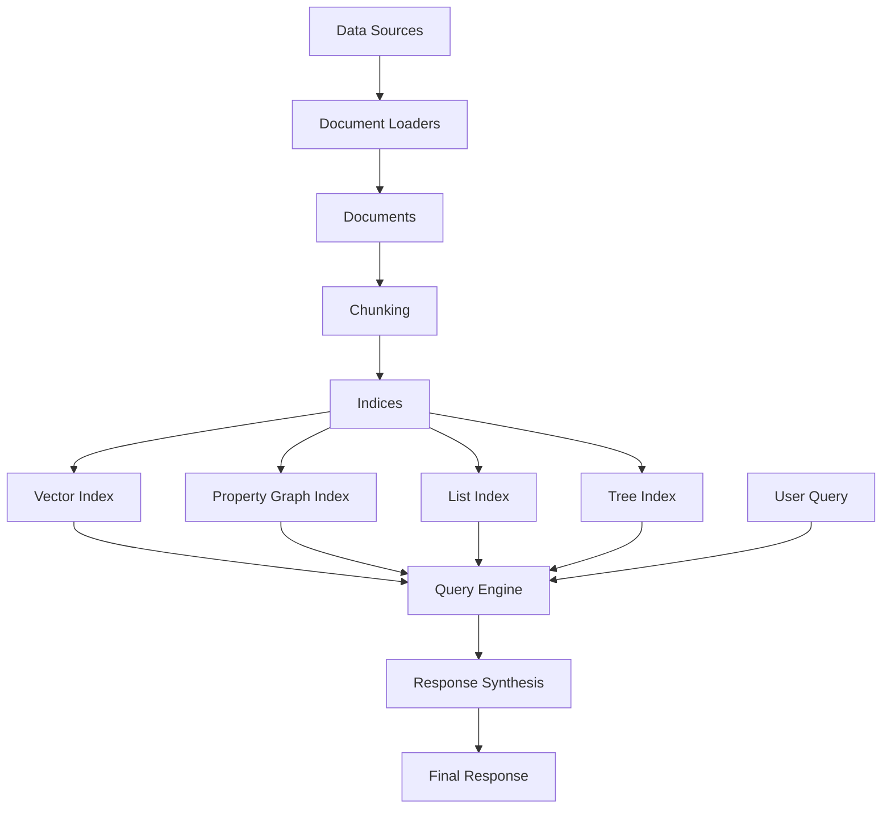
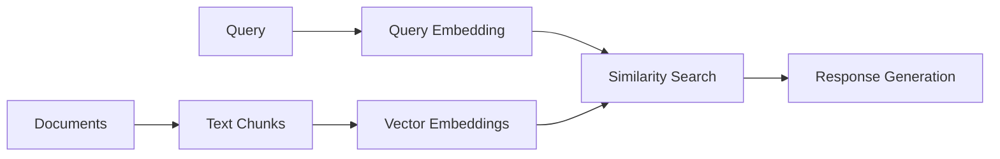
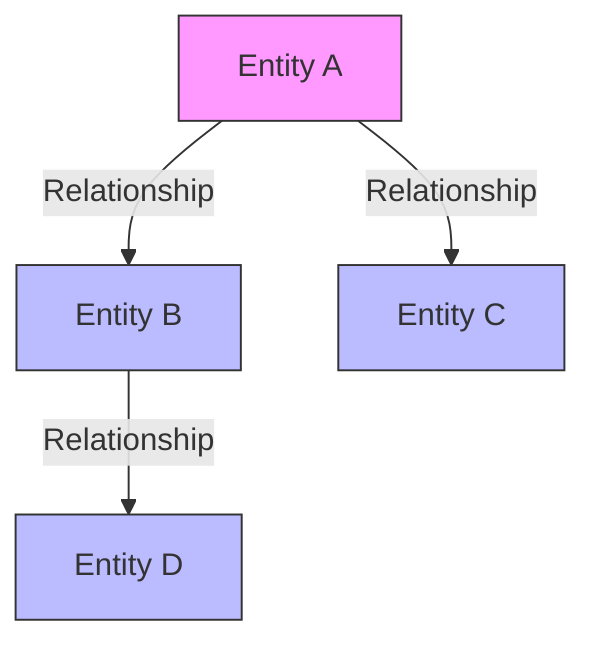
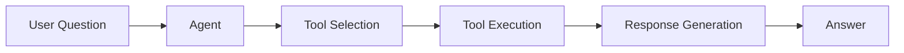

# LlamaIndex API Tutorial

## Introduction

LlamaIndex is a powerful data framework designed to bridge the gap between your custom data sources and large language models (LLMs). In an era where LLMs like GPT-4 contain vast knowledge but lack awareness of your specific data, LlamaIndex provides the essential infrastructure to make these models work effectively with your proprietary information.

### What is LlamaIndex?

At its core, LlamaIndex is a comprehensive framework that solves several critical challenges:

- **Data Ingestion**: Connect to virtually any data source through built-in connectors for files, APIs, databases, and more
- **Data Structuring**: Transform raw data into optimized formats (indices) that LLMs can efficiently process
- **Data Retrieval**: Implement sophisticated retrieval mechanisms to find the most relevant information
- **Data Synthesis**: Enable LLMs to generate accurate, contextually-aware responses based on your data

### Why Use LlamaIndex?

Traditional approaches to making LLMs work with custom data often involve complex prompt engineering or brittle data pipelines. LlamaIndex provides a structured, flexible framework that addresses these challenges with:

- **Retrieval-Augmented Generation (RAG)**: Enhance LLM responses with relevant retrieved context
- **Knowledge Graphs**: Create structured representations of your data's relationships
- **Agent Frameworks**: Enable autonomous and semi-autonomous workflows over your data
- **Fine-tuning and Evaluation**: Continuously improve system performance

## Environment Setup

Before we begin working with LlamaIndex, we need to configure our environment properly.

### API Key Configuration

You'll need an OpenAI API key from [OpenAI's platform](https://platform.openai.com).

### LlamaIndex Settings

LlamaIndex uses a global `Settings` object to configure default behaviors:

- **LLM Provider**: Set which model will answer queries (we'll use `gpt-3.5-turbo`)
- **Temperature**: Controls response randomness (0.1 for more deterministic outputs)
- **Embedding Model**: For vector embeddings (defaults to OpenAI's embedding model)

These settings can be overridden for individual components when needed, but establishing defaults simplifies our code.

## Document Loading

The first step in any LlamaIndex workflow is loading your data. LlamaIndex provides a variety of document loaders (called "readers") to ingest data from different sources.

### Document Readers

LlamaIndex includes readers for many common data sources:

- **SimpleDirectoryReader**: Load files from a local directory
- **PDFReader**: Extract text and metadata from PDF files
- **WebPageReader**: Scrape and process web content
- **CSVReader**: Process structured tabular data
- **And many more**: Including connectors for Notion, Discord, Slack, etc.

### Document Structure

When documents are loaded, they're converted into `Document` objects with:

- **Text Content**: The actual textual data
- **Metadata**: Additional information about the document (source, date, author, etc.)
- **Document ID**: A unique identifier
- **Relationships**: Optional connections to other documents

### Chunking Strategy

Behind the scenes, LlamaIndex will typically split your documents into manageable chunks to:

1. Stay within model context limits
2. Improve retrieval precision
3. Better manage token usage

## Vector Index

Indices are the heart of LlamaIndex - they structure your data for efficient retrieval and interaction with LLMs.

### What is a Vector Index?

A vector index is a powerful data structure that:

1. **Converts text to embeddings**: Transforms documents into numerical vector representations that capture semantic meaning
2. **Enables semantic search**: Finds documents based on meaning rather than just keyword matching
3. **Supports similarity metrics**: Typically uses cosine similarity to measure relevance

### How Vector Indices Work

When you create a vector index in LlamaIndex:

1. Each document chunk is sent to an embedding model (like OpenAI's text-embedding-ada-002)
2. The embedding model returns a high-dimensional vector representing the document's semantic content
3. These vectors are stored in a vector database (which can be in-memory or persistent)
4. When you query the index, your query is also converted to a vector embedding
5. The system finds document chunks with embeddings most similar to your query
6. These relevant chunks are sent to the LLM along with your query to generate a response

### Vector Stores

LlamaIndex supports many vector stores, including:

- SimpleVectorStore (in-memory, default)
- Chroma, Pinecone, Weaviate, Milvus, and many others

## Saving and Loading Indices

Processing large document collections can be time-consuming and computationally expensive. LlamaIndex allows you to persist indices to disk and load them later, saving significant processing time for production applications.

### Storage Context

The `StorageContext` class manages the persistence of index data:

- **Vector store**: Saves the document embeddings and their relationships
- **Document store**: Preserves the original document chunks
- **Index store**: Maintains the index metadata and configuration

### Persistence Formats

LlamaIndex supports multiple persistence options:

1. **Local disk storage**: Save to a local directory (what we'll use here)
2. **Remote storage**: Connect to services like S3, GCS, etc.
3. **Database storage**: Store in MongoDB, PostgreSQL, Neo4j, etc.

### Benefits of Persistence

Persisting indices provides several advantages:

- **Efficiency**: Avoid reprocessing documents on each application startup
- **Cost savings**: Reduce embedding API calls
- **Versioning**: Maintain different versions of your indices
- **Deployment**: Easily move indices between development and production

## Property Graph Index

Beyond vector indices, LlamaIndex supports knowledge graphs through its `PropertyGraphIndex`. These graphs capture not just the content of your documents, but the relationships between entities mentioned in them.

### What is a Property Graph?

A property graph represents information as:

- **Nodes**: Entities or concepts (e.g., "LlamaIndex", "RAG", "Vector Database")
- **Edges**: Relationships between nodes (e.g., "LlamaIndex -> ENABLES -> RAG")
- **Properties**: Attributes attached to nodes and edges

### How Property Graphs Are Built

LlamaIndex creates property graphs through these steps:

1. **Entity Extraction**: Identify key entities in your documents
2. **Relationship Extraction**: Determine how entities relate to each other
3. **Graph Construction**: Organize the entities and relationships into a coherent structure

### Knowledge Graph Extractors

LlamaIndex provides several extractors for building knowledge graphs:

- **SimpleLLMPathExtractor**: Uses an LLM to extract triplets (subject, predicate, object)
- **DynamicLLMPathExtractor**: Allows for more flexible schema definitions
- **SchemaLLMPathExtractor**: Enforces a strict schema for data consistency
- **ImplicitPathExtractor**: Uses existing document metadata relationships

### Benefits of Knowledge Graphs

Property graphs offer unique advantages:

- **Explicit Relationships**: Capture specific connections between concepts
- **Multi-hop Queries**: Answer complex questions requiring traversal of multiple relationships
- **Structured Reasoning**: Enable more precise logical deductions
- **Visualizable**: Can be displayed graphically for intuitive understanding

## LlamaIndex Agents

LlamaIndex provides a powerful agent framework that enables autonomous and semi-autonomous interactions with your data. Agents can use tools, follow reasoning steps, and execute complex workflows.

### What are LlamaIndex Agents?

Agents in LlamaIndex are:

- **Tool-using**: They can invoke functions to retrieve information or perform actions
- **Reasoning-capable**: They can break down complex tasks into steps
- **Context-aware**: They maintain state across multiple interaction turns
- **Goal-oriented**: They work toward completing specific objectives

### Agent Components

A typical LlamaIndex agent consists of:

1. **Tools**: Functions the agent can call to retrieve information or take actions
2. **System Prompt**: Instructions that define the agent's role and capabilities
3. **Memory**: State tracking across interaction turns
4. **Workflow**: The structural flow between different agents or components

### Agent Types

LlamaIndex offers several agent types:

- **FunctionAgent**: Uses a structured function-calling paradigm (what we'll use here)
- **ReActAgent**: Uses a reasoning and acting loop
- **OpenAIAgent**: Leverages OpenAI's built-in function calling
- **CustomAgent**: Build your own agent logic

### Agent Workflows

Agents can be combined into workflows that:

- **Chain agents together**: Hand off tasks between specialized agents
- **Implement complex logic**: Decision trees, conditional execution, loops
- **Maintain shared context**: Pass information between components

## Advanced Query Techniques

LlamaIndex offers sophisticated querying capabilities beyond basic question-answering. These techniques allow for more precise information retrieval and enhanced response quality.

### Retrieval Options

LlamaIndex provides several retrieval strategies:

- **Top-K Retrieval**: Get the K most similar documents (default approach)
- **Metadata Filtering**: Filter documents based on metadata attributes
- **Hybrid Search**: Combine semantic search with keyword matching
- **Re-ranking**: Apply a secondary ranking algorithm to initial results

### Query Engines

Different query engines offer specialized capabilities:

- **VectorQueryEngine**: Basic semantic search with embedding similarity
- **SubQuestionQueryEngine**: Break complex questions into sub-questions
- **RouterQueryEngine**: Route queries to different indices based on content
- **SQLQueryEngine**: Translate natural language to SQL for database querying
- **PandasQueryEngine**: Query DataFrame data with natural language

### Response Synthesis Modes

LlamaIndex supports various ways to synthesize responses:

- **Refine**: Iteratively refine the response with each document
- **Compact**: Compress documents before sending to the LLM
- **Tree Summarize**: Hierarchically summarize documents
- **Simple**: Send all retrieved documents directly to the LLM

### Response Formatting

You can control how responses are presented:

- **Text only**: Plain text responses (default)
- **With sources**: Include source documents and citations
- **Structured output**: Return responses in specific formats (JSON, etc.)

## Conclusion

This tutorial has provided a comprehensive introduction to LlamaIndex's core capabilities. Let's recap what we've learned:

### Key Concepts

1. **Document Loading**: Using readers to ingest data from various sources
2. **Vector Indices**: Creating embeddings-based search for semantic retrieval
3. **Persistence**: Saving and loading indices to avoid reprocessing data
4. **Knowledge Graphs**: Building property graphs to capture relationships
5. **Agents**: Implementing autonomous workflows with reasoning capabilities
6. **Advanced Querying**: Leveraging sophisticated retrieval and response mechanisms

### Next Steps

To continue your LlamaIndex journey, consider exploring:

- **Custom Data Connectors**: Build connectors for your specific data sources
- **Advanced Index Types**: Explore list, tree, and keyword table indices
- **LLM Optimization**: Fine-tune prompt templates and model parameters
- **Evaluation**: Implement systematic testing of your RAG pipelines
- **Multi-Modal Data**: Work with images, audio, and other non-text data
- **Production Deployment**: Scale your applications with cloud infrastructure

### Resources

- **[Official Documentation](https://docs.llamaindex.ai/)**: Comprehensive guides and reference
- **[Tutorials](https://docs.llamaindex.ai/en/latest/examples/index.html)**: Step-by-step guides for specific use cases
