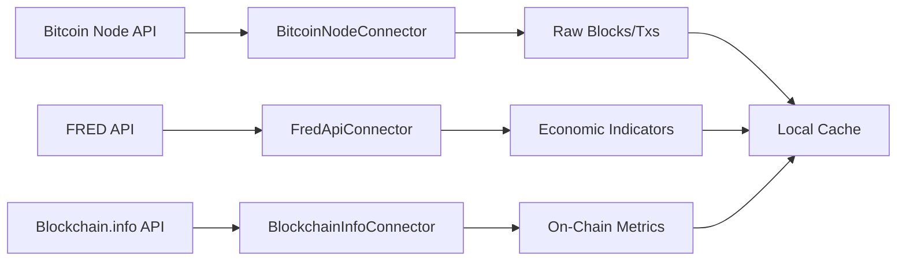
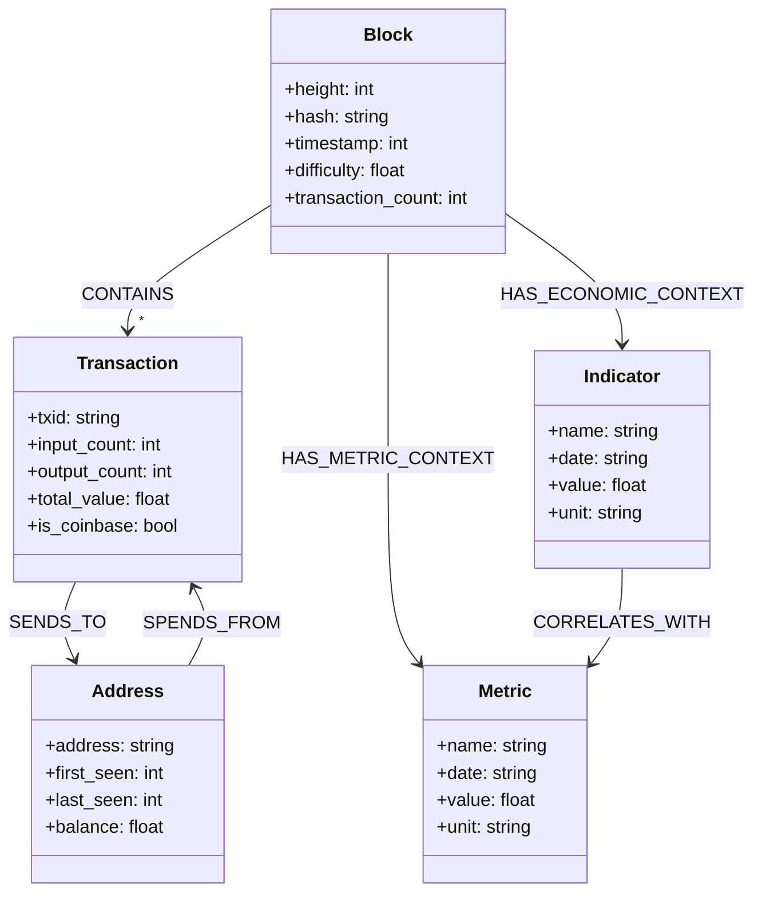
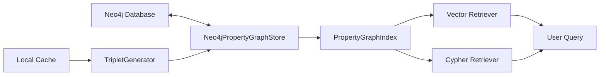
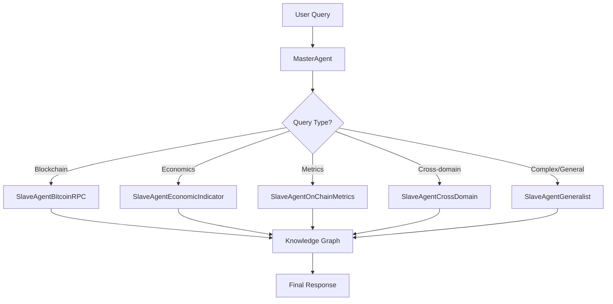
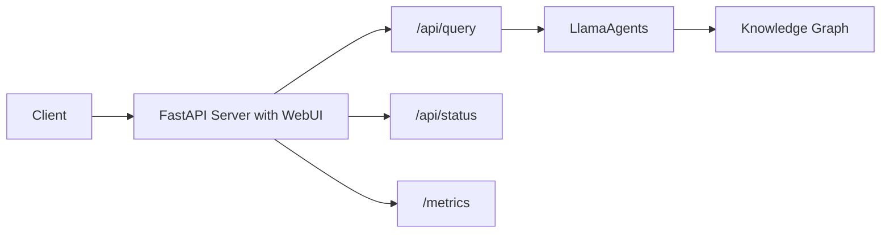
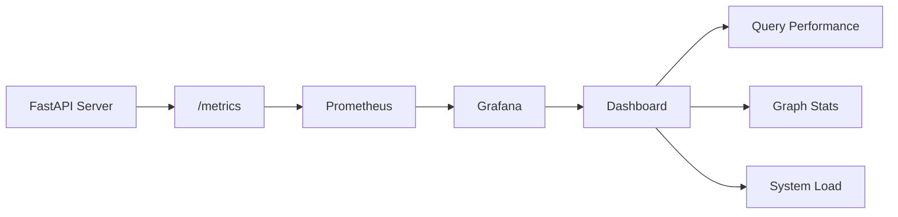
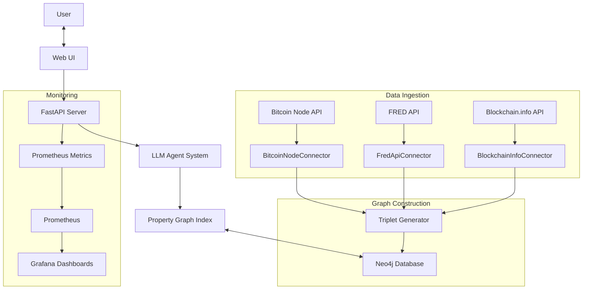

<!-- toc -->

# Enterprise-Scale Bitcoin Data Knowledge Graph with LlamaIndex

<!-- toc -->

- [Introduction](#introduction)
- [Data Connectors](#data-connectors)
  * [Bitcoin Node Connector](#bitcoin-node-connector)
  * [Economic Data Connector](#economic-data-connector)
  * [On-Chain Metrics Connector](#on-chain-metrics-connector)
  * [Data Flow Architecture](#data-flow-architecture)
- [Knowledge Graph Construction](#knowledge-graph-construction)
  * [Triplets: The Building Blocks](#triplets-the-building-blocks)
  * [Entity and Relationship Design](#entity-and-relationship-design)
  * [Neo4j Graph Database](#neo4j-graph-database)
  * [Knowledge Graph Index](#knowledge-graph-index)
- [LLM Agent System](#llm-agent-system)
  * [Master-Slave Architecture](#master-slave-architecture)
  * [Agent Specialization](#agent-specialization)
- [API and Web Interface](#api-and-web-interface)
  * [FastAPI Implementation](#fastapi-implementation)
  * [Asynchronous Processing](#asynchronous-processing)
  * [Background Tasks](#background-tasks)
- [Monitoring and Observability](#monitoring-and-observability)
  * [Prometheus Metrics](#prometheus-metrics)
  * [Grafana Dashboards](#grafana-dashboards)
  * [System Health Indicators](#system-health-indicators)
- [Complete System Architecture](#complete-system-architecture)
- [Getting Started](#getting-started)
  * [Prerequisites](#prerequisites)
  * [Installation](#installation)
  * [Usage Examples](#usage-examples)

<!-- tocstop -->

## Introduction

This project demonstrates how to build an enterprise-scale Bitcoin data knowledge graph using LlamaIndex. The system ingests diverse data sources (blockchain data, economic indicators, and on-chain metrics), constructs a rich knowledge graph, and enables natural language querying through specialized LLM-powered agents. The implementation showcases how to handle petabyte-scale data, build effective semantic search capabilities, and deploy a monitored production system.

Key features include:
- Multi-source data ingestion from Bitcoin node, economic APIs, and on-chain metrics
- Knowledge graph construction with optimized entity-relationship modeling
- Specialized agent system for intelligent, domain-specific querying
- FastAPI service with background processing and real-time updates
- Monitoring with Prometheus and Grafana

## Data Connectors

Our system integrates three primary data sources, each requiring a specialized connector to handle its unique data structure and access patterns.

### Bitcoin Node Connector

The Bitcoin Node Connector (`bitcoinrpc.py`) provides access to raw blockchain data. We use a public Bitcoin node API to fetch blocks and transactions.

**Design Decisions:**
- **Public Node Access**: Rather than running a full node (~500GB), we leverage a public API with token-based authentication, making the project more accessible.
- **Selective Data Extraction**: Instead of ingesting the entire blockchain history (which would be petabytes), we extract only essential fields needed for our knowledge graph.
- **Rate Limiting**: Implemented automatic request throttling to respect API limits and ensure reliable data ingestion.

**Key Methods:**
- `get_blockchain_info()`: Retrieves blockchain metadataCypher-Optimized Property Graph for Bitcoin Data
- `get_block_by_height()`: Fetches blocks by height with configurable verbosity
- `get_transactions_for_block()`: Extracts transactions from blocks
- `extract_block_data()` and `extract_transaction_data()`: Clean and standardize raw data for knowledge graph ingestion

### Economic Data Connector

The Economic Data Connector (`fred.py`) fetches macroeconomic indicators from the Federal Reserve Economic Data (FRED) API.

**Design Decisions:**
- **Indicator Selection**: We chose specific economic indicators like Federal Funds Rate, CPI, GDP growth, that historically correlate with Bitcoin performance.
- **Standardized Output Format**: All economic data is transformed into a consistent timeseries format for seamless integration with the knowledge graph.
- **Time Alignment**: Implemented date conversion and alignment to match economic indicators (often daily/monthly) with blockchain data (block intervals).

**Key Methods:**
- `get_metric()`: Generic method to fetch any supported economic indicator
- `fetch_all_metrics()`: Batch retrieval for efficient processing
- `series_to_json()`: Conversion to a consistent format for knowledge graph ingestion

### On-Chain Metrics Connector

The On-Chain Metrics Connector (`blockchaininfo.py`) collects Bitcoin network metrics from Blockchain.info API.

**Design Decisions:**
- **Complementary Metrics**: Selected metrics that aren't directly available in raw blockchain data but provide crucial network insights.
- **Historical Retrieval**: Implemented timespan-based fetching to collect historical metric snapshots.
- **Metric Mapping**: Created a standardized taxonomy of metrics across different source APIs.

**Key Methods:**
- `get_metric()`: Fetches any supported metric with time-based filtering
- `get_transaction_volume_btc()`, `get_active_addresses()`, etc.: Specialized methods for specific metrics
- `metrics_to_dataframe()`: Conversion to tabular format for analysis and visualization

### Data Flow Architecture

The data ingestion pipeline follows a modular flow designed for scalability and resilience:



## Knowledge Graph Construction

The knowledge graph forms the foundation of our system, enabling complex queries across heterogeneous data sources.

### Triplets

Our knowledge graph is built from "triplets" - a fundamental structure of subject-predicate-object relationships (e.g., "Block 700000 CONTAINS Transaction abc123").

**Design Decisions:**
- **Code-based Triplet Generation**: Since we have structured data, we can avoid prompting LLM for triplet generation and instead use the `TripletGenerator` class to create a cohesive, interlinked knowledge graph. This saves us a lot of API calls.
- **Rich Property Set**: Each node and relationship contains comprehensive properties beyond just identifiers, enabling complex filtering and pattern matching.
- **Semantic Embedding**: We generate natural language descriptions of entities and relationships, embed them with a sentence transformer, and store these vectors to enable semantic search.

### Entity and Relationship Design

The entity-relationship model is optimized for both storage efficiency and query performance:



**Design Decisions:**
- **Hierarchical Labeling**: Entities have both primary labels (e.g., "Block") and secondary labels (e.g., "Indicator:FederalFundsRate") for flexible querying.
- **Temporal Properties**: All time-relevant nodes include consistent datetime fields (year, month, day, timestamp) to enable time-based filtering without complex joins.
- **Value Representation**: Values are stored as typed properties rather than embedded in node names, ensuring proper numeric operations and comparison.

**See [triplets.md](utils/triplets.md) for more details**

### Neo4j Graph Database

We chose Neo4j as our graph database for its maturity, performance, and Cypher query language.

**Design Decisions:**
- **Property Graph Model**: Neo4j's property graph model aligns perfectly with our knowledge graph design, allowing both nodes and relationships to have properties.
- **Index Strategy**: We create strategic indexes on high-cardinality properties (block height, transaction hash) to accelerate common queries.
- **Docker Deployment**: The setup script deploys Neo4j in a Docker container with APOC plugins pre-configured, simplifying setup.

### Knowledge Graph Index

LlamaIndex's `PropertyGraphIndex` provides the bridge between our Neo4j graph database and the LLM-powered query system.



**Design Decisions:**
- **Dual Retrieval Strategy**: We implement both text-to-Cypher conversion (for structured queries) and vector-based semantic search (for conceptual questions).
- **Embedding Cache**: Vectors are stored alongside entities to avoid redundant embedding generation during queries.
- **Batched Embedding**: Entity descriptions are embedded in batches to optimize throughput when updating the graph.

## LLM Agent System

Our agent system transforms natural language queries into specialized graph operations through a carefully designed hierarchy.

### Master-Slave Architecture

We implement a Master-Slave architecture where a central agent routes queries to specialized sub-agents.



**Design Decisions:**
- **Query Routing Logic**: The MasterAgent analyzes query intent to determine the most appropriate specialized agent, using explicit domain knowledge of each agent's capabilities.
- **Specialized Tools**: Each slave agent has a registry of specialized function tools it can invoke based on query intent.

### Agent Specialization

Each specialized agent focuses on a specific domain, with custom functions and domain knowledge:

1. **SlaveAgentBitcoinRPC**: Handles blockchain data queries about blocks, transactions, and addresses
2. **SlaveAgentEconomicIndicator**: Processes economic indicator queries like interest rates and inflation
3. **SlaveAgentOnChainMetrics**: Analyzes Bitcoin network metrics like hash rate and transaction volume
4. **SlaveAgentCrossDomain**: Explores relationships between economic conditions and blockchain performance
5. **SlaveAgentGeneralist**: Handles complex queries requiring custom Cypher or vector search

**Design Decisions:**
- **Domain-Specific Prompting**: Each agent has a specialized system prompt with domain terminology and context.
- **Tool Selection Strategy**: Agents have a curated set of tools optimized for their specific domain.
- **Metadata Enrichment**: Query responses include domain context that might not be explicitly requested.

## API and Web Interface

The system is exposed through a FastAPI service with both API endpoints and a web interface.


### FastAPI Implementation

Our FastAPI implementation provides RESTful endpoints for querying and system status:



**Design Decisions:**
- **API-Design**: Core functionality is exposed through RESTful endpoints, with the web UI as a consumer of these APIs.
- **Response Standardization**: All responses follow a consistent format with clear error handling.

### Asynchronous Processing

The system heavily leverages asynchronous processing to handle multiple concurrent requests and background tasks.

**Design Decisions:**
- **Async Event Handlers**: Using FastAPI's event handlers for startup tasks and scheduled jobs.
- **Non-Blocking Query Execution**: All graph operations are non-blocking to maintain responsiveness.
- **Progress Feedback**: Users receive query progress updates during long-running operations.

### Background Tasks

Several operations run in the background to keep the system updated and monitored:

**Design Decisions:**
- **Scheduled Updates**: The knowledge graph is automatically updated with new data on a configurable schedule.
- **Metrics Collection**: System metrics are collected in the background without impacting query performance.
- **Update State Tracking**: Global state variables track update progress and prevent concurrent updates.

## Monitoring and Observability

Complete monitoring ensures system health and performance tracking in production.


### Prometheus Metrics

We implement basic Prometheus metrics to track system performance:

**Design Decisions:**
- **Counter Metrics**: Track total queries, updates, and other cumulative events.
- **Histogram Metrics**: Measure query and update durations for performance analysis.
- **Gauge Metrics**: Monitor current state like node count, relation count, and last update timestamp.

### Grafana Dashboards

The system includes pre-configured Grafana dashboards for visualizing performance metrics:

**Design Decisions:**
- **Auto Provisioning**: Dashboards are automatically provisioned during setup.
- **Multi-Panel Design**: Different aspects of system performance are separated into logical panels.
- **Real-Time Updates**: Dashboards refresh automatically to show current system state.

### System Health Indicators

Key indicators are exposed to monitor overall system health:



**Design Decisions:**
- **Health Endpoint**: A dedicated `/api/status` endpoint provides basic health information.
- **Update Status Tracking**: The system tracks whether an update is in progress and when the last update completed.
- **Error Tracking**: Failed operations are logged and exposed through metrics.

## Overall Architecture

The complete system integrates all components into a cohesive architecture.



## Getting Started

### Prerequisites

To run this project, you'll need:
- Docker and Docker Compose
- Python 3.10+
- API keys for:
  - OpenAI API (for LLM)
  - FRED API (for economic data)
  - Bitcoin Node API (for blockchain data)

### Installation

1. Follow root README.md for initial project setup
2. Configure API keys in `devops/env/default.env` based on the `devops/env/default.example.env`
3. Run the setup script:
   ```bash
   python setup.py
   ```
4. Start the service:
   ```bash
   python llamaindex.example.py
   ```

### Usage Examples

Basic query examples:
- "How did the Federal Funds Rate correlate with Bitcoin transaction volume in 2025?"
- "Show me blocks mined during periods of high inflation"
- "What happens to Bitcoin hash rate when the S&P 500 declines?"
- "Analyze transaction patterns for address 1A1zP1eP5QGefi2DMPTfTL5SLmv7DivfNa"
