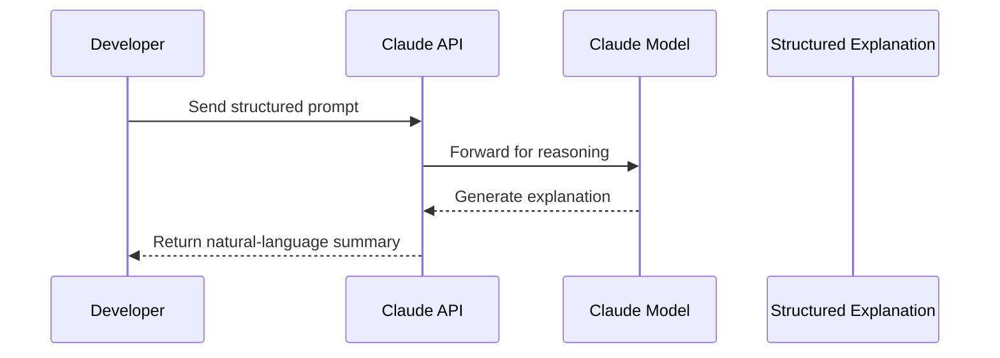

# Anthropic Claude API – Getting Started Guide

This tutorial introduces **Anthropic Claude**, a next-generation large language model (LLM) focused on safe, interpretable, and conversational AI. This guide is aimed at beginners and will help you understand what Claude is, how it works, how to access it, and how to use it to interpret structured data.

---

## Table of Contents

- [1. Introduction](#1-introduction)
- [2. What is Anthropic Claude?](#2-what-is-anthropic-claude)
- [3. Architecture Overview](#3-architecture-overview)
- [4. Setup and Dependencies](#4-setup-and-dependencies)
  - [4.1 Account and API Key](#41-account-and-api-key)
  - [4.2 Installation and Authentication](#42-installation-and-authentication)
- [5. Claude API Workflow](#5-claude-api-workflow)
- [6. Prompt Design](#6-prompt-design)
  - [6.1 Structure of a Good Prompt](#61-structure-of-a-good-prompt)
  - [6.2 Prompt Engineering Tips](#62-prompt-engineering-tips)
- [7. Claude Models Explained](#7-claude-models-explained)
- [8. Visual Flow of Claude API](#8-visual-flow-of-claude-api)
- [9. Example Use Case: Bitcoin Anomaly Detection](#9-example-use-case-bitcoin-anomaly-detection)
- [10. Resources](#10-resources)

---

## 1. Introduction

**Claude** is a language model developed by **Anthropic**, designed around the principles of Constitutional AI. Its goal is to provide accurate, transparent, and ethical AI responses.

Claude is especially good at:
- Explaining structured data
- Interpreting risk
- Following detailed instructions
- Acting as a domain expert (when prompted appropriately)

Claude is accessed using a conversational message-based API.

---

## 2. What is Anthropic Claude?

Claude is similar to other LLMs like GPT-4 or Gemini but trained with a unique technique called **Constitutional AI**. This allows Claude to be:
- Transparent in its reasoning
- Helpful and ethical in sensitive domains (e.g., finance, health)
- Better at refusing harmful requests or hallucinations

It supports:
- Rich structured prompts (JSON-like)
- Step-by-step reasoning
- Use in chat-like flows via an official API

---

## 3. Architecture Overview

Claude’s design revolves around simplicity and modularity. A typical flow:

- You define a clear, structured prompt
- You call the Claude API with that prompt
- Claude responds with a detailed, natural-language explanation

---

## 4. Setup and Dependencies

### 4.1 Account and API Key

To access Claude, follow these steps:

1. Sign up at [https://www.anthropic.com](https://www.anthropic.com)
2. Apply for API access (waitlist or partnership required)
3. Once approved, generate your API key

> **Important**: The Claude API is a paid service. There are no long-term free tiers. This tutorial was built using a personally funded API key.

### 4.2 Installation and Authentication

- Install the SDK: `pip install anthropic`
- Set your API key in an `.env` file or environment variable
- Authenticate in Python using the official `Anthropic()` client

Once authenticated, you can start sending messages to Claude using their API.

---

## 5. Claude API Workflow

Claude’s interaction model uses a **message format**:

- Each request contains a list of `messages`
- Each message has a `role`: either `"user"`, `"assistant"`, or `"system"`
- Claude processes the list and replies accordingly

Claude expects natural language input, but it handles structured data gracefully if formatted clearly.

---

## 6. Prompt Design

### 6.1 Structure of a Good Prompt

A strong Claude prompt includes:

- A clear **persona** (e.g., "You are a financial forensic analyst.")
- Well-formatted **structured input** (as a dictionary or key-value block)
- Clear **step-by-step instructions**
- An explicit request for final decision or summary

### 6.2 Prompt Engineering Tips

- Always define what role Claude is playing
- Ask Claude to evaluate each metric or feature
- Avoid vague prompts like “Explain this”
- Use consistent formatting across all examples
- Use bullet points or numbered lists

Claude performs better when it is treated like a structured report writer, not a chatbot.

---

## 7. Claude Models Explained

Anthropic offers 3 main models under the Claude 3 family:

| Model           | Strengths                                |
|----------------|-------------------------------------------|
| Claude 3 Haiku | Fast, low-cost, basic summarization       |
| Claude 3 Sonnet| Balanced performance and cost             |
| Claude 3 Opus  | Most powerful, best for reasoning tasks   |

For tasks involving sensitive data interpretation (like financial explanations), Claude 3 Opus is recommended.

---

## 8. Visual Flow of Claude API

---

## 9. Example Use Case: Bitcoin Anomaly Detection

Claude can be integrated into real-world pipelines. One such example:

### Project: Real-Time Bitcoin Transaction Anomaly Detection

**Objective:**  
Explain anomalies detected in 1-minute windows of Bitcoin transactions by feeding aggregated features into Claude.

**Process:**

1. Transaction data is pulled from Blockchair
2. Preprocessing (via Spark) generates time-windowed features
3. Anomalous windows are detected using EWMA
4. These are passed to Claude using structured prompts
5. Claude explains the risk in natural language

**Example Prompt Summary:**

> The transaction window has an unusually high output count with low fees, resembling a spam-like “fan-out” pattern. This may indicate dusting or obfuscation. Recommend further investigation.

This demonstrates Claude’s value in high-signal, regulated use cases.

---

## 10. Resources

- [Anthropic Claude API Docs](https://docs.anthropic.com)
- [Official SDK on PyPI](https://pypi.org/project/anthropic)
- [Claude Pricing](https://docs.anthropic.com/claude/docs/usage-pricing)
- [Prompt Engineering Guide](https://github.com/dair-ai/Prompt-Engineering-Guide)
- [Constitutional AI Principles](https://www.anthropic.com/constitutional-ai)

---
