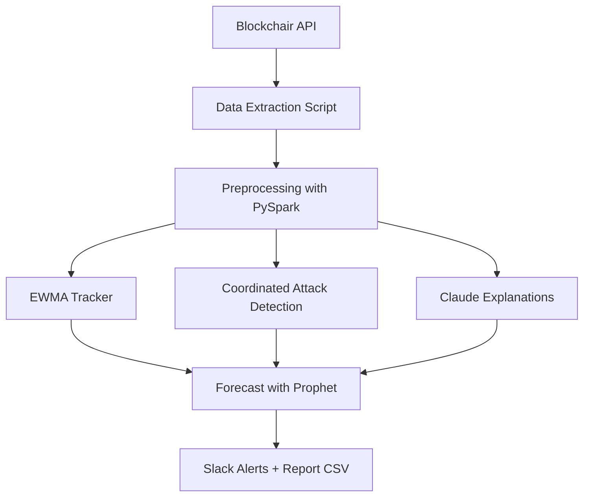

# Real-Time Bitcoin Transaction Anomaly Detection

## Table of Contents
1. [Introduction](#introduction)  
2. [Project Objective](#project-objective)  
3. [Technology Stack](#technology-stack)  
4. [System Architecture](#system-architecture)  
5. [Step-by-Step Pipeline](#step-by-step-pipeline)  
    - [5.1 Data Extraction](#51-data-extraction)  
    - [5.2 Data Preprocessing with PySpark](#52-data-preprocessing-with-pyspark)  
    - [5.3 Anomaly Detection Using Claude](#53-anomaly-detection-using-claude)  
    - [5.4 EWMA-Based Anomaly Tracking](#54-ewma-based-anomaly-tracking)  
    - [5.5 Coordinated Attack Detection](#55-coordinated-attack-detection)  
    - [5.6 Forecasting with Prophet](#56-forecasting-with-prophet)  
    - [5.7 Slack Alerts](#57-slack-alerts)  
    - [5.8 Dash Dashboard Launch](#58-dash-dashboard-launch)  
6. [Why AWS EMR Was Not Used](#why-aws-emr-was-not-used)  
7. [Conclusion](#conclusion)  

---

## Introduction

This project demonstrates how to build a real-time, explainable anomaly detection system for Bitcoin blockchain transactions using Anthropic Claude, PySpark, and time-series analytics. It extracts data from the public blockchain, processes it, detects unusual transaction patterns, and generates human-readable forensic explanations using Claude's LLM capabilities.

---

## Project Objective

The primary objective is to:

- Detect and explain anomalies in Bitcoin transaction behavior in near real-time.
- Implement both statistical and LLM-based methods for detection.
- Create a fully traceable pipeline with forecasting and alerting mechanisms.
- Provide natural language explanations that are interpretable by analysts or compliance officers.

---

## Technology Stack

- **Anthropic Claude API**: For chain-of-thought anomaly explanations  
- **Blockchair API**: For real-time Bitcoin transaction data  
- **PySpark**: For scalable preprocessing and aggregation  
- **Prophet**: For anomaly trend forecasting  
- **Slack Webhooks**: For real-time alerts  
- **Dash (Plotly)**: For future dashboard deployment  
- **Python Scripts**: Modular pipeline scripts in `/scripts`  
- **Jupyter Notebook**: For orchestrating the pipeline and showcasing outputs  

---

## System Architecture

---

## Step-by-Step Pipeline

### 5.1 Data Extraction
- Extracted up to 4,000 Bitcoin transactions using the Blockchair API.
- Key fields such as value, fees, input/output count, and size were selected.
- Raw JSON files were saved in the `data/raw/` directory.

### 5.2 Data Preprocessing with PySpark
- All numeric fields were typecast for Spark compatibility.
- Aggregated transaction statistics were computed in 1-minute and 5-minute windows.
- EWMA-specific count data was created.
- Outputs were saved in `data/processed/`.

### 5.3 Anomaly Detection Using Claude
- Time-windowed summaries were sent to Claude with a structured forensic prompt.
- Each prompt asked:
    - Is this statistically unusual?
    - What types of suspicious activity might this resemble?
    - Could there be legitimate causes?
    - Should this be flagged for investigation?
- Natural language responses were stored in `report/anomaly_explanations_full.csv`.

### 5.4 EWMA-Based Anomaly Tracking
- Transaction counts were smoothed using Exponential Weighted Moving Average (EWMA).
- Z-scores were calculated to measure deviation from smoothed trends.
- Any window with `|z| > 2` was flagged as anomalous.
- Final results were written to `report/ewma_anomalies.csv`.

### Slack Alert Format Explanation (EWMA-Based Anomaly Tracking)

Each anomaly alert sent to Slack contains the following fields:

| Field       | Description |
|-------------|-------------|
| **Time**    | Timestamp of the 1-minute window during which the anomaly was detected. |
| **Tx Count**| Number of Bitcoin transactions observed during that window. |
| **Z-Score** | Statistical deviation from the expected value (EWMA). Values with `|z| > 2` are considered anomalous. |
| **Context Note** | An explanation like "Flagged due to deviation from smoothed EWMA baseline" is added to clarify why the alert was triggered. |

These metrics are formatted using Slack's Block Kit layout for better readability. The structured alert makes it easier for analysts to quickly review, verify, and respond to unusual blockchain activity.

### 5.5 Coordinated Attack Detection
- Transactions with input or output counts ≥ 10 were flagged.
- Time-based clustering was used to detect coordination across multiple transactions.
- Detected clusters were written to `report/coordinated_attacks.csv`.

#### Slack Alert Format Explanation (Coordinated Attacks)

Each alert for coordinated attack detection includes:

| Field         | Description |
|---------------|-------------|
| **Time**      | Minute of detection (grouped by transaction timestamps). |
| **Tx Count**  | Number of flagged transactions within the minute. |
| **Avg Inputs**| Average number of input addresses across flagged transactions. |
| **Avg Outputs**| Average number of output addresses across flagged transactions. |
| **Sample Tx** | A representative transaction hash from the detected cluster. |
| **Context**   | Notes that the alert is based on structural fan-in/fan-out patterns over time.

This structured alert helps distinguish high-risk clustering behavior, often linked to spam, mixing, or laundering attempts.

### 5.6 Forecasting with Prophet
- Transaction counts were forecasted 30 minutes into the future.
- The Prophet model was trained on EWMA-based transaction data.
- Output was saved to `report/prophet_forecast.csv`.

### 5.7 Slack Alerts
- Anomalies from both EWMA and coordinated attacks triggered real-time Slack alerts.
- Alerts included:
    - Timestamp
    - Z-score
    - Transaction count
    - Sample transaction hash (for coordination)

### 5.8 Dash Dashboard Launch
- A Dash app was created (but not run in this pipeline execution).
- Located in `dashboards/dashboard_app.py`.
- It visualizes anomaly patterns, transaction volumes, and explanations.

---

## Why AWS EMR Was Not Used

Although originally considered, AWS EMR was excluded from this project for the following reasons:

- **Cost Constraints**: This tutorial is designed to be reproducible without incurring cloud charges.
- **Local Feasibility**: The Mac M3 system used had sufficient memory and CPU for PySpark operations.
- **No Need for Scaling**: The current scale of 4,000 transactions per run did not require a distributed cluster.

The architecture remains cloud-compatible and EMR-ready, but local-only execution ensures accessibility and avoids setup complexity.

---

## Conclusion

This project showcases a robust, interpretable approach to anomaly detection in blockchain data by combining:

- Real-time Bitcoin transaction extraction
- Distributed preprocessing with PySpark
- Chain-of-thought anomaly analysis via Claude
- EWMA anomaly tracking and visualization
- Coordinated attack detection with alerts
- Forecasting using Prophet
- Dashboard readiness for production monitoring

---

## Scripts Used in This Project

To keep the project modular and maintainable, key components were encapsulated into separate Python script files. These were invoked using wrapper functions defined in `BitcoinTxAnomaly_utils.py`.

### Utility Wrapper: `BitcoinTxAnomaly_utils.py`

This utility file serves as a centralized interface to invoke all project components in a clean and structured way. It contains function wrappers for the following scripts:

- `run_extract()`: Calls `extract_and_upload.py`
- `run_preprocess()`: Calls `preprocess_with_spark.py`
- `run_explanation()`: Calls `anomaly_explainer.py`
- `run_anomaly_detection()`: Calls `track_anomalies.py`
- `run_coordinated_attack_check()`: Calls `detect_coordinated_attacks.py`
- `run_alert()`: Calls `send_alert.py`
- `run_forecast()`: Calls `forecast_with_prophet.py`

Each function prints execution status, handles errors, and ensures the script executes from the correct working directory.

---

### Individual Scripts and Their Roles

- **`extract_and_upload.py`**  
  Extracts Bitcoin transaction data from the Blockchair API and saves it in raw JSON format for downstream processing.

- **`preprocess_with_spark.py`**  
  Preprocesses the extracted transactions using PySpark, including time-windowed aggregation and output formatting.

- **`anomaly_explainer.py`**  
  Sends suspicious transaction summaries to Claude using structured prompts and stores the explanations in CSV files.

- **`track_anomalies.py`**  
  Applies Exponential Weighted Moving Average (EWMA) smoothing and flags anomalous windows based on statistical deviations.

- **`detect_coordinated_attacks.py`**  
  Detects temporal and structural transaction patterns suggesting coordinated attacks, based on clustering heuristics.

- **`send_alert.py`**  
  Sends Slack alerts for high-risk or coordinated anomaly clusters including transaction metrics and summary details.

- **`forecast_with_prophet.py`**  
  Uses Facebook Prophet to predict future transaction volume trends based on EWMA-smoothed historical data.

---

These scripts were not run individually but called from within the notebook using `BitcoinTxAnomaly_utils.py` to maintain consistency and modular execution.

---
