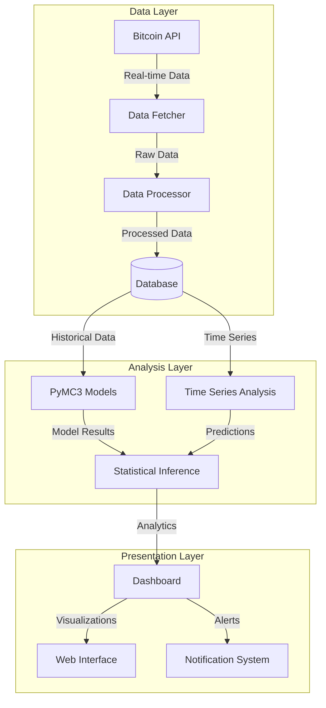
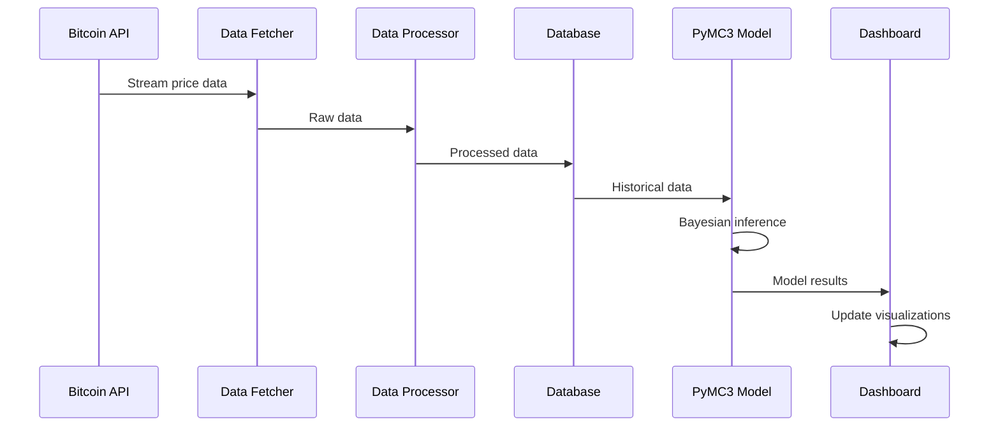
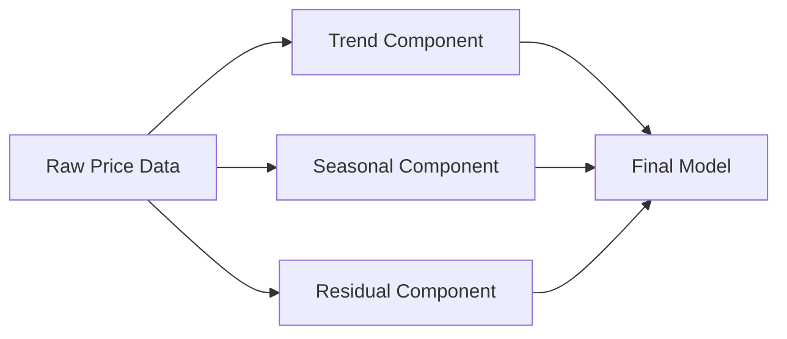

# Real-time Bitcoin Price Analysis Using PyMC3

## Project Overview

This project presents a real-time Bitcoin price analysis system utilizing PyMC3 for Bayesian statistical modeling. The system continuously fetches live Bitcoin price data, processes it, applies probabilistic time series models, and provides analytical insights through comprehensive visualizations. The aim is to enable uncertainty-aware forecasting in volatile financial markets.

## Key Features

- Real-time Bitcoin price data acquisition and transformation
- Bayesian modeling using PyMC3 and MCMC inference
- Time series analysis and probabilistic forecasting
- Interactive visualization and model diagnostics
- Historical pattern recognition and automated price alert system
- Integrated testing and evaluation for model performance


## Project Structure

```
📦 bitcoin-price-analysis
 ┣ 📂 src
 ┃ ┣ 📂 data
 ┃ ┃ ┣ 📜 data_fetcher.py      # Bitcoin price data acquisition
 ┃ ┃ ┣ 📜 data_processor.py    # Data cleaning and preprocessing
 ┃ ┃ ┗ 📜 database.py          # Database operations
 ┃ ┣ 📂 models
 ┃ ┃ ┣ 📜 bayesian_model.py    # PyMC3 model definitions
 ┃ ┃ ┣ 📜 time_series.py       # Time series analysis
 ┃ ┃ ┗ 📜 predictive.py        # Price prediction models
 ┃ ┣ 📂 visualization
 ┃ ┃ ┣ 📜 dashboard.py         # Interactive dashboard
 ┃ ┃ ┗ 📜 plots.py             # Visualization utilities
 ┃ ┗ 📂 utils
 ┃   ┣ 📜 config.py            # Configuration settings
 ┃   ┗ 📜 helpers.py           # Utility functions
 ┣ 📂 notebooks
 ┃ ┣ 📜 exploration.ipynb      # Data exploration
 ┃ ┗ 📜 analysis.ipynb         # Analysis notebooks
 ┣ 📂 tests
 ┃ ┣ 📜 test_data.py          # Data processing tests
 ┃ ┣ 📜 test_models.py         # Model tests
 ┃ ┗ 📜 test_utils.py          # Utility tests
 ┣ 📂 docs
 ┃ ┣ 📜 api.md                 # API documentation
 ┃ ┗ 📜 models.md              # Model documentation
 ┣ 📜 .env.example             # Environment variables template
 ┣ 📜 .gitignore              # Git ignore rules
 ┣ 📜 requirements.txt         # Project dependencies
 ┣ 📜 setup.py                # Package setup
 ┗ 📜 README.md               # Project documentation
```

## System Architecture

The system consists of real-time data ingestion modules, Bayesian modeling pipelines, and visualization layers. It supports both WebSocket and REST-based API connections for fetching market data and integrates real-time updates into the forecasting workflow.



## 📈 Data Flow



## Technical Implementation

### Data Collection
- Uses public APIs (e.g., CoinGecko) to fetch Bitcoin prices.
- Real-time updates via WebSocket or scheduled polling.
- Data is cleaned, validated, and structured into time series using Pandas.

### Statistical Modeling
The project employs PyMC3 for sophisticated Bayesian modeling:

```python
import pymc3 as pm

def create_price_model(data):
    with pm.Model() as model:
        # Prior for volatility
        σ = pm.HalfNormal('σ', sd=1)
        
        # Prior for mean return
        μ = pm.Normal('μ', mu=0, sd=1)
        
        # Price change likelihood
        returns = pm.Normal('returns', mu=μ, sd=σ, observed=data)
        
        # Sampling
        trace = pm.sample(2000, tune=1000, return_inferencedata=False)
    
    return model, trace
```

### Time Series Components



## Visualization Components

The dashboard includes:
1. Real-time price charts
2. Bayesian inference plots
3. Prediction intervals
4. Model diagnostics
5. Performance metrics

## Prerequisites
- Python 3.8+
- PyMC3
- Pandas
- Plotly
- NumPy

### Installation

```bash
# Clone the repository
git clone https://github.com/yourusername/bitcoin-price-analysis.git

# Create virtual environment
python -m venv venv
source venv/bin/activate  # On Windows: venv\Scripts\activate

# Install dependencies
pip install -r requirements.txt
```

### Configuration
1. Copy `.env.example` to `.env`
2. Add your API keys and configuration settings
3. Adjust model parameters in `config.py`

## Usage Examples

```python
from src.data.data_fetcher import BitcoinDataFetcher
from src.models.bayesian_model import PriceModel

# Initialize data fetcher
fetcher = BitcoinDataFetcher()

# Get real-time data
data = fetcher.get_latest_prices()

# Create and run model
model = PriceModel(data)
results = model.analyze()

# Generate visualizations
model.plot_results()
```

## Model Diagnostics

The system includes comprehensive model diagnostics:
- MCMC convergence checks
- Prior and posterior predictive checks
- Model comparison metrics
- Residual analysis

## Testing

```bash
# Run all tests
pytest

# Run specific test suite
pytest tests/test_models.py
```

## Authors

- Madhumitha Rajagopal

