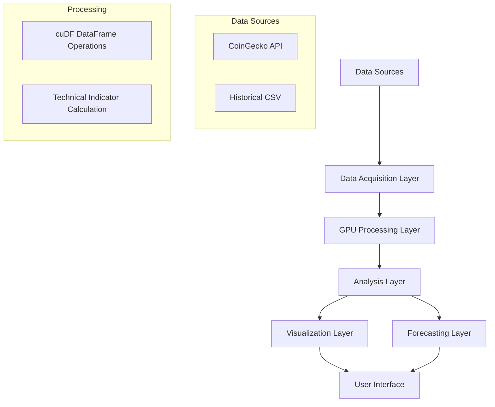

<!-- toc -->

- [Real-Time Bitcoin Data Processing with cuDF](#real-time-bitcoin-data-processing-with-cudf)
  * [Overview](#overview)
  * [System Architecture](#system-architecture)
  * [Data Pipeline](#data-pipeline)
  * [Technical Indicators](#technical-indicators)
  * [Real-Time Processing Capabilities](#real-time-processing-capabilities)
  * [GPU-Acceleration Benefits](#gpu-acceleration-benefits)
  * [Forecasting Methodology](#forecasting-methodology)
  * [Implementation Considerations](#implementation-considerations)

<!-- tocstop -->

# Real-Time Bitcoin Data Processing with cuDF

This document presents a comprehensive example of implementing a real-time Bitcoin data processing system using NVIDIA's RAPIDS cuDF library. The companion notebook `cudf.example.ipynb` provides the executable implementation of the concepts described here.

## Overview

The Bitcoin real-time data processor is designed to leverage GPU acceleration for analyzing cryptocurrency market data with both historical context and real-time updates. This system serves several purposes:

1. **Market Analysis**: Providing technical indicators and price trend analysis for Bitcoin
2. **Performance Demonstration**: Showcasing the speed advantages of GPU-accelerated data processing
3. **Real-Time Visualization**: Creating interactive, continuously updated charts of Bitcoin price movements
4. **Price Forecasting**: Predicting potential future price movements based on historical patterns

## System Architecture

The system architecture follows a modular design with clear separation of concerns:

The implementation centralizes utility functions in the `utils/cudf_utils.py` module, which provides a reusable library of GPU-accelerated operations specifically tailored for cryptocurrency data processing.

## Data Pipeline

The data pipeline consists of several stages:

1. **Data Acquisition**:
   - Historical data is fetched from the CoinGecko API, providing a foundation for analysis
   - Real-time data is fetched at regular intervals to provide current market context
   - Both sources are combined to create a comprehensive dataset

2. **Data Transformation**:
   - Raw price data is converted to GPU-accelerated cuDF DataFrames
   - Timestamps are normalized and standardized
   - Missing values are handled appropriately

3. **Technical Analysis**:
   - GPU-accelerated calculation of financial indicators
   - Statistical analysis of price movements
   - Pattern recognition for market trends

4. **Visualization and Output**:
   - Interactive Plotly charts for data visualization
   - CSV export for further analysis or record-keeping
   - Forecasting of potential future price movements

## Technical Indicators

The system calculates the following technical indicators using GPU acceleration:

1. **Simple Moving Averages (SMA)**:
   - Short-term (7-day) for recent trends
   - Medium-term (20-day) for intermediate trends
   - Long-term (50-day) for established trends
   - Extended long-term (200-day) for major market cycles

2. **Volatility Metrics**:
   - 20-day rolling standard deviation to measure market volatility
   - Normalized volatility relative to price

3. **Rate of Change (ROC)**:
   - 1-day ROC for immediate price momentum
   - 7-day ROC for weekly trends
   - 30-day ROC for monthly price direction

4. **Relative Strength Index (RSI)**:
   - 14-day RSI to identify overbought/oversold conditions
   - Using standard 70/30 thresholds for signal generation

## Real-Time Processing Capabilities

The system's real-time processing capabilities include:

1. **Low-Latency Updates**:
   - Configurable update frequency (default: every 3 seconds)
   - Efficient CPU-to-GPU memory transfers minimize latency
   - Incremental updates to avoid redundant calculations

2. **Streaming Data Processing**:
   - Continuous addition of new price points
   - Dynamic recalculation of technical indicators
   - Real-time visualization updates

3. **Memory Management**:
   - Efficient GPU memory utilization
   - Automatic cleanup of stale data
   - Optimized batch sizes for processing

## GPU-Acceleration Benefits

The implementation demonstrates several key benefits of GPU acceleration:

1. **Performance Improvements**:
   - Technical indicator calculations up to 10x faster than CPU-based alternatives
   - Ability to process larger historical datasets (365+ days) with minimal latency
   - Real-time updates with sub-second processing time

2. **Scaling Capabilities**:
   - Linear scaling with additional GPU cores
   - Efficient handling of growing dataset sizes
   - Parallel processing of multiple indicators simultaneously

3. **Resource Utilization**:
   - Reduced CPU load during data processing
   - Better multitasking capabilities
   - Lower power consumption compared to equivalent CPU-based processing

## Forecasting Methodology

The price forecasting system uses a combination of:

1. **Feature Engineering**:
   - Technical indicators as predictive features
   - Historical price patterns
   - Momentum and volatility metrics

2. **Machine Learning Approach**:
   - Linear regression model for trend prediction
   - Standardized features for balanced weighting
   - Rolling window training for adaptive forecasting

3. **Confidence Intervals**:
   - 95% confidence bounds for predictions
   - Error estimation based on historical accuracy
   - Visual representation of prediction uncertainty

## Implementation Considerations

When implementing this system, several considerations were addressed:

1. **API Rate Limiting**:
   - CoinGecko API has rate limits that must be respected
   - Optional API key support for higher limits
   - Graceful handling of API errors and timeouts

2. **GPU Resource Availability**:
   - Fallback to CPU processing when GPU is unavailable
   - Dynamic resource allocation based on dataset size
   - Memory management to prevent out-of-memory errors

3. **Data Quality**:
   - Handling missing or anomalous data points
   - Duplicate detection and removal
   - Timestamp normalization across data sources

4. **User Experience**:
   - Interactive visualizations for better data exploration
   - Clear progress indicators during long-running operations
   - Configurable parameters for customized analysis

This implementation provides a complete demonstration of how cuDF can be used to build a high-performance, real-time data processing system for cryptocurrency market analysis, showcasing both the technical capabilities and practical applications of GPU-accelerated data processing. 