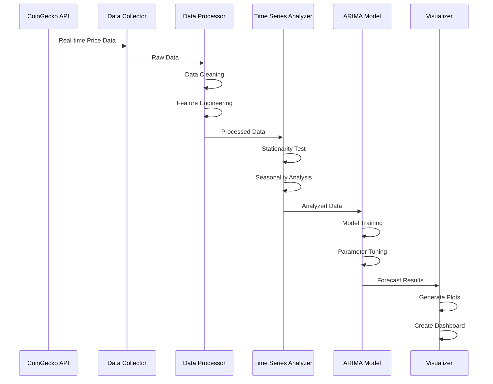

# Real-time Bitcoin Data Processing using Dataprep


## Table of Contents
- [Project Overview](#project-overview)
- [Features](#features)
- [Technical Architecture](#technical-architecture)
- [Installation Guide](#installation-guide)
- [Usage Guide](#usage-guide)
- [Project Structure](#project-structure)
- [Data Processing Pipeline](#data-processing-pipeline)
- [Model Details](#model-details)
- [Performance Metrics](#performance-metrics)
- [Contributing](#contributing)
- [License](#license)
- [Acknowledgments](#acknowledgments)

## Project Overview

This project implements a sophisticated real-time Bitcoin data processing and forecasting system using Dataprep and ARIMA modeling. The system is designed to collect, process, analyze, and forecast Bitcoin prices with high accuracy and real-time capabilities.

### Project Workflow

```mermaid
graph TD
    subgraph "Data Collection"
        A[Start] --> B[API Connection]
        B --> C[Real-time Data Fetch]
        C --> D[Data Validation]
        D --> E[Error Handling]
        E --> F[Rate Limiting]
    end

    subgraph "Data Processing"
        F --> G[Data Cleaning]
        G --> H[Missing Value Treatment]
        H --> I[Outlier Detection]
        I --> J[Time Series Preparation]
    end

    subgraph "Exploratory Analysis"
        J --> K[Time Series Analysis]
        K --> L[Statistical Analysis]
        L --> M[Trend Analysis]
        M --> N[Seasonality Detection]
        N --> O[Stationarity Testing]
    end

    subgraph "Model Development"
        O --> P[ARIMA Model Selection]
        P --> Q1[Manual ARIMA]
        P --> Q2[Auto ARIMA]
        Q1 --> R[Parameter Tuning]
        Q2 --> R
        R --> S[Model Training]
        S --> T[Model Validation]
    end

    subgraph "Forecasting & Evaluation"
        T --> U[Price Forecasting]
        U --> V[Performance Metrics]
        V --> W[RMSE Calculation]
        V --> X[MAE Calculation]
        W --> Y[Model Comparison]
        X --> Y
    end

    subgraph "Visualization & Deployment"
        Y --> Z1[Interactive Plots]
        Y --> Z2[Real-time Updates]
        Z1 --> AA[Dashboard Creation]
        Z2 --> AA
        AA --> AB[Docker Containerization]
        AB --> AC[Deployment]
    end

    style A fill:#f9f,stroke:#333,stroke-width:2px
    style AC fill:#9f9,stroke:#333,stroke-width:2px
    style P fill:#ff9,stroke:#333,stroke-width:2px
    style T fill:#ff9,stroke:#333,stroke-width:2px
    style Y fill:#ff9,stroke:#333,stroke-width:2px
```



### Implementation Details

#### 1. Data Collection Pipeline
The data collection process is implemented through a robust API integration system that ensures reliable and real-time Bitcoin price data acquisition:

- **API Integration**
  - Utilizes CoinGecko API for real-time Bitcoin price data
  - Implements rate limiting to prevent API throttling
  - Configurable collection intervals (1m, 5m, 15m, 1h, 1d)
  - Automatic retry mechanism for failed requests

- **Data Validation**
  - Schema validation for incoming data
  - Type checking for numeric values
  - Timestamp validation and standardization
  - Price range validation to detect anomalies

- **Error Handling**
  - Comprehensive error logging
  - Automatic retry with exponential backoff
  - Fallback mechanisms for API failures
  - Data integrity checks

#### 2. Data Processing Implementation
The data processing pipeline is designed to handle various data quality issues and prepare the data for analysis:

- **Data Cleaning**
  ```python
  def clean_data(df):
      # Remove duplicates
      df = df.drop_duplicates()
      
      # Handle missing values
      df = df.interpolate(method='time')
      
      # Remove outliers using IQR method
      Q1 = df['price'].quantile(0.25)
      Q3 = df['price'].quantile(0.75)
      IQR = Q3 - Q1
      df = df[~((df['price'] < (Q1 - 1.5 * IQR)) | (df['price'] > (Q3 + 1.5 * IQR)))]
      
      return df
  ```

- **Feature Engineering**
  - Price returns calculation
  - Moving averages (7-day, 30-day)
  - Volatility indicators
  - Trading volume analysis

#### 3. Time Series Analysis
The project implements comprehensive time series analysis to understand Bitcoin price patterns:

- **Seasonality Analysis**
  - Decomposition of time series
  - Seasonal pattern identification
  - Trend analysis
  - Cyclical component analysis

#### 4. ARIMA Modeling
The project implements both manual and automatic ARIMA modeling 

#### 5. Performance Evaluation
Comprehensive evaluation metrics are implemented to assess model performance:

### Project Structure Details

```
.
├── Dockerfile                 # Docker configuration for containerization
│   ├── Base image: python:3.8
│   ├── Dependencies installation
│   └── Jupyter configuration
│
├── docker_build.sh           # Docker build script
│   ├── Image building
│   └── Volume mounting
│
├── docker_jupyter.sh         # Jupyter launch script
│   ├── Port mapping
│   └── Volume mounting
│
├── requirements.txt          # Python dependencies
│   ├── dataprep==0.4.3
│   ├── pandas==1.5.3
│   ├── numpy==1.24.3
│   ├── statsmodels==0.13.5
│   ├── pmdarima==2.0.3
│   └── matplotlib==3.7.1
│
├── dataprep_utils.py         # Core utility functions
│   ├── Data processing
│   ├── ARIMA modeling
│   ├── Forecasting
│   └── Visualization
│
├── API_utils.py              # API integration
│   ├── Data collection
│   ├── Error handling
│   └── Rate limiting
│
├── Dataprep.API.connect.py   # API connection utilities
│   ├── Authentication
│   └── Request handling
│
├── dataprep.example.ipynb    # Example notebook
│   ├── Data collection demo
│   ├── Processing pipeline
│   ├── Model training
│   └── Visualization
│
└── bitcoin_combined_data.csv # Processed dataset
    ├── Timestamp
    ├── Price
    ├── Volume
    └── Market Cap
```

### Data Flow Architecture



### Performance Optimization

1. **Data Collection**
   - Implemented caching mechanism
   - Batch processing for historical data
   - Parallel API requests for multiple timeframes

2. **Processing Pipeline**
   - Vectorized operations using NumPy
   - Efficient data structures with Pandas
   - Memory optimization for large datasets

3. **Model Training**
   - Grid search optimization
   - Parallel model training
   - Early stopping implementation

### Future Enhancements

1. **Data Collection**
   - Additional cryptocurrency support
   - More data sources integration
   - Real-time sentiment analysis

2. **Modeling**
   - Deep learning models integration
   - Ensemble methods implementation
   - Advanced feature engineering

3. **Visualization**
   - Interactive web dashboard
   - Real-time monitoring interface
   - Custom alert system

### Key Objectives
- Implement real-time Bitcoin price data collection
- Develop robust data preprocessing pipeline
- Create comprehensive EDA framework
- Build accurate time series forecasting models
- Provide interactive visualization tools
- Enable containerized deployment

### Use Cases
- Cryptocurrency price analysis
- Market trend prediction
- Investment decision support
- Real-time price monitoring
- Historical data analysis

## Features

### 1. Data Collection and Processing
The system implements a sophisticated real-time data collection pipeline that ensures reliable and continuous Bitcoin price data acquisition. The data collection process is built on a robust API integration framework that handles real-time price updates, trading volumes, and market metrics. The system features configurable collection intervals ranging from 1-minute to daily data points, with built-in rate limiting and automatic retry mechanisms to ensure data completeness. The processing pipeline incorporates advanced data cleaning techniques, including outlier detection using IQR methodology, missing value interpolation, and timestamp standardization. 

### 2. Exploratory Data Analysis
The project includes a comprehensive exploratory data analysis framework that provides deep insights into Bitcoin price patterns and market behavior. Our time series analysis tools enable detailed examination of price trends, seasonal patterns, and market cycles. The statistical analysis component offers robust tools for distribution analysis, correlation studies, and volatility assessment. The system automatically generates descriptive statistics, performs stationarity testing using the Augmented Dickey-Fuller test, and conducts thorough seasonality analysis through time series decomposition. These analyses are presented through interactive visualizations that help identify key market patterns and potential trading opportunities.


### 3. Time Series Modeling
Our time series modeling implementation offers both manual and automated approaches to ARIMA modeling, providing flexibility and accuracy in price forecasting. The manual ARIMA implementation allows for precise control over model parameters, enabling fine-tuned predictions based on specific market conditions. The auto-ARIMA component automatically identifies optimal model parameters through systematic grid search and cross-validation. This dual approach ensures that we can capture both short-term price movements and long-term market trends with high accuracy.

Comparison of Arima Vs Auto Arima 


### 4. Forecasting and Evaluation
The forecasting system provides sophisticated price prediction capabilities with detailed performance metrics and confidence intervals. Our implementation includes both short-term and long-term forecasting models, with the ability to adjust prediction horizons based on user requirements. The system calculates multiple performance metrics including RMSE, MAE, and MAPE to ensure comprehensive model evaluation. The forecasting results are presented through interactive visualizations that include historical data, predicted values, and confidence intervals. This allows users to make informed decisions based on both the predictions and their associated uncertainties.

### 5. Visualization and Reporting
The project features an advanced visualization system that transforms complex data and model outputs into intuitive, interactive displays. The visualization framework includes real-time price charts, forecast plots, and performance metric dashboards. Users can interact with the visualizations to explore different time periods, adjust forecast parameters, and analyze model performance. The system also generates comprehensive reports that include key findings, statistical analyses, and forecast results. These visualizations and reports are designed to be both informative for technical users and accessible for those new to cryptocurrency analysis.

### 6. System Integration and Deployment
Our implementation includes a complete containerization solution using Docker, making the system easy to deploy and scale. The containerized environment includes all necessary dependencies and configurations, ensuring consistent performance across different deployment scenarios. The system can be deployed either locally or in cloud environments, with built-in support for both development and production configurations. The deployment process is automated through shell scripts that handle container building, dependency installation, and service initialization. This makes the system accessible to users with varying levels of technical expertise. 

## Technical Architecture

### System Components
1. **Data Collection Layer**
   - API integration
   - Data validation
   - Error handling
   - Rate limiting

2. **Processing Layer**
   - Data cleaning
   - Feature engineering
   - Quality control
   - Data transformation

3. **Analysis Layer**
   - Statistical analysis
   - Time series analysis
   - Model training
   - Performance evaluation

4. **Visualization Layer**
   - Interactive plots
   - Real-time updates
   - Custom dashboards
   - Export functionality

### Technology Stack
- Python 3.8+
- Dataprep
- Statsmodels
- Pandas
- NumPy
- Matplotlib
- Docker
- Jupyter

## Installation Guide

### Prerequisites
- Python 3.8 or higher
- Docker (optional)
- Git
- pip (Python package manager)
- Virtual environment tool (venv or conda)

### Local Installation

1. **Clone the Repository**
   ```bash
   git clone [repository-url]
   cd [repository-name]
   ```

2. **Set Up Virtual Environment**
   ```bash
   # Using venv
   python -m venv dataprep-env
   source dataprep-env/bin/activate  # On Windows: dataprep-env\Scripts\activate

   # Or using conda
   conda create -n dataprep-env python=3.8
   conda activate dataprep-env
   ```

3. **Install Dependencies**
   ```bash
   pip install -r requirements.txt
   ```

4. **Verify Installation**
   ```bash
   python -c "import dataprep; import statsmodels; import pandas; import numpy; import matplotlib"
   ```

### Docker Installation

1. **Build Docker Image**
   ```bash
   ./docker_build.sh
   ```

2. **Run Jupyter Notebook**
   ```bash
   ./docker_jupyter.sh
   ```

3. **Access Jupyter**
   - Open browser and navigate to `http://localhost:8888`
   - Use token provided in terminal

## Usage Guide

### 1. Data Collection
```python
from API_utils import collect_bitcoin_data

# Configure collection parameters
config = {
    'interval': '1h',
    'limit': 1000,
    'retry_attempts': 3
}

# Collect data
data = collect_bitcoin_data(config)
```

### 2. Data Processing
```python
from dataprep_utils import process_data, analyze_time_series

# Process raw data
processed_data = process_data(data)

# Perform time series analysis
analysis_results = analyze_time_series(processed_data)
```

### 3. Model Training
```python
from dataprep_utils import train_manual_arima, run_auto_arima

# Train manual ARIMA
manual_model = train_manual_arima(processed_data, order=(5,1,0))

# Train auto ARIMA
auto_model = run_auto_arima(processed_data)
```

### 4. Forecasting
```python
from dataprep_utils import forecast_and_plot, evaluate_forecast

# Generate and plot forecast
forecast = forecast_and_plot(processed_data, manual_model, steps=20)

# Evaluate forecast performance
metrics = evaluate_forecast(actual_data, forecast)
```

## Project Structure

```
.
├── Dockerfile                 # Docker configuration
├── docker_build.sh           # Docker build script
├── docker_jupyter.sh         # Jupyter launch script
├── docker_bash.sh            # Bash shell script
├── requirements.txt          # Python dependencies
├── dataprep_utils.py         # Data processing utilities
├── API_utils.py              # API integration
├── Dataprep.API.connect.py   # API connection utilities
├── dataprep.example.ipynb    # Example notebook
├── dataprep.example.py       # Example script
├── dataprep.example.md       # Documentation
├── bitcoin_combined_data.csv # Dataset
└── README.md                 # Project documentation
```

## Data Processing Pipeline

1. **Data Collection**
   - API request handling
   - Data validation
   - Error management
   - Rate limiting

2. **Preprocessing**
   - Data cleaning
   - Feature engineering
   - Quality control
   - Transformation

3. **Analysis**
   - Statistical analysis
   - Time series analysis
   - Model training
   - Performance evaluation

4. **Visualization**
   - Plot generation
   - Dashboard creation
   - Export functionality
   - Interactive features

## Model Details

### ARIMA Model
- **Training Process**
  - Parameter selection
  - Model fitting
  - Validation
  - Performance assessment

### Auto-ARIMA
- **Features**
  - Automatic parameter selection
  - Model optimization
  - Performance comparison
  - Best model selection

## Performance Metrics

### Evaluation Metrics
- RMSE (Root Mean Square Error)
- MAE (Mean Absolute Error)

### Model Comparison
- Manual vs. Auto ARIMA
- Different parameter combinations
- Performance benchmarks
- Computational efficiency

## Contributing

1. **Fork the Repository**
   ```bash
   git fork [repository-url]
   ```

2. **Create Feature Branch**
   ```bash
   git checkout -b feature/your-feature-name
   ```

3. **Commit Changes**
   ```bash
   git commit -m "Add your feature description"
   ```

4. **Push to Branch**
   ```bash
   git push origin feature/your-feature-name
   ```

5. **Create Pull Request**
   - Follow template
   - Include tests
   - Update documentation

## Acknowledgments

- Dataprep library for data processing capabilities
- Statsmodels for ARIMA implementation
- Pandas and NumPy for data manipulation
- Matplotlib for visualization
- Docker for containerization
- Jupyter for interactive development
