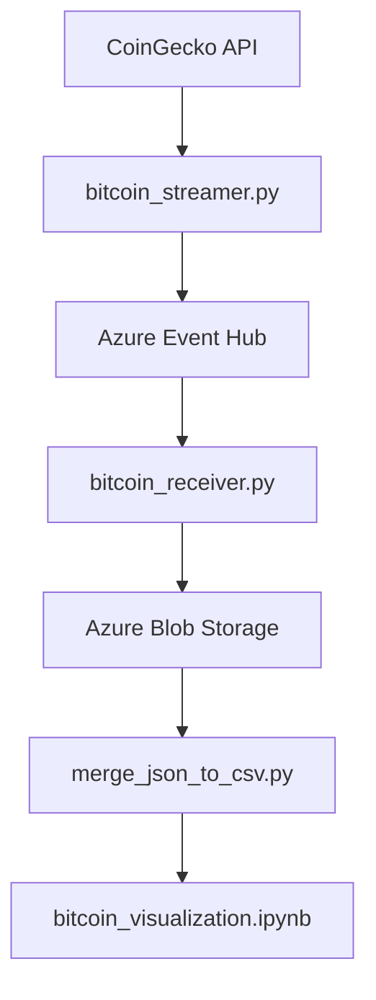
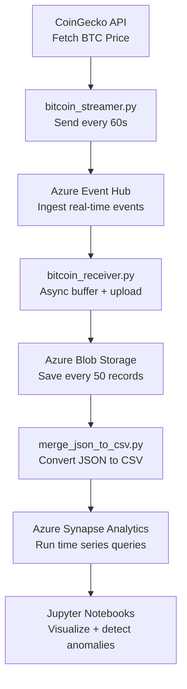

#  Real-Time Bitcoin Streaming with Azure & Docker (DATA605 Project)

This project demonstrates a real-time cloud data pipeline for Bitcoin price tracking using the Azure SDK for Python. It fetches live Bitcoin prices from the CoinGecko API, streams the data into Azure Event Hub, receives and buffers events, stores them in Azure Blob Storage, and finally performs time-series analysis on the collected data.

All components are modular, fully containerized using Docker, and designed to simulate a real-world, scalable analytics workflow.

---

##  Objective

The goal of this project is to:

- Stream real-time Bitcoin pricing data from the CoinGecko API
- Ingest the data into **Azure Event Hub**
- Receive the stream and batch-upload events into **Azure Blob Storage**
- Utilize **Azure Synapse Analytics** to perform a time-series analysis on the stored data
- Visualize insights using Python-based statistical and ML techniques (rolling averages, MACD, Bollinger Bands, anomaly detection)
- Deploy and execute all components in a **reproducible Docker environment**

---

## Step 2: Starting with Docker

As per the project prerequisites, the system was developed using Docker from the beginning to ensure portability, reproducibility, and a consistent environment.

I used the **Simple Docker Setup (data605_style)** as recommended in the course. This approach allowed me to:

- Run all my scripts and notebooks inside a clean container
- Avoid dependency issues across systems
- Mount my project directory into the container for live code access
- Run Jupyter Notebook seamlessly inside Docker

I created the following Docker-related files in the root of my project:

- `Dockerfile` – defines the Python environment and installs project dependencies
- `docker_build.ps1` – builds the Docker image (`bitcoin-project`)
- `docker_bash.ps1` – opens a terminal inside the container
- `docker_jupyter.ps1` – starts Jupyter Notebook inside the container

### Environment

- **Base Image**: `python:3.10-slim`
- **Python Libraries**: Installed via `requirements.txt`
- **Mounted Folder**: Local project folder is mounted to `/app` inside Docker
- **Jupyter Access**: Exposed on `localhost:8888` with token authentication

### Screenshot Example


---

## Step 3: Setting Up the Project Folder and Scripts

Once the Docker environment was ready, I structured the project into a clean and modular format, separating utilities, scripts, notebooks, and documentation.

### Folder Structure

/project-root/
```text
├── Dockerfile # Defines the container environment
├── requirements.txt # All dependencies used across scripts & notebooks
├── docker_build.ps1 # Builds the Docker image
├── docker_bash.ps1 # Opens a terminal inside the container
├── docker_jupyter.ps1 # Launches Jupyter Notebook inside Docker
├── bitcoin_utils.py # Shared helper functions and API wrappers
├── bitcoin_streamer.py # Streams BTC price to Azure Event Hub
├── bitcoin_receiver.py # Receives events and stores in Azure Blob
├── merge_json_to_csv.py # Converts downloaded JSON files into CSV
├── bitcoin_visualization.ipynb # Time-series and anomaly detection
├── bitcoin.API.ipynb # Demonstrates API functions from utils module
├── bitcoin.example.ipynb # Full pipeline demo using live or simulated data
├── bitcoin.API.md # Explains architecture, wrapper logic
├── bitcoin.example.md # Hands-on walkthrough and tutorial
├── docker_instructions.md # How to run the project inside Docker
└── /images/ # Screenshots used in documentation
```

---

### What Each Script Does

- **`bitcoin_streamer.py`**: 
  Fetches live Bitcoin price from the CoinGecko API every 60 seconds and sends it as a JSON event to Azure Event Hub.

- **`bitcoin_receiver.py`**: 
  Receives messages from Event Hub asynchronously, buffers them, and uploads every 50 records as a `.json` file to Azure Blob Storage.

- **`bitcoin_utils.py`**: 
  Contains reusable functions for Azure authentication, price fetching, and blob upload. Keeps the code DRY and organized.

- **`merge_json_to_csv.py`**: 
  Reads all stored `.json` files and merges them into a single `.csv` file for time-series analysis.

- **`bitcoin_visualization.ipynb`**: 
  Performs rolling averages, MACD, Bollinger Bands, Isolation Forest anomaly detection, and z-score analysis on the CSV data.

- **`.ipynb notebooks`**: 
  API notebook (`bitcoin.API.ipynb`) demonstrates the utils layer.  
  Example notebook (`bitcoin.example.ipynb`) simulates the real-time pipeline end-to-end.

- **Docker scripts (`.ps1`)**: 
  Make the setup process seamless for Windows users, especially for building, launching Jupyter, and testing scripts inside the container.

---

### Screenshot: Project Folder


---

## Step 4: Azure Configuration

This project uses two key Azure services to build the real-time data pipeline:

- **Azure Event Hub** – to ingest high-throughput real-time event data
- **Azure Blob Storage** – to persist and store events for analysis

All communication between the Python scripts and Azure services is authenticated using a **Service Principal** via the Azure SDK for Python (`azure-identity` library).

---

###  Azure Resources Created

####  1. Azure Event Hub

- **Resource Group**: `bitcoin-streaming-rg`
- **Namespace**: `bitcoin-eventhub-ns`
- **Event Hub Name**: `bitcoin-hub`
- **Consumer Group**: `$Default`
- **Permissions**:
  - Role assignments for the **Service Principal**:
    - `Azure Event Hubs Data Sender`
    - `Azure Event Hubs Data Receiver`

####  2. Azure Blob Storage

- **Storage Account Name**: `bitcoinstreamstorage`
- **Container Name**: `bitcoin-data`
- **Access Tier**: Hot (default for frequent read/write)
- **Security**: Public access disabled (private with service principal credentials)

---

###  Azure Authentication with Service Principal

To securely connect Python with Azure services, I created an **App Registration** (service principal) in Azure Active Directory:

- Generated:
  - `TENANT_ID`
  - `CLIENT_ID`
  - `CLIENT_SECRET`

These values were securely stored in a local `.env` file and loaded using `python-dotenv`.

####  Sample `.env` File

TENANT_ID=xxxxxxxx-xxxx-xxxx-xxxx-xxxxxxxxxxxx
CLIENT_ID=xxxxxxxx-xxxx-xxxx-xxxx-xxxxxxxxxxxx
CLIENT_SECRET=your-client-secret-here
EVENT_HUB_NAMESPACE=bitcoin-eventhub-ns.servicebus.windows.net
EVENT_HUB_NAME=bitcoin-hub
CONSUMER_GROUP=$Default
STORAGE_ACCOUNT_URL=https://bitcoinstreamstorage.blob.core.windows.net
STORAGE_CONTAINER_NAME=bitcoin-data

### Screenshots of Azure Portal

Below are screenshots of the Azure components created and configured for this project:


---

##  Step 5: Full Script Flow & Data Pipeline Overview

This section explains how all the components — Python scripts, Azure services, Docker, and notebooks — work together to form a seamless, real-time data pipeline.

---

###  End-to-End Flow

1. **`bitcoin_streamer.py`** runs inside Docker and fetches Bitcoin prices every 60 seconds from CoinGecko.
2. Each price reading is formatted as a JSON event and sent to **Azure Event Hub** using the Azure SDK.
3. **`bitcoin_receiver.py`**, also run inside Docker, listens to the Event Hub asynchronously.
4. It buffers each incoming event and, after every 50 events, writes them to a `.json` file.
5. This file is then uploaded to **Azure Blob Storage** using secure service principal authentication.
6. The uploaded files are later used for analysis in `.ipynb` notebooks.

---

###  Script Roles and Communication

| Script | Role | Connected To |
|--------|------|---------------|
| `bitcoin_streamer.py` | Sends real-time BTC price data | CoinGecko API → Azure Event Hub |
| `bitcoin_receiver.py` | Receives, buffers, and uploads data | Azure Event Hub → Azure Blob |
| `bitcoin_utils.py` | Shared functions (auth, fetch, upload) | Used by both streamer & receiver |
| `merge_json_to_csv.py` | Converts blob `.json` files into a clean `.csv` | Local storage |
| `bitcoin_visualization.ipynb` | Time series analysis and anomaly detection | Uses merged CSV |
| Docker container | Isolated Python runtime | Runs everything inside `/app` |

---

###  Visual Architecture



### Screenshots of scripts


---

##  Step 6: Time Series Analysis in Azure Synapse Analytics

After streaming and storing the real-time Bitcoin data in Azure Blob Storage, I used **Azure Synapse Analytics** to load, transform, and visualize the data.

---

### Loading the Data

- Used **Azure Synapse Studio** to connect to the Blob container (`bitcoin-data`)
- Registered the JSON files as external tables using `OPENROWSET` or Dataflow
- Parsed timestamp and price fields from the newline-delimited JSON structure
- Saved intermediate results into a temporary or permanent SQL table

---

###  Analysis Performed

I applied the following time-series techniques directly inside Synapse using SQL:

- **Hourly aggregation** of Bitcoin price
- **Moving average** (5-period smoothing)
- **Anomaly detection** using z-scores and thresholds
- **Trend detection** with simple linear slope indicators

---

### Visual Output (Graphs from Synapse)

Below are screenshots of the graphs and analysis panels created inside Synapse:


---

## Step 7: Final Summary and Reflections

This project helped me build a complete, cloud-integrated real-time data pipeline from scratch using:

- **Azure Event Hub** for streaming
- **Azure Blob Storage** for storage
- **Azure Synapse Analytics** for time-series analysis
- **Docker** for full environment control and reproducibility
- **Python** for scripting and modular logic

---


---

## Overall Project Workflow

The diagram below shows how real-time Bitcoin price data flows from the source API through Azure services and ends up in your time-series analysis pipeline:




### What I Learned

- How to work with **real-time data** and cloud-based event streaming
- How to build and use a **Dockerized development workflow**
- How to connect Python securely to Azure using **Service Principal authentication**
- How to perform **time series analysis** and anomaly detection on real-world financial data
- How to document, modularize, and demonstrate an end-to-end system cleanly

---

### Challenges I Faced

- Setting up Docker after development instead of at the beginning
- Path-related issues when using Git Bash (solved by switching to PowerShell)
- Getting Azure Blob Storage to correctly receive and store batched JSON files

---

### If I Had More Time

- I'd automate anomaly detection alerts using email or Teams webhook
- I would build a Streamlit dashboard on top of the Synapse outputs
- I’d explore more advanced ML models inside Azure Synapse

---

This project taught me how to combine **cloud infrastructure**, **data engineering**, **containerization**, and **analytics** — all within one clean, reproducible environment.


