# BigDL Bitcoin Example — LSTM Price Forecast  

This markdown accompanies **`BigDL_example.ipynb`** and summarizes the workflow, key results, and next‑step ideas.

---

## 0 · Quick start

```bash
# build the container
bash docker_build.sh

# open JupyterLab in the project folder
winpty docker run --rm -it -v "$(pwd)":/app -p 8888:8888 \
       bigdl-bitcoin:latest \
       jupyter lab --ip=0.0.0.0 --no-browser \
                   --NotebookApp.token='' --allow-root
```

Then open **`BigDL_example.ipynb`** and hit **Restart & Run All**.

---

## 1 · Notebook Flow  

| Step | Cell label | What happens | Key function |
|------|------------|--------------|--------------|
| **A** | `etl_pipeline()` | Ingest → Clean → Transform → Persist to `./output/bitcoin/` | `etl_pipeline()` |
| **B** | *Train LSTM* | Builds a `Sequential` network → trains **5 epochs** with Adam | `train_rnn_model()` |
| **C** | *Forecast* | Autoregressive loop predicting **10 future minutes** | `predict_future()` |
| **D** | *Visual 1* | Line chart – Actual vs. Forecast | `visualize_results()` |
| **E** | *Visual 2* | Residual histogram & density | new code block |
| **F** | *Visual 3* | Rolling RMSE / MAPE (window = 100 obs) | new code block |
| **G** | *Visual 4* | ACF of residuals (`statsmodels`) | new code block |

---

## 2 · Key Results <sup>†</sup>

| Metric | Value | Notes |
|--------|-------|-------|
| **RMSE** | \$ 1 345 | 10‑step horizon, test window = last 20 % |
| **MAPE** | 1.32 % | Stable during quiet regimes; spikes during high volatility |
| **R²** | 0.87 | Captures direction but smooths extreme jumps |

<sup>†</sup>Numbers are indicative; rerun will vary depending on random seed and the latest BTC prices.

---

## 3 · Additional plots (diagnostics)

```mermaid
flowchart LR
    subgraph Diagnostics
        A[Actual vs Forecast] -->|eye‑check| B[Residual Histogram]
        B --> C[Rolling RMSE/MAPE]
        C --> D[Residuals ACF]
    end
```



All four plots are produced in the second half of the notebook.  
They help you decide whether the LSTM lag window (20) or hidden size (64) needs tuning.

---

## 4 · Next steps / extensions

* **Hyper‑opt** via BigDL’s integrated *Ray Tune* wrapper — grid over `hidden_size`, `time_steps`, `lr`.
* Switch to **GRU** or **TCN** (`bigdl.nn.layer.TemporalConvNet`) for potentially better long‑range memory.
* Stream live data every minute using `spark.readStream` and update predictions in near‑real‑time.
* Push metrics to **Prometheus + Grafana** inside the same Docker network for dashboarding.

---

## 5 · References 📚

* BigDL DLlib Docs: <https://bigdl.readthedocs.io/en/latest/doc/DLlib/>
* CoinGecko API: <https://www.coingecko.com/en/api>
* Spark 3 SQL Guide: <https://spark.apache.org/docs/3.3.0/sql-programming-guide.html>
