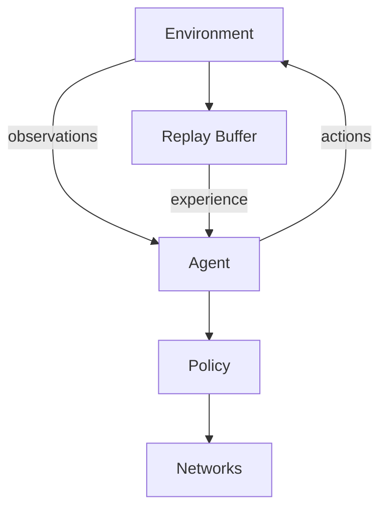
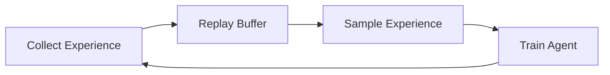

# TensorFlow Agents (TF-Agents) Tutorial

## Introduction

TensorFlow Agents (TF-Agents) is a powerful and scalable library for building reinforcement learning (RL) algorithms. Designed for researchers, developers, and practitioners, TF-Agents simplifies the creation, training, and deployment of RL agents within the TensorFlow ecosystem.

### What is TF-Agents?

TF-Agents provides modular and easy-to-use components for:

* **Agents**: Pre-built implementations of popular RL algorithms.
* **Environments**: Interfaces to interact with simulated or real-world tasks.
* **Policies**: Strategies used by agents to determine actions.
* **Networks**: Neural networks tailored for RL tasks.
* **Replay Buffers**: Efficient storage and retrieval of experiences.
* **Drivers**: Facilitate interaction between agents and environments.

### Why Use TF-Agents?

TF-Agents addresses common RL challenges with structured, flexible tools:

* **Modularity**: Easily extend or combine existing RL components.
* **Scalability**: Supports distributed training for handling large-scale problems.
* **Integration**: Seamless interoperability with TensorFlow 2.x and TensorFlow ecosystem.
* **Efficiency**: Optimized implementations for high-performance training and inference.



## Environment Setup

Proper environment setup is crucial for TF-Agents.

### Installation

Install TF-Agents via pip:

```bash
pip install tf-agents
```

### Dependencies

Ensure compatibility by installing TensorFlow and other necessary packages:

```bash
pip install tensorflow numpy pillow matplotlib
```

## Environments

RL environments define the tasks agents learn to solve.

### Types of Environments

* **Standard Python Environments (`py_environment`)**
* **TensorFlow Environments (`tf_environment`)**: Optimized for efficient execution.

### Environment Interface

Each environment must implement:

* `reset()`: Initializes and returns initial state.
* `step(action)`: Executes action and returns the next state, reward, and termination signal.

## Agents

TF-Agents provides implementations of several popular RL algorithms:

* **DQN (Deep Q-Network)**
* **DDPG (Deep Deterministic Policy Gradient)**
* **PPO (Proximal Policy Optimization)**
* **REINFORCE**
* **SAC (Soft Actor-Critic)**

### Building an Agent

Creating an agent involves:

1. Defining neural networks (actor and/or critic)
2. Specifying the optimizer
3. Configuring training parameters

## Policies

Policies dictate how agents choose actions based on observations:

* **Random Policy**: Select actions randomly
* **Greedy Policy**: Select actions maximizing expected return
* **Epsilon-Greedy Policy**: Balance exploration and exploitation

### Policy Usage

Policies can be saved, loaded, and deployed independently:

```python
from tf_agents.policies import policy_saver

saver = policy_saver.PolicySaver(policy)
saver.save('policy_dir')
```

## Replay Buffers

Replay buffers store experience tuples for training off-policy agents:

* **TFUniformReplayBuffer**: Uniform sampling
* **PrioritizedReplayBuffer**: Prioritized sampling for efficiency

### Buffer Operations

* Adding experiences (`buffer.add_batch()`)
* Sampling experiences (`buffer.get_next()`)

## Networks

TF-Agents offers customizable network architectures optimized for RL tasks:

* **Q-Networks**: For value-based methods
* **Actor/Critic Networks**: For policy-gradient methods
* **Custom Networks**: Define your own architecture using TensorFlow layers

## Training Loop

A typical TF-Agents training loop involves:

1. Collecting experience (data collection)
2. Storing experience (replay buffer)
3. Training the agent (gradient updates)



## Evaluation

Regular evaluation of your agent:

* Use separate evaluation environments
* Monitor metrics (e.g., average reward, episode length)

## Advanced Techniques

TF-Agents supports advanced methods to enhance agent performance:

* **Distributed Training**: Parallelize environment interactions and training updates
* **Multi-Agent Systems**: Develop and manage interactions between multiple agents
* **Meta-Learning**: Agents that rapidly adapt to new tasks

## Saving and Deployment

TF-Agents enables easy saving and deployment of trained agents:

### Saving Agents

```python
checkpoint = tf.train.Checkpoint(agent=agent)
checkpoint.save(file_prefix='checkpoint_dir/agent')
```

### Loading Agents

```python
checkpoint.restore(tf.train.latest_checkpoint('checkpoint_dir'))
```

## Conclusion

This tutorial provided an overview of TF-Agents' core capabilities, including:

* Environment creation
* Agent setup
* Policies and networks
* Replay buffers
* Training and evaluation loops

### Next Steps

Continue exploring TF-Agents:

* **Custom Environments**: Create your own RL tasks
* **Advanced Algorithms**: Experiment with SAC, PPO, and more
* **Hyperparameter Tuning**: Optimize agent performance through systematic experimentation
* **Production Deployment**: Integrate TF-Agents models into scalable applications

### Resources

* [Official Documentation](https://www.tensorflow.org/agents)
* [TF-Agents Tutorials](https://www.tensorflow.org/agents/tutorials/0_intro_rl)
