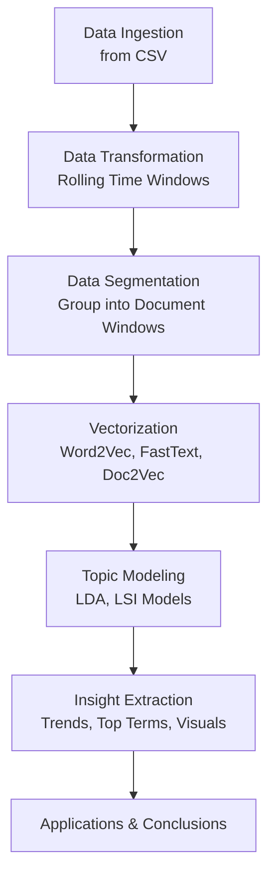

# Bitcoin Topic Modeling & Analysis Using Gensim

*By: Sagar Maheshwari*

This project walks through an end-to-end Natural Language Processing (NLP) pipeline applied to Bitcoin-related data. Using **Gensim**, it performs **vectorization**, **topic modeling**, and generates insights on evolving crypto narratives. The pipeline was implemented in a Jupyter Notebook and follows structured stages for reproducibility and extensibility.

---

## Full Pipeline Overview



---

## 1. Importing Modules

The notebook begins by importing core libraries:

- `pandas` for data manipulation
- `matplotlib` for plotting
- `gensim` for NLP and topic modeling
- Custom module `gensim_utils` containing helper functions

> Ensures modularity and code reuse for tasks like vectorization and model training.

---

## 2. Data Ingestion

- Data is pre-loaded using `pandas.read_csv()` from `data.csv`
- Originally intended to be fetched from **CoinGecko API**
- Content includes historical Bitcoin metadata and descriptions

```python
df = pd.read_csv("data.csv")
```

> This CSV acts as a simulated feed of real-time crypto news/data.

---

## 3. Data Transformation & Segmentation

### Data Transformation

- A custom `data_transform(df, window=5)` function is used to apply rolling windows
- Each segment includes multiple records grouped into one document

```python
df = data_transform(df, window=5)
```

> The rolling window groups temporal information into units for semantic analysis.

### Segmentation

- Documents are created using `segmentation(df)`
- These are fed into NLP models

```python
documents = segmentation(df)
```

> Each document simulates a weekly snapshot of crypto news.

---

## 4. Vectorization

### Word2Vec

- Learns distributed representations of words based on context
- Helps find semantically similar terms

```python
w2v_model = word2vec(documents)
```

### FastText

- Extends Word2Vec by considering character-level n-grams
- Handles out-of-vocabulary and rare crypto-specific terms

```python
ft_model = fasttext(documents)
```

### Doc2Vec

- Learns document-level embeddings
- Supports similarity comparison of different time windows

```python
tagged_docs = doc_tagger(documents)
d2v_model = do2vec(tagged_docs)
```

> These vector models allow semantic exploration of the dataset at word and document levels.

---

## 5. Topic Modeling

Topic modeling helps uncover **latent themes** in the crypto text data.

### LDA (Latent Dirichlet Allocation)

- Probabilistic model to extract topic distributions over documents
- Topics are distributions over words

```python
dictionary, corpus = corpus_creation(documents)
lda = lda_modeling(dictionary, corpus)
```

### LSI (Latent Semantic Indexing)

- Uses Singular Value Decomposition (SVD) to extract topics
- Captures deeper co-occurrence semantics

```python
lsi = lsi_modeling(dictionary, corpus)
```

> Both models reveal key terms and groupings that evolve over time.

---

## 6. Insight Extraction

### Examples of Analysis:

#### Bitcoin Price Over Time

```python
plt.plot(df["date"], df["price"])
plt.title("Bitcoin Price Over Time")
```

#### Topic-Term Charts

- Visualize top contributing terms for each topic
- Analyze how often each topic appears in a window

#### Similarity Analysis

- Compare vector similarity between windows
- Detect sudden topic shifts (e.g., bearish vs bullish sentiment)

---

## Business Applications

- **Investor Insight:** Predict shifts in sentiment
- **Market Signals:** Use topic drift as signal for decision-making

---

## Repository Structure

```
.
├── docker_data605_style       # Docker Folder
├── data.csv                   # Bitcoin time-series dataset
├── gensim_utils.py            # Modular functions for project
├── gensim.API.ipynb           # Native function usage
├── gensim.API.md              # Native function usage documentation
├── gensim.example.ipynb       # Main project
├── gensim.example.md          # Main project function usage & documentation
├── logfile.log                # Logging file
├── price_logfile.log          # Bitcoin Price Logging file
├── README.md                  # Project Description
├── requirements.txt           # Requirements
```

---

## Instructions to run project

```
> Open Terminal in parent folder

> cd docker_data605_style

> ./docker_build.sh

> ./docker_jupyter.sh -d <PATH TO PARENT FOLDER>

> Open http://localhost:8888/

> Select `data` folder from the directory

> Read the markdown files and run the notebooks to follow the examples
```

---

## Conclusion

This project combines NLP and unsupervised learning to model evolving themes in Bitcoin content. It demonstrates a robust and modular approach using:
- Gensim vectorizers (Word2Vec, FastText, Doc2Vec)
- LDA and LSI topic models
- Matplotlib visualizations

> This methodology is adaptable to other cryptocurrencies or financial domains.

---