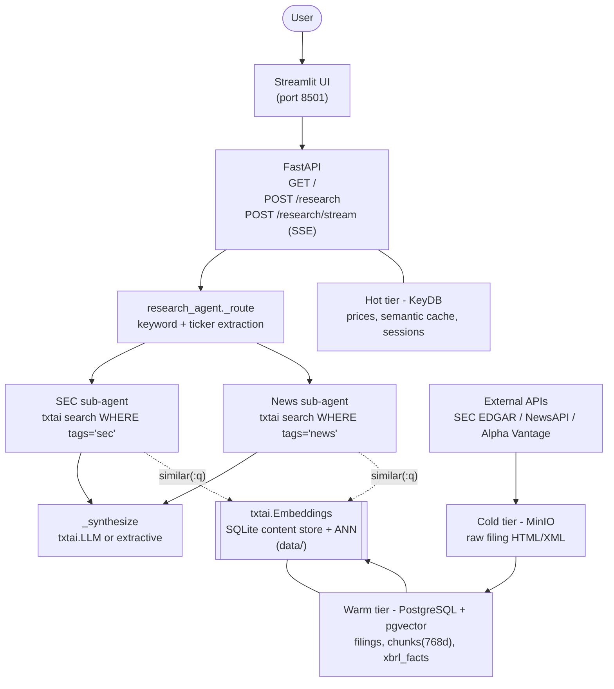

# txtai for Multi-Agentic Market Research

- A `txtai`-based market research platform that ingests SEC EDGAR filings
  and financial news, stores them across a four-tier storage architecture,
  and answers natural-language questions through an agentic retrieval
  pipeline served behind a FastAPI + Streamlit front end
- The whole search and agent layer is built on `txtai.Embeddings` plus an
  optional `txtai.LLM` synthesizer, so the project is essentially a worked
  example of how far you can take `txtai` as the search core of a real
  application
- Two ways to use it: a **Streamlit UI** for interactive Q&A, or **Jupyter
  notebooks** for the same pipeline cell-by-cell
- Project: `UmdTask430` for DATA605 Spring 2026

# System Architecture



- The diagram is the project at a glance: every read path resolves to a
  `txtai.Embeddings.search` call; every write path lands a chunk in the
  `txtai` index after going through the warm tier first

# Storage Architecture

- Four physical tiers, each chosen for a different access pattern. They are
  wired together by the factory helpers in `app/storage/__init__.py`
  (`get_keydb_client`, `get_postgres_client`, `get_minio_client`,
  `get_cache_manager`) — agent and collector code never instantiates a
  client directly

- **Hot tier - KeyDB (Redis-compatible)** at port `6379`
  - `prices:{ticker}` with 60s TTL: live snapshot from Alpha Vantage
  - `cache:{md5(query)}` with 3600s TTL: semantic-search response cache so
    repeated questions skip the embedding model and the SQL query
  - `session:{id}` with 1800s TTL: per-session agent memory used by the
    Streamlit chat
  - Why KeyDB and not Redis? KeyDB is a drop-in fork with multithreaded I/O
    and a more permissive license — same protocol, no code changes
  - Client: `app/storage/hot_storage/keydb_client.py`,
    cache wrapper: `app/storage/cache_manager.py`

- **Warm tier - PostgreSQL + pgvector** at port `5432`
  - `companies(cik, ticker, name, sector, …)` — entity table
  - `filings(id, ticker, filing_type, accession_number, filing_date, …)` —
    one row per SEC filing
  - `chunks(id, filing_id, chunk_index, text, section, embedding vector(768))`
    — chunked filing text with a `pgvector` 768-dim embedding column matching
    `sentence-transformers/all-mpnet-base-v2`
  - `document_metadata`, `xbrl_facts`, `articles` — auxiliary tables
  - Indexed with `ivfflat (embedding vector_cosine_ops) WITH (lists = 100)`
    so pgvector remains a viable analytics fallback to the txtai index
  - Schema is in [`sql/init.sql`](sql/init.sql) and is mounted into the
    Postgres container at boot
  - Client: `app/storage/warm_storage/pgvector_client.py`

- **Cold tier - MinIO (S3-compatible)** at ports `9000` (S3 API) / `9001`
  (console)
  - Buckets `sec/`, `news/`, `web/`, `social/` — each holds raw documents
    keyed by `{ticker}/{accession}/{filename}`
  - Append-only archive used to re-derive the warm tier and the search
    index without re-hitting upstream APIs (SEC EDGAR rate-limits at 10 RPS)
  - Client: `app/storage/cold_storage/minio_client.py`

- **Search tier - `txtai.Embeddings` on SQLite** at `data/`
  - The artifact this project is really about; described in its own section
    below

- Why four tiers, not one? Different data has different access patterns.
  Live prices need sub-millisecond reads (hot). Structured rows with
  metadata filters need SQL plus vectors (warm). Raw 5-MB HTML filings need
  cheap durable storage (cold). The semantic search index needs
  filter-aware ANN over the chunked text (search). Collapsing them into one
  store either bloats the hot path or pushes blob writes through the search
  index

# Search Index — `txtai` Deep-Dive

- The single source of truth for retrieval is one `txtai.Embeddings`
  instance configured in
  [`app/pipeline/embeddings.py`](app/pipeline/embeddings.py):

  ```python
  Embeddings(
      {
          "path": "sentence-transformers/all-mpnet-base-v2",
          "content": True,
          "chunksize": 100,
      }
  )
  ```

  - `path`: the encoder. 768-dim, matches the pgvector schema exactly so
    the same embeddings can live in both the txtai SQLite store and Postgres
  - `content=True`: the original text is stored alongside the vectors in
    SQLite, which is what gives us a SQL surface (see filter section below)
  - `chunksize=100`: streaming insert batch size; tuned to keep memory flat
    during `scripts.backfill_txtai_from_chunks --from-scratch`

- Persistence: the index lives at
  `data/{config.json,documents,embeddings,index.db}`
  - Written via `Embeddings.save(path)` after each upsert in `upsert(...)`
  - Read at process start via `Embeddings.load(path)` inside
    `create_embeddings()`
  - Singleton-cached via `get_embeddings()` so the API server, eval harness,
    and notebooks all share the same on-disk artifact and don't fight over
    SQLite locks

- Search shape — every query goes through one of two `txtai` calls:
  1. **Plain semantic top-k**:
     ```python
     embeddings.search(query, limit=k)
     ```
     used by simple smoke tests and the notebook
  2. **SQL-style filter** (the production path):
     ```python
     embeddings.search(
         "SELECT id, text, score, tags, data FROM txtai "
         "WHERE similar(:q) AND tags = :src LIMIT :k",
         parameters={"q": query, "src": "sec", "k": 5},
     )
     ```
     used by both sub-agents to scope a query to one source. The custom
     `data` column carries per-chunk metadata (ticker, filing_type,
     filing_date) that `txtai` does not surface by default — the wrapper in
     `app.pipeline.embeddings.search` lifts those fields back to the top
     level

- Why `txtai` over raw FAISS / LangChain RAG?
  - Bundles three things we need together: a SQLite-backed ANN index, a
    SQL-like filter language over the same store, and a unified `LLM`
    abstraction
  - We get `WHERE tags = 'sec'` semantics without standing up a separate
    Postgres-vector duplicate or hand-rolling a metadata layer over FAISS
  - The pgvector copy in the warm tier is for analytics and is not on the
    hot read path

- The full `txtai` surface used by the project is enumerated in
  [`notebooks/txtai.API.ipynb`](notebooks/txtai.API.ipynb), with each
  primitive isolated in one cell

# Agentic Infrastructure

- The pipeline is implemented in
  [`app/agents/research_agent.py`](app/agents/research_agent.py) as a small
  state machine. It exposes two entry points:
  - `run_research_sync(query) -> dict` — drains the pipeline into a single
    JSON-serialisable result; called by `POST /research`
  - `run_research(query) -> Iterator[ResearchEvent]` — streams one event
    per stage (`route` -> `retrieve` -> `synthesize` -> `done`); consumed
    by `POST /research/stream` (SSE) and the Streamlit UI

- **Stage 1 - Router** (`_route(query)`)
  - Deterministic keyword match against `_SEC_KEYWORDS` (10-K, 8-K, proxy,
    risk factor, …) and `_NEWS_KEYWORDS` (analyst, upgrade, sentiment,
    bearish, …)
  - Ticker extraction prefers cashtags (`$AAPL`), then known company names,
    then bare uppercase tokens with a small stop-list (`SEC`, `CEO`, …)
  - Output: `{"agents": ["sec","news"], "ticker": "AAPL", "reason": "..."}`
  - The router is intentionally LLM-free: it costs nothing, never hangs,
    and is fully testable. An LLM router can be plugged in without changing
    callers because the schema does not change

- **Stage 2 - Retrieval** — one sub-agent per source, each backed by `txtai`
  - `_run_sec_agent(query, ticker)` -> `embeddings.search(... WHERE tags='sec' ...)`
  - `_run_news_agent(query, ticker)` -> `embeddings.search(... WHERE tags='news' ...)`
  - Results are post-filtered by ticker (`_filter_by_ticker`) when the
    router extracted one, then truncated to `_MAX_CHUNKS_PER_AGENT = 5`
  - Each chunk carries the `metadata` dict the collector wrote so the
    citation step can render `[1] AAPL 10-K 2024-09-28`

- **Stage 3 - Synthesis**
  - If `LLM_BASE_URL` / `LLM_API_KEY` / `LLM_MODEL` are set, the synthesizer
    builds a numbered-citation prompt and calls `txtai.LLM(...)` (any
    OpenAI-compatible endpoint, including local Ollama)
  - Otherwise it falls back to `_synthesize_template`, an extractive
    composer that takes the first 1–2 sentences of the top three chunks
    and stitches them together with citation markers
  - The fallback exists so the demo runs end-to-end on a laptop with no
    paid API keys, and so citations always reference real text rather than
    a hallucination

- **Other agents** (`diligence`, `earnings`, `regulatory`, `orchestrator`)
  - Live alongside `research_agent` and back the dashboard pages in
    `app/ui/dashboard.py`
  - They share the same `get_embeddings()` singleton — adding a new
    domain agent is a matter of writing one `txtai`-search wrapper and
    plugging it into the router, no infra changes required

# Setup

- Clone and enter the project
  ```bash
  > git clone <repo-url>
  > cd class_project/data605/Spring2026/projects/UmdTask430_DATA605_Spring2026_txtai_for_market_research
  ```

- Configure secrets
  ```bash
  > cp .env.example .env
  ```
  - Edit `.env` to fill in:
    - `SEC_USER_AGENT`: real contact email (required by SEC EDGAR)
    - `NEWSAPI_KEY`, `ALPHAVANTAGE_API_KEY`: news collectors
    - `OPENAI_API_KEY`: txtai embedding backend
  - Optional, for LLM-backed answers: `LLM_BASE_URL`, `LLM_API_KEY`,
    `LLM_MODEL` (any OpenAI-compatible endpoint, including local Ollama).
    Without these the synthesizer falls back to an extractive template

- Bring up the storage tiers and the API
  ```bash
  > docker-compose build
  > docker-compose up -d
  ```
  - Starts: KeyDB (6379), PostgreSQL+pgvector (5432), MinIO (9000/9001),
    FastAPI (8000), Streamlit (8501)

- Seed the index with one ticker (one-time)
  ```bash
  > docker-compose exec api python -m scripts.run_sec_collector --ticker AAPL --limit 5
  > docker-compose exec api python -m scripts.run_earnings_collector --ticker AAPL --quarters 4
  > docker-compose exec api python -m scripts.backfill_txtai_from_chunks --from-scratch
  ```
  - The earnings step uses Alpha Vantage's `EARNINGS_CALL_TRANSCRIPT`
    endpoint on the same `ALPHAVANTAGE_API_KEY` already in `.env` — no
    extra key required, free tier caps at 25 requests/day

- Stop everything when done
  ```bash
  > docker-compose down
  ```

# Run the Streamlit UI

- The Docker stack already serves the UI — just open the browser
  - `http://localhost:8501`: Streamlit research chat
  - `http://localhost:8000/docs`: FastAPI OpenAPI docs

- Or run the UI from a local venv (Python 3.11+)
  ```bash
  > python -m venv .venv && source .venv/bin/activate
  > pip install -r requirements.txt
  > uvicorn app.api.server:app --host 127.0.0.1 --port 8000 &
  > streamlit run app/ui/research.py --server.port 8501
  ```

- Try it
  - Type a question like _"What are the key risks in Apple's latest 10-K?"_
  - The pipeline routes to the SEC and/or news sub-agents, retrieves the
    top-k chunks, and synthesizes a cited answer

# Run the Jupyter Notebooks

- Two paired notebooks live in `notebooks/`
  - `txtai.API.ipynb`: txtai library primitives in isolation (Embeddings,
    SQL filter, save/load, LLM)
  - `txtai.example.ipynb`: full end-to-end demo — ingest a ticker, query
    the index, run the agentic pipeline, stream events
  - Both notebooks open with a table of the `txtai` and project endpoints
    they exercise so the reader can navigate cell-by-cell

- Make sure the storage tiers are up first
  ```bash
  > docker-compose up -d keydb postgres minio
  ```

- Launch Jupyter from the project root (so `app.*` imports resolve)
  ```bash
  > source .venv/bin/activate
  > pip install jupyterlab jupytext
  > jupyter lab notebooks/
  ```

- Open `txtai.example.ipynb` and run the cells top to bottom
  - Cell 1: load `.env` and configure logging
  - Cell 2: ingest a small batch of AAPL filings
  - Cell 3: spot-check the txtai index
  - Cell 4: call `run_research_sync(query)` — the same entry point used
    by FastAPI
  - Cell 5: stream events with `run_research(query)` — the same generator
    used by the SSE endpoint and the Streamlit UI

- Notebooks are paired with `*.py` files via jupytext, so edits to either
  format stay in sync

# API Endpoints

- `GET /`: health probe and capability summary

- `POST /research`: synchronous, returns the full result
  ```json
  {
    "query": "Apple revenue trend",
    "route": {"agents": ["sec","news"], "ticker": "AAPL"},
    "answer": "...",
    "retrievals": [...],
    "used_llm": false,
    "chunk_count": 8
  }
  ```

- `POST /research/stream`: Server-Sent Events, one per pipeline stage
  (`route` -> `retrieve` -> `synthesize` -> `done`)

# Project Layout

- `app/`: application code
  - `agents/research_agent.py`: the agentic pipeline (router -> sub-agents
    -> synthesizer)
  - `agents/{diligence,earnings,regulatory,orchestrator}.py`: domain agents
    used by the dashboard
  - `api/server.py`: FastAPI server
  - `collectors/`: SEC and news collectors
  - `pipeline/{ingest,embeddings}.py`: chunk and index documents into
    `txtai.Embeddings`
  - `storage/`: KeyDB / PostgreSQL+pgvector / MinIO clients
  - `ui/`: Streamlit pages — `research.py`, `dashboard.py`, `chat.py`

- `scripts/`: one-shot CLIs (`run_sec_collector`, `run_sec_bulk`,
  `backfill_txtai_from_chunks`, `eval_research`, `check_storage_status`)

- `notebooks/`: paired Jupyter / jupytext notebooks
- `sql/init.sql`: PostgreSQL schema
- `data/`: persisted txtai index (gitignored, regenerable)
- `docs/architecture.excalidraw`: editable architecture diagram source
- `RUN_INSTRUCTIONS.md`: deep operational guide and troubleshooting

# Tests and Eval

- Unit tests
  ```bash
  > docker-compose exec api python -m pytest app/agents/test app/pipeline/test -v
  ```

- End-to-end smoke (ingest + one query)
  ```bash
  > ./scripts/smoke_test.sh
  ```

- Latency and retrieval metrics
  ```bash
  > docker-compose exec api python -m scripts.eval_research --warmup
  > docker-compose exec api python -m scripts.eval_research --repeats 5 --json logs/eval.json
  ```
- Reports per-stage p50/p95/p99 latency, routing accuracy on a benchmark
  set, and retrieval health (chunks/query, chunk-empty rate)

# Troubleshooting

- See `RUN_INSTRUCTIONS.md` for SEC rate limits, missing OpenAI key,
  pgvector extension issues, and other common problems
