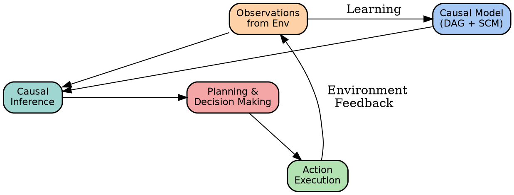

::: columns
:::: {.column width=15%}

::::
:::: {.column width=75%}

\vspace{0.4cm}
\begingroup \large
MSML610: Advanced Machine Learning
\endgroup
::::
:::

\vspace{1cm}

\begingroup \Large
**$$\text{\blue{Lesson 15.1: Causal Reasoning Agents}}$$**
\endgroup
\vspace{1cm}

::: columns
:::: {.column width=65%}
**Instructor**: Dr. GP Saggese, [gsaggese@umd.edu](gsaggese@umd.edu)

**References**:

- Pearl, J.: _"The Book of Why"_ (2018)

- Pearl, J. & Mackenzie, D.: _"The Seven Pillars of Causal Reasoning"_ (2018)

- Bottou, L. et al.: _"From Machine Learning to Machine Reasoning"_ (2013)

::::
:::: {.column width=40%}

{ height=25% }

::::
:::

# ##############################################################################
# LLMs and Causal Reasoning
# ##############################################################################

## ##############################################################################
## LLMs: Strengths and Limitations
## ##############################################################################

* LLMs: Where They Excel

- Large Language Models excel at **pattern matching at scale**
  - Trained on massive text corpora to capture statistical regularities
  - Exceptional for prediction: $\Pr(\text{next token} | \text{history})$
  - Strong performance on language understanding, summarization, generation
  - World knowledge encoded through pretraining

- **Example**: Predicting the next word in _"The capital of France is ___"_ → easy

- Strengths:
  - Massive scale enables capturing complex statistical patterns
  - Transfer learning from pretraining to diverse downstream tasks
  - Few-shot learning through in-context examples

* LLMs: Critical Limitations

- LLMs fundamentally struggle with **explicit causal reasoning**
  - Pattern matching cannot distinguish correlation from causation
  - No built-in mechanism to reason about counterfactuals (what-if scenarios)
  - Cannot reliably predict interventions vs. observational data
  - Confounding variables not explicitly handled

- **Example**: Given _"Ice cream sales and drowning deaths both spike in summer"_, 
  an LLM may infer a causal link rather than recognizing temperature as a confounder

- Critical gaps:
  - **Intervention reasoning**: _"What if we increase X? How does Y change?"_
  - **Counterfactual reasoning**: _"What would have happened if the past were different?"_
  - **Causal discovery**: Learning causal structure from data
  - **Robustness to distribution shift**: Generalizing under causal changes

## ##############################################################################
## Pattern-Based Reasoning vs. Causal Reasoning
## ##############################################################################

* Pattern Recognition and Its Limits

- **Pattern-based reasoning**: Learn $f: X \to Y$ from observed associations
  - Extract statistical regularities: what features predict outcomes
  - No understanding of _why_ these associations exist
  - Works perfectly in stationary environments

- **Causal reasoning**: Learn mechanisms—the underlying data-generating process
  - Understand _why_ X causes Y through explicit models
  - Transfer knowledge to new interventions and environments
  - Explain and debug failures

::: columns
:::: {.column width=50%}
**Pattern Matching**

- Pros
  - Scales with data quantity
  - Captures complex associations
  - Practical for stable settings

- Cons
  - Breaks under distribution shift
  - Cannot reason about interventions
  - Vulnerable to confounding
  - Opaque causal mechanisms
::::
:::: {.column width=50%}
**Causal Reasoning**

- Pros
  - Robust to distribution shift
  - Generalizes to new interventions
  - Interpretable mechanisms
  - Handles confounding

- Cons
  - Requires causal model specification
  - Sample complexity for learning
  - Stronger assumptions
::::
:::

* Robustness: When Pattern Matching Fails

- **Distribution shift**: When test data differs from training data
  - Spurious correlations learned during training don't hold in deployment
  - LLMs confidently make wrong predictions due to pattern reliance

- **Example**: Medical diagnosis
  - Training data: Hospital A diagnoses condition X using test Y
  - Hospital A had a faulty calibration: test Y strongly predicts diagnosis but not disease
  - Pattern-based model learns: high Y $\to$ condition X
  - New hospital with correct calibration: model fails spectacularly

- **Intervention robustness**: Actions that change the world
  - Feedback loops: recommending product A increases demand, changing patterns
  - Reward hacking: optimizing a proxy metric instead of true objective
  - Policy change: changing business rules invalidates historical patterns

- **Example**: Content recommendation
  - Pattern: users who engage with trending topics get recommended more trending
  - Intervention: change algorithm to reduce trending bias
  - Unintended consequence: recommendation patterns shift, breaking past associations

# ##############################################################################
# Enhancing LLM Reasoning with Causality
# ##############################################################################

## ##############################################################################
## Chain-of-Thought Prompting for Causal Reasoning
## ##############################################################################

* Chain-of-Thought Prompting: Structured Reasoning

- **Chain-of-thought (CoT)** encourages the model to break down complex reasoning
  - Instead of: _"Q: Does X cause Y?"_ → Direct answer
  - CoT: _"Let me think step by step..."_ → Intermediate reasoning steps

- How it helps with causal reasoning:
  - Forces explicit consideration of mechanisms
  - Enables backtracking and correction of errors
  - Makes assumptions and reasoning transparent
  - Allows verification of causal logic

- **Example**: CoT for causal inference
  ```
  Q: "If we increase advertising budget, will sales increase?"
  
  CoT: "Let me think about this:
  1. Advertising increases brand awareness (mechanism)
  2. Brand awareness increases purchase intent (mechanism)
  3. Purchase intent leads to sales (mechanism)
  4. But we should also check for confounders...
     (Are we only increasing budget in growing markets?)
  5. And feedback loops: Does higher sales justify more spending?"
  ```

- Limitations of plain CoT:
  - Still pattern-based, not mechanistic
  - Can rationalize incorrect causal claims
  - Doesn't ground reasoning in data or formal causal models

* Causal Prompting Frameworks

- **Structured causal prompts** guide explicit causal reasoning
  - What are the variables involved?
  - What are the causal relationships? (DAG or causal graph)
  - What are the confounders?
  - What are the identifying assumptions?

- **Example**: Structured causal prompt template
  ```
  Problem: [description]
  
  Variables:
  - Treatment: [what are we intervening on?]
  - Outcome: [what do we care about?]
  - Confounders: [what common causes exist?]
  
  Causal structure: [draw or describe relationships]
  
  Identification strategy: [how do we isolate the causal effect?]
    - Assumption 1: [e.g., no unmeasured confounding]
    - Assumption 2: [e.g., positivity/overlap]
    - Assumption 3: [e.g., no feedback loops]
  
  Conclusion: [the causal effect is...]
  ```

## ##############################################################################
## Integrating Causal and Probabilistic Frameworks
## ##############################################################################

* Connecting LLMs to Formal Causal Models

- **Gap between LLMs and causal inference**:
  - LLMs: black-box functions trained on text
  - Causal inference: formal models with explicit assumptions and identifiability

- **Integration strategy**: Use LLM for reasoning, ground in causal frameworks
  - LLM as semantic engine: interpret domain knowledge, generate hypotheses
  - Causal model as reasoning engine: formal inference, constraint checking
  - Probabilistic framework as uncertainty quantifier: propagate uncertainty

- **Example**: Causal reasoning for policy evaluation
  - LLM input: _"We're considering a new hiring policy. What are potential causal effects?"_
  - LLM output: Proposes causal graph with treatment (policy), outcome (hiring equity)
  - Causal inference: Estimates causal effects using observed data under identifying assumptions
  - Uncertainty quantification: Confidence intervals accounting for assumptions

* Bayesian Networks and Causal DAGs

- **Causal DAG** (Directed Acyclic Graph): represents causal relationships
  - Nodes: variables (treatments, outcomes, confounders, mediators)
  - Directed edges: causal influences
  - Absence of edge: no direct causal effect

- **Example**: Educational intervention causal DAG
  ```graphviz
  digraph CausalDAG {
      splines=true;
      nodesep=1.0;
      ranksep=0.75;
      rankdir=LR;

      node [shape=box, style="rounded,filled", fontname="Helvetica", fontsize=11, penwidth=1.4];

      SES [label="Socioeconomic\nStatus", fillcolor="#FFD1A6"];
      SchoolQuality [label="School\nQuality", fillcolor="#FFD1A6"];
      Tutorial [label="Tutorial\nProgram", fillcolor="#F4A6A6"];
      StudentMotiv [label="Student\nMotivation", fillcolor="#B2E2B2"];
      TestScore [label="Test\nScore", fillcolor="#A6C8F4"];

      SES -> SchoolQuality;
      SES -> StudentMotiv;
      SchoolQuality -> Tutorial [label="  Selection"];
      StudentMotiv -> Tutorial;
      Tutorial -> TestScore;
      StudentMotiv -> TestScore;
      SchoolQuality -> TestScore;

      { rank=same; SES; SchoolQuality; }
  }
  ```

- Key concepts:
  - **Confounder**: variable with arrows to both treatment and outcome
  - **Mediator**: variable on causal path from treatment to outcome
  - **Collider**: variable with incoming arrows from multiple causes

* Tool Use: Integrating Causal Inference into LLM Workflows

- **Tool use paradigm**: LLM as reasoner, external tools as executors
  - LLM decides what reasoning to perform
  - Tools execute causal inference, simulation, or statistical analysis
  - Results feed back into LLM for further reasoning

- **Available tools for causal reasoning**:
  - Causal discovery tools: learn causal structure from data
  - Causal effect estimation: ATE (Average Treatment Effect), heterogeneous effects
  - Counterfactual simulation: what-if predictions under assumed causal model
  - Sensitivity analysis: robustness to assumption violations

- **Example**: LLM-guided causal analysis workflow
  ```
  1. LLM reads domain knowledge and data description
  2. LLM proposes causal DAG
  3. LLM selects identification strategy (e.g., matching, instrumental variables)
  4. Tool executes: estimates causal effect from data
  5. Tool output: point estimate, confidence interval, sensitivity checks
  6. LLM interprets: what does this estimate tell us about the intervention?
  7. LLM explains: what are the key assumptions and their plausibility?
  ```

- Benefits:
  - Explicit reasoning is interpretable and verifiable
  - Formal guarantees and assumptions are transparent
  - Tool outputs ground LLM claims in data
  - Failures are diagnostic rather than opaque

# ##############################################################################
# Causal Agent Architectures
# ##############################################################################

## ##############################################################################
## Agents with Explicit Causal Models
## ##############################################################################

* Causal Reasoning Agents: Design

- **Goal**: Build agents that can reason causally about the world and act robustly
  - Maintain an explicit causal model of the environment
  - Use causal inference to evaluate proposed actions
  - Update causal beliefs as new evidence arrives
  - Adapt behavior when causal assumptions are violated

- **Agent components**:
  - **Causal model**: formal representation of how actions affect outcomes
  - **Observational data**: what the agent observes in the environment
  - **Inference engine**: computes causal effects and counterfactuals
  - **Planning module**: selects actions to achieve goals
  - **Learning module**: updates causal model from experience

* Causal Agent Architecture (1/2)



* Causal Agent Architecture (2/2)

- **Causal model** represents assumptions about mechanisms
  - Structural Causal Model (SCM): $Y := f_Y(PA_Y, U_Y)$ for each variable
  - Parameters: effect sizes, functional forms
  - Uncertainty: distributions over possible models or parameters

- **Inference module** answers causal queries
  - $\Pr(Y | do(X = x))$ : effect of intervention X on Y
  - $Y_{x'} = f_Y(x', U_Y)$ : counterfactual outcomes
  - Effect heterogeneity: how effects differ across populations

- **Planning module** optimizes over actions
  - Evaluate action $a$ by computing: $\EE[U | do(a)]$ where U is utility
  - Consider robustness: What if my causal model is wrong?
  - Explore vs. exploit: Balance testing assumptions vs. maximizing reward

- **Learning module** updates the model
  - Fit parameters to observed data
  - Test causal assumptions (Markov, faithfulness)
  - Detect model misspecification

## ##############################################################################
## Integrating Causal Inference into Planning
## ##############################################################################

* Planning Under Causal Uncertainty

- **Core challenge**: Agent's causal model may be wrong
  - True world has causal structure agent doesn't know
  - Agent must choose actions using possibly incorrect model
  - Need policies that work well even under model misspecification

- **Robust planning approaches**:
  - **Conservatism**: prefer actions with robust effects across models
  - **Exploration**: test uncertain causal assumptions through action
  - **Adaptation**: update causal model as new evidence arrives
  - **Sensitivity analysis**: quantify robustness to assumption violations

* Markov Decision Processes (MDPs) with Causal Structure

- **Standard MDP**: $M = \langle \mathcal{S}, \mathcal{A}, P, R \rangle$
  - State space, action space, transition dynamics, reward function
  - Dynamics may embed causal structure implicitly

- **Causal MDP**: explicitly model causal mechanisms
  - Variables $X = (X_1, \ldots, X_n)$ that evolve over time
  - Actions intervene on specific variables
  - Rewards depend on achievable states
  - Transition: $X_t' := f(X_t, A_t, \varepsilon_t)$ (causal functions)

- **Example**: Medical treatment sequential decision
  - Variables: $(Patient\_Severity, Treatment, Patient\_Outcome)$
  - Action: choose treatment type
  - Outcome: health improvement (depends on severity + treatment)
  - Causal structure: Treatment has different effects for different severity levels

* Value Functions and Causal Effects

- **Standard RL**: value function $V(s) = \EE[\sum_t \gamma^t r_t | s_0 = s]$

- **Causal RL**: value function accounts for causal effects
  - $V(s) = \EE[R | do(A = a^*), S = s]$ where $a^*$ is optimal action
  - Policies must account for how actions change world state
  - Offline learning: learn from historical data with unknown confounding

- **Q-function with causal effects**:
  $$Q(s, a) = \Pr(\text{Reward} | do(A = a), S = s)$$

  - Standard RL assumes: $\Pr(\text{next state} | a, s) = P(s' | a, s)$ (known transition)
  - Causal RL must infer: Does $a$ actually cause $s'$, or is $s$ a confounder?

* Policy Robustness: Worst-Case Planning

- **Robust planning**: find policy that performs well under model uncertainty
  - Let $\Theta$ be set of possible causal models
  - Robust value: $V_{\text{robust}}(s) = \max_a \min_{\theta \in \Theta} Q_\theta(s, a)$
  - Guarantees: policy works even if true model is worst-case

- **Uncertainty sets**:
  - Parameter uncertainty: effect sizes could be different
  - Structural uncertainty: causal graph might be different
  - Identification uncertainty: causal effects may be unidentified

- **Example**: Drug dosage decision under causal uncertainty
  - Low dose vs. high dose: which is safer?
  - Risk: high dose might have nonlinear side effects we haven't modeled
  - Robust policy: start with conservative low dose, observe response, adapt

# ##############################################################################
# Trustworthy AI Through Causality
# ##############################################################################

## ##############################################################################
## Transparency and Interpretability
## ##############################################################################

* Making Reasoning Explicit and Interpretable

- **Opacity problem**: Black-box AI systems are hard to trust and debug
  - Neural networks: uninterpretable high-dimensional feature spaces
  - LLMs: billions of parameters, unclear what's being reasoned
  - Consequences: hard to catch failures before deployment

- **Causal transparency**: explicit mechanisms make reasoning visible
  - Causal graph: clear representation of assumed relationships
  - Causal effects: quantify impact of each decision
  - Counterfactuals: explain decisions by contrasting what-ifs

- **Example**: Loan approval decision
  - Black-box: Model says _"Loan denied"_ (opaque)
  - Causal: Model says _"Loan denied because credit score drops effect on default rate by 15%, controlling for income and employment"_ (transparent)

* Causal Explanations for Decisions

- **Contrastive explanations**: Why A rather than B?
  - Not just why A happened, but what would need to change for B instead

- **Recourse**: How can someone affected by decision change the outcome?
  - Requires causal model: what actions lead to decision reversal?
  - Fairness concern: recourse may be impossible if requirements are correlated with protected attributes

- **Example**: Hiring decision
  - Denial reason (non-causal): _"You have fewer years of experience"_
  - Causal recourse: _"Adding 2 years of experience would likely change decision, but experience is correlated with age, raising fairness concerns"_

- **Feature importance from causality**:
  - Not correlation (feature co-varies with outcome) $\to$ confounding
  - True causal importance: direct effect on outcome under intervention

## ##############################################################################
## Robustness Through Causal Constraints
## ##############################################################################

* Finding Brittle Decisions Through Causal Analysis

- **Brittleness**: decisions that break under small perturbations
  - Spurious correlations learned by pattern-based models
  - Vulnerable to adversarial examples or distribution shift
  - Often due to unrecognized confounding in training data

- **Causal analysis uncovers brittleness**:
  - Compare learned patterns to causal ground truth
  - Identify decisions driven by spurious correlations
  - Test robustness under causal interventions

- **Example**: Recidivism prediction (criminal justice)
  - Pattern learned: arrest history strongly predicts re-offense
  - Causal truth: arrest history may be proxy for policing patterns, not criminality
  - Brittleness: model fails if policing patterns change (different neighborhood, different police policy)

* Causal Constraints on Model Predictions

- **Constraint approach**: restrict model to predictions consistent with causal knowledge
  - Hard constraints: must enforce causal assumptions (e.g., no effect if no mechanism)
  - Soft constraints: penalize predictions violating causal knowledge
  - Helps prevent spurious patterns from being learned

- **Monotonicity constraints**: if treatment increases, outcome can't decrease
  - E.g., more education should not decrease earnings
  - Helps prevent absurd predictions

- **Structural constraints**: encode causal DAG
  - Variable A cannot affect B if no directed path A $\to$ B
  - Reduces model flexibility but increases robustness

* Adversarial Robustness with Causal Models

- **Adversarial examples**: small input perturbations that fool models
  - Pattern-based models: vulnerable because they rely on associations
  - Causal models: more robust because mechanisms are explicit

- **Causal adversarial robustness**:
  - Only perturbations along causal edges can meaningfully affect outcome
  - Confounded perturbations (correlating with true causes) are benign
  - Helps distinguish real threats from spurious ones

## ##############################################################################
## Fairness Through Causal Reasoning
## ##############################################################################

* Causal Approaches to Bias and Discrimination

- **Fairness challenge**: what does it mean to treat people fairly?
  - Statistical parity: outcomes equally distributed across groups
  - Causal fairness: no discrimination through causal mechanisms

- **Three sources of group differences**:
  1. **Direct discrimination**: causal effect of protected attribute (illegal)
  2. **Indirect discrimination**: protected attribute causes unprotected predictor which causes outcome
  3. **Structural discrimination**: system perpetuates historical inequities

- **Example**: Hiring fairness
  - Protected: gender
  - Potential discriminator: field of study (may be correlated with gender)
  - Question: can we use field of study if it correlates with gender?
  - Causal answer: depends on whether field of study is a barrier to entry or just different productivity

* Causal Definitions of Fairness

- **Counterfactual fairness** (Kusner et al.):
  - Decisions would be same if protected attribute were different
  - Requires model of how protected attribute influences other variables
  - Strong requirement: may be too restrictive in practice

- **Path-specific effects** (decompositional approach):
  - Decompose total effect into direct (discriminatory) and indirect
  - Allow indirect effects if not caused by discrimination
  - More nuanced: separates correlation from causation

- **Example**: Gender wage gap
  - Total gap: women earn 20% less
  - Causal decomposition:
    - Direct effect: 5% unexplained by occupation/experience (discrimination)
    - Indirect effect: 15% via occupational segregation (structural inequity)

* Causal Constraints for Fair Models

- **Fairness through constraints**:
  - Control for mediators: adjust for variables on causal path
  - Balance confounders: ensure treatment and control groups similar on confounders
  - Remove selection bias: correct for how samples were selected

- **Example**: College admissions fairness
  - Constraint: admission decision should not depend on applicant's gender
  - But gender may have influenced GPA (indirect path)
  - Solution: directly adjust for GPA (mediator) if you believe it's fair predictor
  - Or: use causal effect of gender on success (counterfactual score) instead of observed score

## ##############################################################################
## Safety Through Causal Reasoning
## ##############################################################################

* Causal Constraints on Harmful Outcomes

- **Safety challenge**: prevent AI systems from causing harm
  - Specification problem: hard to enumerate all bad outcomes
  - Unintended consequences: system optimizes for stated goal but harms something else
  - Feedback loops: system's actions change the world in unexpected ways

- **Causal approach**: model how system's actions affect harms
  - Identify causal paths to bad outcomes
  - Prohibit or mitigate interventions on these paths
  - Monitor for emergence of new causal pathways

- **Example**: Content recommendation safety
  - Harm: radicalization through information bubbles
  - Causal path: algorithm optimizes for engagement $\to$ recommends extreme content $\to$ radicalizes users
  - Safeguard: constraint that algorithm cannot increase polarization score

* Transparency for Trustworthy Autonomy

- **Autonomous systems and trust**:
  - Humans must understand and trust system decisions
  - Black-box autonomy is high-risk (medical decisions, criminal justice, military)
  - Causal reasoning provides transparency

- **Causal explanations for actions**:
  - Why did agent take action A?
  - What causal model led to this decision?
  - What would have to change for different action?
  - What assumptions could be wrong?

- **Human-in-the-loop with causality**:
  - Agent proposes action with causal justification
  - Human reviews: are assumptions correct? Are harms mitigated?
  - Human can override: here's a causal reason why that's wrong
  - Iterative refinement of agent's causal model

* Causal Monitoring and Adaptation

- **Deployment robustness**: system must work even when deployed
  - Distribution shift: world changes from training environment
  - Causal monitoring: detect when causal assumptions are violated
  - Adapt: update model or trigger human oversight

- **Causal anomaly detection**:
  - Expected relationship: $Y = f(X) + \varepsilon$
  - Observe: $Y$ deviates from expectation
  - Diagnosis: Is it random noise, confounding, or violation of causal mechanism?
  - Response: retrain, debug, or alert human

- **Example**: Medical treatment effectiveness monitoring
  - Deployed model: drug X increases recovery by 30%
  - Observation: new patient cohort shows only 10% improvement
  - Diagnosis: new cohort is older, has comorbidities
  - Causal monitoring: heterogeneous effect analysis reveals drug less effective for elderly
  - Adaptation: patient stratification in treatment recommendations

# ##############################################################################
# Summary and Key Takeaways
# ##############################################################################

* Causal Reasoning for Trustworthy AI

- **Core insight**: LLMs excel at pattern matching but fail at causal reasoning
  - Pattern-based decisions break under distribution shift and interventions
  - Causal models provide robustness through explicit mechanisms

- **Integration strategy**: combine LLM strengths with causal frameworks
  - LLM reasoning + causal tools + explicit models = trustworthy AI
  - Tool use enables grounding claims in data and formal inference

- **Causal agent architectures**:
  - Explicit causal models in reasoning and planning
  - Planning under uncertainty with robustness
  - Adaptive learning from experience

- **Four pillars of trustworthy AI through causality**:
  1. **Transparency**: explicit mechanisms are interpretable
  2. **Robustness**: causal constraints prevent brittle decisions
  3. **Fairness**: causal decomposition separates discrimination from structure
  4. **Safety**: causal monitoring and constraints prevent harms

* The Path Forward

- Building trustworthy autonomous agents requires:
  - Making causal assumptions explicit
  - Testing these assumptions with data
  - Integrating formal inference into decision-making
  - Monitoring deployed systems for causal violations

- Open challenges:
  - Learning causal models from limited data
  - Reasoning under causal uncertainty
  - Balancing transparency with complexity
  - Scaling causal inference to high-dimensional problems

- Key message: _"AI systems that reason causally are fundamentally more trustworthy, transparent, and robust than pure pattern-matching approaches."_
