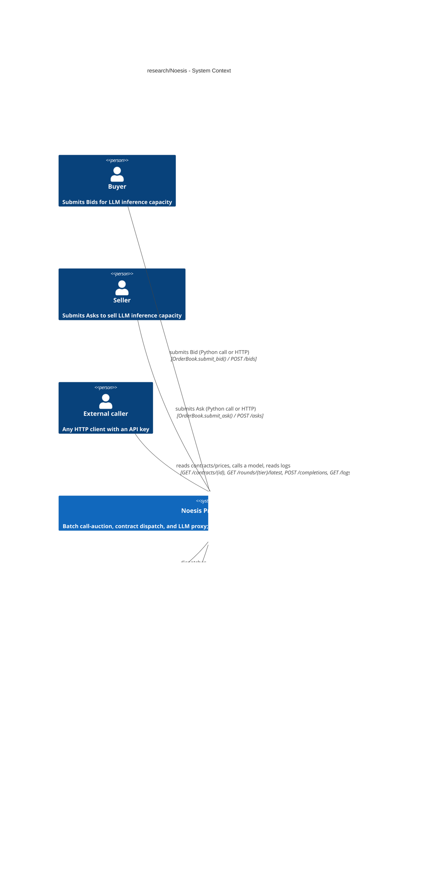
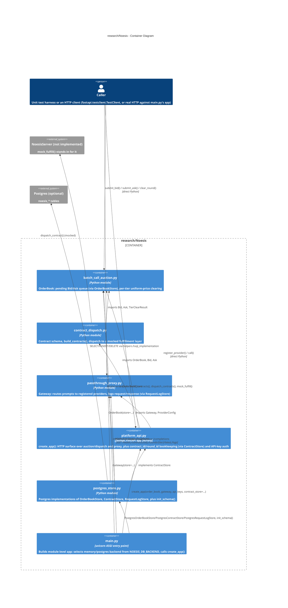

# Rules
- This document describe the code as it is, without making reference to intermediate
  PRs and how the code evolved
- It refers to:
  - The \Noesis{} protocol overview in `papers/Noesis/*.tex`
  - The implementation plan `research/Noesis/plan.Noesis.md`

# Overview
- `research/Noesis` contains:
  - `NoesisMarket`
  - `NoesisServer`
  - a thin HTTP surface over both (`NoesisPlatform` section)
  - a runnable deployment around that HTTP surface

- The HTTP surface
  - `batch_call_auction.py` and `contract_dispatch.py`: a call-auction that matches
    buyer/seller orders for LLM inference capacity and dispatches cleared contracts
    to a fulfillment layer
  - `passthrough_proxy.py`: a minimal LLM API gateway that routes prompts to
    registered providers and logs every request/response pair
  - `platform_api.py`: a `fastapi.FastAPI` app factory (`create_app()`) that wraps
    both of the above behind HTTP endpoints, so an external caller can reach them
    without importing the Python modules directly
  - `postgres_store.py`: Postgres-backed implementations of the storage interfaces
    the three modules above define, so their in-memory state can be swapped for a
    persistent backend
  - `main.py`: process entry point that builds a module-level `app`, wired to either
    the in-memory or the Postgres backend depending on env vars, meant to be run via
    `uvicorn research.Noesis.main:app`
  - `devops/`: Docker Compose deployment of `main.py`'s `app` plus a Postgres sidecar
    for local dev
- Problem solved: implements a two-sided market for LLM inference capacity
  (capability tier, latency, reliability, price), a mock fulfillment/dispatch layer
  for matched contracts, and a logging/proxy layer for LLM calls, reachable over HTTP
  by a caller outside the Python process, with an optional persistent (Postgres)
  backend and a containerized deployment path
- Key design decisions visible from the code:
  - Every stateful store (`OrderBook`'s pending orders, `platform_api`'s
    contract/round log, `Gateway`'s request log) sits behind a pluggable `abc.ABC`
    (`OrderBookStore`, `ContractStore`, `RequestLogStore`), each with an in-memory
    default and a `postgres_store.py` implementation; the three business-logic
    modules never import `postgres_store.py`, so a caller that never selects the
    Postgres backend never picks up a `psycopg2` dependency
  - Every side effect that would be non-deterministic in a test (fulfillment outcome,
    provider network call, wall-clock time) is injected as a callable
    (`FulfillmentFunc`, `ProviderCallFunc`, `clock_func`, `rng`), so tests control it
    directly
  - Dataclasses with hand-written `__init__` methods encode the schema and validate
    every field with `hdbg.dassert_*` at construction time
  - `platform_api.py` adds no new validation logic: it reuses the same
    `hdbg.dassert_*` checks already in the three lower modules, catching the
    resulting `AssertionError` once at the app level and returning an HTTP 400
  - `main.py` selects the storage backend once, at import time, from
    `NOESIS_DB_BACKEND` (`"memory"` default or `"postgres"`); every other module is
    unaware which backend is active
- Who uses it: the unit test suites under `research/Noesis/test/`; an HTTP client
  wrapped in a `fastapi.testclient.TestClient` in tests, or a real HTTP client
  against `main.py`'s `app` when run via `uvicorn` or the
  `devops/docker_run/run_docker_noesis.sh` container
- The two systems are not wired together at the business-logic level:
  `contract_dispatch.mock_fulfill()` stands in for `NoesisServer`, and
  `passthrough_proxy.Gateway` has no caller from the market side. `platform_api.py`
  unifies them only as two independent route groups on one HTTP app, not as a shared
  dependency graph

# Architecture (C4 Model)

## C1 (Context)
- Describes how the Noesis prototype fits with its (simulated) users and the external
  systems it integrates with, some of which are stubbed or optional


- The buyer/seller side is a test harness or an HTTP caller of
  `POST /bids`/`POST /asks`; either way there is no user-facing UI
- `External caller` is any HTTP client (`fastapi.testclient.TestClient` in tests, a
  real client against `main.py`'s `app` otherwise) that reaches `NoesisMarket` and
  `NoesisServer` without importing the Python modules, gated by an `X-API-Key` header
  on the write endpoints
- `NoesisServer` is the real fulfillment layer described in `plan.Noesis.md`'s
  `NoesisServer` section; `contract_dispatch.mock_fulfill()` is its placeholder in
  this codebase
- `LLM Providers` are the real backends `passthrough_proxy.Gateway` calls through
  `ProviderConfig.call_func`; tests inject a stand-in `ProviderCallFunc` instead of a
  network call
- `Postgres` is entirely optional: `main.py` only connects to it, and
  `postgres_store.py` is only imported, when `NOESIS_DB_BACKEND=postgres`; the
  default `NOESIS_DB_BACKEND=memory` path never touches this system

## C2 (Container)
- Describes the six modules inside `research/Noesis` and the dependencies between
  them


- `contract_dispatch.py` is the only lower-layer module with an internal dependency
  on another lower-layer module: it imports `batch_call_auction` (`Bid`, `Ask`,
  `TierClearResult`) to build `Contract`s from a cleared round
- `passthrough_proxy.py` has no import relationship with `batch_call_auction.py`
  /`contract_dispatch.py`; it is a standalone container with no call path to or from
  the market side
- `platform_api.py` imports all three lower modules but adds no import between them:
  it is a fourth, higher container, not a rewire of the three existing ones (see the
  `## Weaknesses and Assumptions` entry on this)
- `postgres_store.py` is the only module that imports all three of
  `batch_call_auction.py`/`contract_dispatch.py`/`platform_api.py` (to subclass their
  `*Store` `abc.ABC`s and reference their dataclasses); none of those three import it
  back, so there is no import cycle and no transitive `psycopg2` dependency for a
  caller that never selects the Postgres backend
- `main.py` is the only module that imports `postgres_store.py`, and only inside its
  `NOESIS_DB_BACKEND == "postgres"` branch (a deferred import); it is the sole place
  that decides which storage backend every other module runs against for the life of
  the process

## C3 (Component)
- Describes the runtime call chain from order submission through logged fulfillment
  outcome, the primary multi-module flow in this codebase

```mermaid
%%{init: {"themeVariables": {"fontSize": "18px"}, "flowchart": {"nodeSpacing": 45, "rankSpacing": 55}}}%%
flowchart LR
    submit_bid["OrderBook.submit_bid()"] --> store[("OrderBookStore<br/>(in-memory or Postgres)")]
    submit_ask["OrderBook.submit_ask()"] --> store
    store --> clear_round["OrderBook.clear_round()"]
    clear_round --> match["_match_orders_in_tier()<br/>(per c_level)"]
    match --> tier_result["TierClearResult<br/>(fills, clearing_price, unfilled)"]
    tier_result --> build["build_contracts(bids, tier_results)"]
    build --> contract["Contract<br/>(fulfilled=None)"]
    contract --> dispatch["dispatch_contract() /<br/>dispatch_contracts()"]
    dispatch --> fulfill["fulfillment_func<br/>(default: mock_fulfill())"]
    fulfill --> save["ContractStore.save_contract()<br/>(_MarketState.clear_round())"]
```


- `OrderBook.submit_bid()`/`submit_ask()` and `clear_round()` no longer hold
  `List[Bid]`/`List[Ask]` state directly: they delegate to an injected
  `OrderBookStore` (`_InMemoryOrderBookStore` by default), so `clear_round()` fetches
  pending orders once via `store.get_bids()`/`get_asks()`, buckets them by `c_level`
  in Python, and calls `_match_orders_in_tier()` once per tier, then calls
  `store.clear()` unconditionally (matched orders and unmatched orders alike)
- `build_contracts()` looks up each `Fill`'s buyer in `bids` (by `buyer_id`) to pull
  `l_max`/`r_min` onto the resulting `Contract`, since a `Fill` only carries
  `n_tasks`/`c_level`/`price`
- `dispatch_contract()` mutates `contract.fulfilled` in place using whatever
  `fulfillment_func` is passed (`mock_fulfill()` by default), and returns the same
  object
- `platform_api._MarketState.clear_round()` is the orchestration point that ties the
  market side together for the HTTP API: it reads pending bids, calls
  `OrderBook.clear_round()`, mints one shared `round_id` via
  `ContractStore.next_round_id()`, builds and dispatches every contract for the
  round, persists each via `ContractStore.save_contract()`, then persists and returns
  one `RoundClearResponse` per tier via `ContractStore.save_round()`
- `passthrough_proxy.Gateway.call()` runs a parallel, currently disconnected flow:
  `call()` looks up the `ProviderConfig` for `provider_name`, times
  `provider_config.call_func(model, prompt)` with the injected `clock_func`, computes
  `cost` from `cost_per_char`, and persists a `RequestLogEntry` via the injected
  `RequestLogStore.append()`, queried later via `get_log()` / `query_log()`
- `main.py` runs once, at import time, before any request-handling flow above: it
  resolves `NOESIS_DB_BACKEND`, builds the concrete `OrderBook` / `Gateway` /
  `ContractStore` (each wired to the same store backend), and passes them to
  `platform_api.create_app()` to produce the module-level `app` object `uvicorn`
  serves

## C4 (Code)
- Primary call flow, market side:
  ```text
  OrderBook.clear_round()
    - _match_orders_in_tier() [once per c_level bucket]
  build_contracts(bids, tier_results)
  dispatch_contracts(contracts, fulfillment_func=mock_fulfill)
    - dispatch_contract() [once per contract]
      - fulfillment_func(contract) [default: mock_fulfill()]
  ```
- Primary call flow, gateway side:
  ```text
  Gateway.call(provider_name, model, prompt)
    - provider_config.call_func(model, prompt)
  ```
- Primary call flow, HTTP round-clearing:
  ```text
  POST /rounds/clear
    - _MarketState.clear_round()
      - OrderBook.clear_round()
      - ContractStore.next_round_id()
      - build_contracts() / dispatch_contracts()
      - ContractStore.save_contract() [once per contract]
      - ContractStore.save_round() [once per tier]
  ```
- Process startup flow (`main.py`, module import time):
  ```text
  _get_db_backend()  # NOESIS_DB_BACKEND, default "memory"
  if "postgres":
    hsqlimpl.wait_db_connection() / get_connection_from_env_vars()
    postgres_store.init_schema()
    OrderBook(store=PostgresOrderBookStore(connection))
    Gateway(store=PostgresRequestLogStore(connection))
    contract_store = PostgresContractStore(connection)
  else:
    OrderBook(); Gateway(); contract_store = None
  _parse_api_keys(os.environ["NOESIS_API_KEYS"])
  platform_api.create_app(order_book, gateway, api_keys, contract_store=contract_store)
  ```
- Notable code patterns:
  - `_match_orders_in_tier()` implements a uniform-price call auction: sort bids by
    `p_max` descending and asks by `p_min` ascending (`sorted()` is stable, so ties
    keep submission order), then walk both queues with running
    `remaining_bid_n_tasks` / `remaining_ask_n_tasks` counters, matching `min()` of
    the two while the best bid still crosses the best ask; the clearing price is the
    midpoint of the last matched (marginal) bid/ask pair, applied uniformly to every
    `Fill` in the tier
  - Every stateful store follows the same repository pattern: an `abc.ABC`
    (`OrderBookStore`, `ContractStore`, `RequestLogStore`) owned by the module that
    uses it, a private in-memory default (`_InMemoryOrderBookStore`,
    `_InMemoryContractStore`, `_InMemoryRequestLogStore`) constructed when the owning
    class's `store` constructor argument is `None`, and a Postgres implementation in
    `postgres_store.py`; business logic never branches on which concrete store is
    active
  - Every dataclass (`Bid`, `Ask`, `ProviderConfig`) overrides the generated
    `__init__` to add `hdbg.dassert_*` validation (non-empty ids, positive
    quantities, `[0, 1]`-bounded rates) at construction time, trading dataclass
    boilerplate for fail-fast validation
  - Non-deterministic effects are injected, not hardcoded: `FulfillmentFunc`
    (`contract_dispatch.py`), `ProviderCallFunc` and `clock_func`
    (`passthrough_proxy.py`), and `rng: random.Random` (`mock_fulfill()`) are all
    swappable, so the test suites never depend on real randomness, time, or network
    calls
  - `postgres_store.py` mixes two SQL-execution styles: bulk single-row inserts and
    ordered `SELECT`s go through `helpers.hsql_implementation`'s
    `execute_insert_query()`/`execute_query_to_df()`, while any statement needing
    `RETURNING` (`save_contract()`, `append()`) or bound parameters on a
    caller-controlled value (`get_latest_round()`, `query()`) drops to a raw
    `connection.cursor().execute()` call, since `hsqlimpl` has neither
  - `main.py` defers `import research.Noesis.postgres_store` (and
    `helpers.hsql_implementation`) inside its `NOESIS_DB_BACKEND == "postgres"`
    branch, matching `helpers.hsql`'s own optional-import gating on `psycopg2`, so
    the default `memory` backend never imports either module

## Key Functions / Classes
| Name                                                                                          | Purpose                                                                                                                          | Returns                                                                                             |
| --------------------------------------------------------------------------------------------- | -------------------------------------------------------------------------------------------------------------------------------- | --------------------------------------------------------------------------------------------------- |
| `batch_call_auction.Bid` / `Ask`                                                              | Validated buyer/seller order for one capability tier                                                                             | Constructed instance (raises via `hdbg.dassert_*` on invalid fields)                                |
| `batch_call_auction.OrderBookStore`                                                           | `abc.ABC` for `OrderBook`'s pending `Bid`/`Ask` storage backend                                                                  | N/A (interface)                                                                                     |
| `batch_call_auction.OrderBook`                                                                | Queues `Bid`/`Ask` orders (via `OrderBookStore`) and clears them into `TierClearResult`s per round                               | `Dict[str, TierClearResult]` from `clear_round()`                                                   |
| `batch_call_auction._match_orders_in_tier()`                                                  | Uniform-price call-auction matching for one tier's bids/asks                                                                     | `TierClearResult`                                                                                   |
| `contract_dispatch.build_contracts()`                                                         | Turns a cleared round's `Fill`s into `Contract` records, carrying `l_max`/`r_min` from the winning `Bid`                         | `List[Contract]`                                                                                    |
| `contract_dispatch.mock_fulfill()`                                                            | Randomized pass/fail stand-in for `NoesisServer`, seedable via `rng`                                                             | `bool`                                                                                              |
| `contract_dispatch.dispatch_contract()` / `dispatch_contracts()`                              | Runs a contract (or list) through `fulfillment_func` and logs the outcome onto `Contract.fulfilled`                              | Mutated `Contract` / `List[Contract]`                                                               |
| `passthrough_proxy.RequestLogStore`                                                           | `abc.ABC` for `Gateway`'s request/response log storage backend                                                                   | N/A (interface)                                                                                     |
| `passthrough_proxy.Gateway`                                                                   | Registers providers and exposes one `call()` API that logs every request/response pair (via `RequestLogStore`)                   | `RequestLogEntry`-backed log, queried via `get_log()` / `query_log()`                               |
| `platform_api.ContractStore`                                                                  | `abc.ABC` for `_MarketState`'s contract log and per-tier "latest cleared round" cache storage backend                            | N/A (interface)                                                                                     |
| `platform_api.create_app()`                                                                   | Builds the HTTP app over an `OrderBook`/`Gateway`/`ContractStore`: health, bids, asks, round clearing, contract/round/log lookup | Configured `fastapi.FastAPI` app                                                                    |
| `platform_api._MarketState`                                                                   | Assigns `contract_id`/`round_id`, dispatches contracts, and caches each tier's latest cleared round, on top of `OrderBook`       | N/A (internal state holder)                                                                         |
| `postgres_store.init_schema()`                                                                | Creates every `noesis_*` table/sequence if it doesn't exist yet (idempotent DDL)                                                 | `None`                                                                                              |
| `postgres_store.PostgresOrderBookStore` / `PostgresContractStore` / `PostgresRequestLogStore` | Postgres-backed `OrderBookStore`/`ContractStore`/`RequestLogStore` implementations                                               | Instances usable as the `store=`/`contract_store=` argument of `OrderBook`/`Gateway`/`create_app()` |
| `main._parse_api_keys()`                                                                      | Parses `NOESIS_API_KEYS` (`"key:account,..."`) into the `Dict[str, str]` `create_app()` expects                                  | `Dict[str, str]`                                                                                    |
| `main._get_db_backend()`                                                                      | Resolves `NOESIS_DB_BACKEND` (`"memory"` default or `"postgres"`)                                                                | `str`                                                                                               |
| `main.app`                                                                                    | Module-level `fastapi.FastAPI` app, built once at import time, served via `uvicorn research.Noesis.main:app`                     | `fastapi.FastAPI` instance                                                                          |

## External Dependencies
| Module                        | Purpose                                                                                                                                                                                                                      |
| ----------------------------- | ---------------------------------------------------------------------------------------------------------------------------------------------------------------------------------------------------------------------------- |
| `helpers.hdbg`                | Assertion helpers (`dassert_ne`, `dassert_lt`, `dassert_lte`, `dassert_in`, `dassert_not_in`, `dassert_is_not`) used for field validation and invariant checks                                                               |
| `helpers.hprint`              | `hprint.to_str()` used to format debug-log messages                                                                                                                                                                          |
| `helpers.hsql_implementation` | `postgres_store.py`'s Postgres access layer: `execute_insert_query()`, `execute_query_to_df()`; `main.py`'s `wait_db_connection()`, `get_connection_from_env_vars()` (deferred import, `postgres` backend only)              |
| `dataclasses`                 | Backs `Bid`, `Ask`, `Fill`, `TierClearResult`, `Contract`, `ProviderConfig`, `RequestLogEntry`; `postgres_store.py` also uses `dataclasses.asdict()` to bulk-insert `Bid`/`Ask` rows                                         |
| `random`                      | `random.Random` source for `mock_fulfill()`'s pass/fail draw                                                                                                                                                                 |
| `time`                        | `time.perf_counter` default clock for `Gateway`'s latency measurement                                                                                                                                                        |
| `typing`                      | `Callable`, `Dict`, `List`, `Optional`, `Tuple` type hints throughout                                                                                                                                                        |
| `abc`                         | `abc.ABC`/`abc.abstractmethod` backing `OrderBookStore`, `RequestLogStore`, `ContractStore`                                                                                                                                  |
| `os`                          | `main.py`'s env var reads (`NOESIS_DB_BACKEND`, `NOESIS_API_KEYS`, `POSTGRES_*`)                                                                                                                                             |
| `pandas`                      | `postgres_store.py`'s row-to-`DataFrame` conversion for bulk inserts (`add_bid()`, `add_ask()`) and query-result-to-dataclass conversion                                                                                     |
| `fastapi`                     | `platform_api.py`'s HTTP framework: routing, `Depends()`-based auth, request/response validation, `exception_handler()`                                                                                                      |
| `pydantic`                    | `platform_api.py`'s request/response schemas (`BidRequest`, `ContractResponse`, etc.), pinned in via `fastapi`                                                                                                               |
| `psycopg2` (transitive)       | Real Postgres driver behind `helpers.hsql_implementation`; only imported when `NOESIS_DB_BACKEND=postgres` selects the deferred import path in `main.py`                                                                     |
| `uvicorn`                     | ASGI server that runs `main.py`'s module-level `app`; invoked as `uvicorn research.Noesis.main:app` (`devops/compose/docker-compose.noesis.yml`'s `noesis_api.command`), not called from within `research/Noesis`'s own code |

# Critique and Improvements

## Strengths
- Clean layering: the pure matching algorithm (`_match_orders_in_tier()`) is separate
  from the stateful coordination (`OrderBook`), matching
  `.claude/skills/architecture.rules.md`'s guidance to separate business logic from
  infrastructure
- The storage layer follows one consistent repository pattern across all three
  stateful components (`OrderBookStore`, `ContractStore`, `RequestLogStore`): an
  `abc.ABC` owned by the module that uses it, an in-memory default, and a
  `postgres_store.py` implementation, so `main.py` swaps the backend for the whole
  process without any change to
  `batch_call_auction.py`/`contract_dispatch.py`/`passthrough_proxy.py`/`platform_api.py`
- Every non-deterministic effect (fulfillment outcome, provider call, wall-clock
  time) is injected as a callable, which is why the test suites in
  `research/Noesis/test/` can assert exact expected output with no mocking framework
- Dataclasses group related fields (per-tier `TierClearResult`, per-contract
  `Contract`) instead of returning bare tuples, and validate at construction time
  instead of scattering checks downstream
- Docstrings consistently tie code back to the owning section of `plan.Noesis.md`
  (e.g. `contract_dispatch.py`'s module docstring references the `NoesisMarket` and
  `NoesisServer` sections) or `spec.PR_P2b.md` (the Postgres backend), which keeps
  the mock-vs-real and memory-vs-persistent boundaries explicit in the code itself
- The Postgres backend is opt-in and dependency-isolated: `main.py` only imports
  `postgres_store.py`/`helpers.hsql_implementation` inside its
  `NOESIS_DB_BACKEND == "postgres"` branch, so the default `memory` backend never
  requires a running Postgres instance or a `psycopg2` install

## Weaknesses and Assumptions
1. `contract_dispatch.py` and `passthrough_proxy.py` are not wired together: **Fact**
   (no import or call between the two modules; `mock_fulfill()` never invokes
   `Gateway.call()`; `platform_api.py` imports both but only routes HTTP requests to
   each independently, adding no call between them either). **Impact**: the market
   and server prototypes are two disconnected islands; each is reachable over HTTP
   but neither is integrated with the other
2. Tier matching is exact-string only, no capability substitution: **Fact**
   (`OrderBook`'s docstring states a bid's `c_level_min` is "matched only against
   asks with the same `c_level` string"). **Impact**: a bid requesting at least the
   "cheap" tier cannot be filled by a "frontier" ask even though a stronger tier
   should satisfy a weaker requirement
3. `build_contracts()` assumes at most one active bid per `buyer_id` per round:
   **Fact** (stated in its own docstring). **Impact**: if a buyer submits two bids in
   the same round, every one of that buyer's `Fill`s silently inherits
   `l_max`/`r_min` from whichever bid is last in the `bids` list, which can
   misattribute guarantees to the wrong fill
4. `OrderBook.clear_round()` unconditionally drops every processed order, matched or
   not: **Fact** (class docstring: "A cleared round drops every order it processed,
   matched or not", implemented as an unconditional `store.clear()` call)
   **Impact**: unfilled bids/asks are not resubmitted to the next round; a caller
   wanting carry-over must re-submit them manually, and nothing in the current code
   does that
5. `DEFAULT_BATCH_INTERVAL_MINUTES` is a constant, not an enforced schedule: **Fact**
   (comment: "not enforced by this module, which clears one round per
   `OrderBook.clear_round()` call and leaves scheduling to the caller") **Impact**:
   there is no timer/loop driving batch cadence; a caller must invoke `clear_round()`
   at the right cadence itself
6. The Postgres backend has no connection pooling and no schema-migration framework:
   **Fact** (`postgres_store.py` docstrings: `Postgres*Store` classes each hold one
   `connection` "shared for the process lifetime"; `init_schema()`'s docstring states
   "a schema migration/versioning framework (e.g. Alembic) is out of scope")
   **Impact**: concurrent request volume is bottlenecked on a single connection per
   process, and any future schema change requires hand-written `ALTER TABLE`
   statements with no tracked migration history
7. `PostgresContractStore.get_contract()` builds its `WHERE` clause by f-string
   interpolation instead of the bound-parameter style every other `postgres_store.py`
   query uses: **Fact** (`get_contract()` interpolates `contract_id` directly into
   the SQL string, while `get_latest_round()` and `query()` bind
   `tier`/`provider`/`model` via `%s` placeholders). **Impact**: currently safe only
   because FastAPI's path-parameter coercion guarantees `contract_id: int` before
   this code runs; the inconsistent pattern is a latent SQL-injection risk if
   `get_contract()` is ever called with a caller-controlled string, and the mixed
   style makes the module harder to audit as a whole
8. `passthrough_proxy.ProviderConfig.cost_per_char` is an explicitly crude
   placeholder pricing model: **Fact** (docstring states it stands in for real
   per-token provider pricing). **Impact**: logged `cost` figures are not
   representative of real provider billing, which is normally token-based, not
   character-based
9. Reputation/eligibility filtering described in `plan.Noesis.md`'s `NoesisMarket`
   section is not implemented: **Fact** (no corresponding code exists in
   `research/Noesis`). **Impact**: the auction lets any seller win a contract each
   round regardless of past `mock_fulfill()` outcomes, so under-delivering sellers
   are never priced out or excluded
10. `platform_api.py`'s state is per-app-instance (in-memory or, if `main.py`
    selected it, per-connection Postgres), and only three endpoints are
    authenticated: **Fact** (`POST /rounds/clear`, `GET /health`,
    `GET /contracts/{id}`, `GET /rounds/{tier}/latest`, and `GET /logs` take no
    `X-API-Key`, per `plan.Noesis.md`'s literal auth scope of "before accepting a
    bid/ask or a gateway call"). **Impact**: on the default `memory` backend a
    restart loses every pending order, contract, and round record; on either backend,
    any caller can trigger clearing or read contract/log data, including raw
    unscrubbed prompts/responses via `GET /logs`, without an API key
11. The Postgres sidecar in `devops/compose/docker-compose.noesis.yml` is documented
    as dev-only, but nothing in the code enforces that: **Fact** (compose file
    comment: "Do NOT run this as a sidecar in the ECS prod path; use AWS RDS there
    instead, with the same five `POSTGRES_*` values set as ECS task definition
    secrets"). **Impact**: this is a deployment convention documented only in a YAML
    comment, not a code-level guard; nothing stops a future deployment from reusing
    this compose file as-is in production
