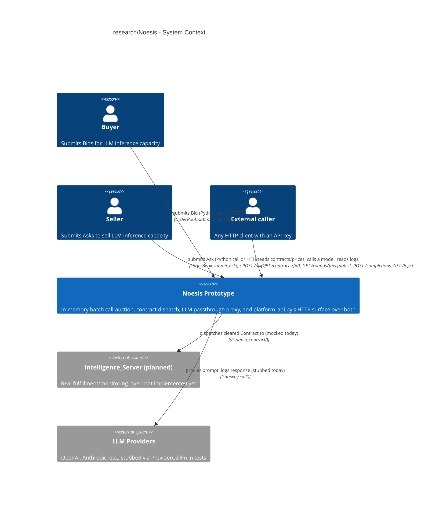
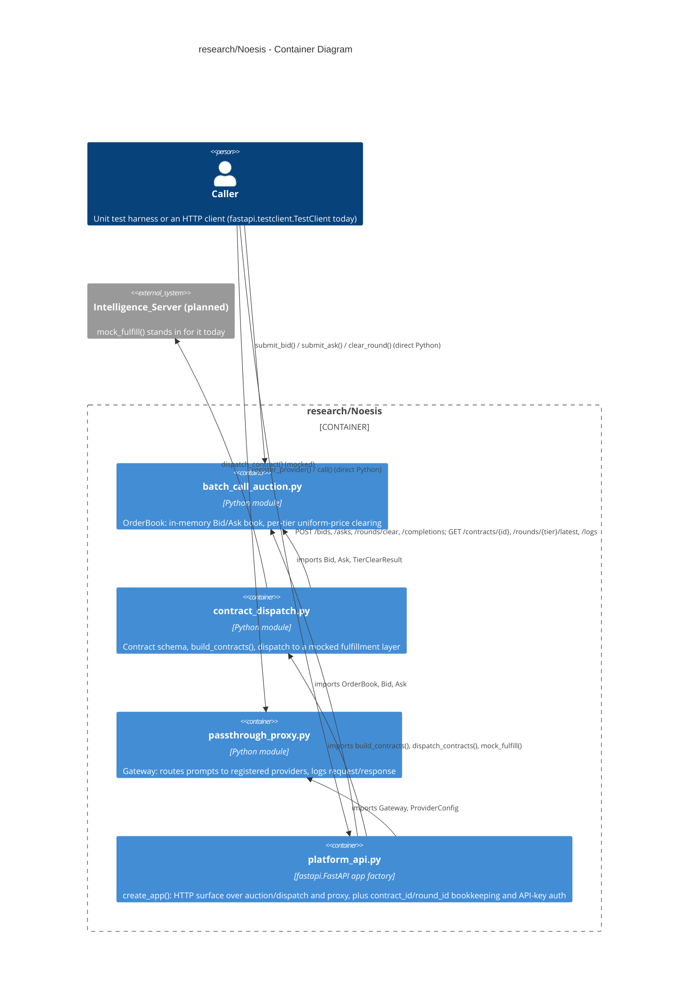

# Overview
- `research/Noesis` prototypes two coupled systems described in
  `plan.Noesis.md` (`NoesisMarket` and `NoesisServer` sections), plus a thin
  HTTP surface over both (`NoesisPlatform` section):
  - `batch_call_auction.py` and `contract_dispatch.py`: an in-memory
    call-auction that matches buyer/seller orders for LLM inference capacity and
    dispatches cleared contracts to a fulfillment layer
  - `passthrough_proxy.py`: a minimal LLM API gateway that routes prompts to
    registered providers and logs every request/response pair
  - `platform_api.py`: a `fastapi.FastAPI` app factory (`create_app()`) that
    wraps both of the above behind HTTP endpoints, so an external caller can
    reach them without importing the Python modules directly
- Problem solved: bootstraps a two-sided market for LLM inference capacity
  (capability tier, latency, reliability, price) and the logging/proxy layer
  that will eventually fulfill and monitor the matched contracts, reachable
  over HTTP by a caller outside the Python process
- Key design decisions visible from the code:
  - Everything is in-memory (Python lists/dicts); no persistence layer
  - Every side effect that would be non-deterministic in a test (fulfillment
    outcome, provider network call, wall-clock time) is injected as a callable
    (`FulfillmentFn`, `ProviderCallFn`, `clock_fn`, `rng`), so tests control it
    directly
  - Dataclasses with hand-written `__init__` methods encode the schema and
    validate every field with `hdbg.dassert_*` at construction time
  - `platform_api.py` adds no new validation logic: it reuses the same
    `hdbg.dassert_*` checks already in the three lower modules, catching the
    resulting `AssertionError` once at the app level and returning an HTTP 400
- Who uses it: the unit test suites under `research/Noesis/test/`, plus, since
  `platform_api.py`, an HTTP client wrapped in a
  `fastapi.testclient.TestClient` (or a real server once `NoesisPlatform` PR2
  containerizes and deploys `create_app()`'s app); there is still no
  standalone launch script (`uvicorn.run(...)` entry point) — that is
  `NoesisPlatform` PR2's job, not PR1's
- The two systems are not wired together at the business-logic level yet:
  `contract_dispatch.mock_fulfill()` stands in for `Intelligence_Server` (per
  `plan.Noesis.md`'s `NoesisMarket` PR2 and `NoesisServer` PR4), and
  `passthrough_proxy.Gateway` has no caller from the market side; the plan
  defers that integration until both sides reach matching PRs.
  `platform_api.py` unifies them only as two independent route groups on one
  HTTP app, not as a shared dependency graph

# Architecture (C4 Model)

## C1 (Context)
- Describes how the Noesis prototype fits with its (simulated) users and the
  external systems it will eventually integrate


- The buyer/seller side is a test harness or, since `platform_api.py`, an HTTP
  caller of `POST /bids`/`POST /asks`; either way there is still no real
  user-facing UI
- `External caller` is `platform_api.py`'s new addition: any HTTP client
  (`fastapi.testclient.TestClient` in tests today) that reaches `NoesisMarket`
  and `NoesisServer` without importing the Python modules, gated by an
  `X-API-Key` header on the write endpoints
- `Intelligence_Server` is the real fulfillment layer described in
  `plan.Noesis.md`'s `NoesisServer` section; `contract_dispatch.mock_fulfill()`
  is its placeholder until that section's PR4 lands
- `LLM Providers` are the real backends `passthrough_proxy.Gateway` will call;
  tests inject a stand-in `ProviderCallFn` instead of a network call

## C2 (Container)
- Describes the four modules inside `research/Noesis` and the dependencies
  between them


- `contract_dispatch.py` is the only lower-layer module with an internal
  dependency: it imports `batch_call_auction` (`Bid`, `Ask`,
  `TierClearResult`) to build `Contract`s from a cleared round
- `passthrough_proxy.py` has no import relationship with `batch_call_auction.py`
  /`contract_dispatch.py`; it is a standalone container, developed against a
  separate section of the plan (`plan.Noesis.md`'s `NoesisServer` section) and
  only meant to converge with the market side once `NoesisServer`'s PR4 and
  `NoesisMarket`'s PR2/PR3 are both in place
- `platform_api.py` imports all three lower modules but does not import
  anything new between them: it is a fourth, higher container, not a rewire of
  the three existing ones (see the `## Weaknesses and Assumptions` entry on
  this)

## C3 (Component)
- Describes the runtime call chain from order submission through logged
  fulfillment outcome, the primary multi-module flow in this codebase

```mermaid
flowchart LR
    submit_bid["OrderBook.submit_bid()"] --> book[("_bids / _asks\n(pending orders)")]
    submit_ask["OrderBook.submit_ask()"] --> book
    book --> clear_round["OrderBook.clear_round()"]
    clear_round --> match["_match_orders_in_tier()\n(per c_level)"]
    match --> tier_result["TierClearResult\n(fills, clearing_price, unfilled)"]
    tier_result --> build["build_contracts(bids, tier_results)"]
    build --> contract["Contract\n(fulfilled=None)"]
    contract --> dispatch["dispatch_contract() /\ndispatch_contracts()"]
    dispatch --> fulfill["fulfillment_fn\n(default: mock_fulfill())"]
    fulfill --> logged["Contract.fulfilled = True/False"]
```


- `clear_round()` buckets every pending `Bid`/`Ask` by `c_level` and calls
  `_match_orders_in_tier()` once per tier, then empties the book (matched orders
  and unmatched orders alike)
- `build_contracts()` looks up each `Fill`'s buyer in `bids` (by `buyer_id`) to
  pull `l_max`/`r_min` onto the resulting `Contract`, since a `Fill` only
  carries `n_tasks`/`c_level`/`price`
- `dispatch_contract()` mutates `contract.fulfilled` in place using whatever
  `fulfillment_fn` is passed (`mock_fulfill()` by default), and returns the same
  object
- `passthrough_proxy.Gateway.call()` runs a parallel, currently disconnected
  flow: `call()` looks up the `ProviderConfig` for `provider_name`, times
  `provider_config.call_fn(model, prompt)` with the injected `clock_fn`,
  computes `cost` from `cost_per_char`, and appends a `RequestLogEntry` to the
  internal log queried later via `get_log()` / `query_log()`

## C4 (Code)
- Primary call flow, market side:
  ```text
  OrderBook.clear_round()
    - _match_orders_in_tier() [once per c_level bucket]
  build_contracts(bids, tier_results)
  dispatch_contracts(contracts, fulfillment_fn=mock_fulfill)
    - dispatch_contract() [once per contract]
      - fulfillment_fn(contract) [default: mock_fulfill()]
  ```
- Primary call flow, gateway side:
  ```text
  Gateway.call(provider_name, model, prompt)
    - provider_config.call_fn(model, prompt)
  ```
- Notable code patterns:
  - `_match_orders_in_tier()` implements a uniform-price call auction: sort bids
    by `p_max` descending and asks by `p_min` ascending (`sorted()` is stable,
    so ties keep submission order), then walk both queues with running
    `remaining_bid_n_tasks` / `remaining_ask_n_tasks` counters, matching `min()`
    of the two while the best bid still crosses the best ask; the clearing price
    is the midpoint of the last matched (marginal) bid/ask pair, applied
    uniformly to every `Fill` in the tier
  - Every dataclass (`Bid`, `Ask`, `ProviderConfig`) overrides the generated
    `__init__` to add `hdbg.dassert_*` validation (non-empty ids, positive
    quantities, `[0, 1]`-bounded rates) at construction time, trading dataclass
    boilerplate for fail-fast validation
  - Non-deterministic effects are injected, not hardcoded: `FulfillmentFn`
    (`contract_dispatch.py`), `ProviderCallFn` and `clock_fn`
    (`passthrough_proxy.py`), and `rng: random.Random` (`mock_fulfill()`) are
    all swappable, so the test suites never depend on real randomness, time, or
    network calls
  - `OrderBook.clear_round()` is destructive: it clears `self._bids` and
    `self._asks` unconditionally after building results, so a round can only be
    cleared once and dropped orders are not retried in a later round

## Key Functions / Classes
| Name                                                             | Purpose                                                                                                  | Returns                                                               |
| ---------------------------------------------------------------- | -------------------------------------------------------------------------------------------------------- | --------------------------------------------------------------------- |
| `batch_call_auction.Bid` / `Ask`                                 | Validated buyer/seller order for one capability tier                                                     | Constructed instance (raises via `hdbg.dassert_*` on invalid fields)  |
| `batch_call_auction.OrderBook`                                   | Queues `Bid`/`Ask` orders and clears them into `TierClearResult`s per round                              | `Dict[str, TierClearResult]` from `clear_round()`                     |
| `batch_call_auction._match_orders_in_tier()`                     | Uniform-price call-auction matching for one tier's bids/asks                                             | `TierClearResult`                                                     |
| `contract_dispatch.build_contracts()`                            | Turns a cleared round's `Fill`s into `Contract` records, carrying `l_max`/`r_min` from the winning `Bid` | `List[Contract]`                                                      |
| `contract_dispatch.mock_fulfill()`                               | Randomized pass/fail stand-in for `Intelligence_Server`, seedable via `rng`                              | `bool`                                                                |
| `contract_dispatch.dispatch_contract()` / `dispatch_contracts()` | Runs a contract (or list) through `fulfillment_fn` and logs the outcome onto `Contract.fulfilled`        | Mutated `Contract` / `List[Contract]`                                 |
| `passthrough_proxy.Gateway`                                      | Registers providers and exposes one `call()` API that logs every request/response pair                   | `RequestLogEntry`-backed log, queried via `get_log()` / `query_log()` |
| `platform_api.create_app()`                                      | Builds the HTTP app over an `OrderBook`/`Gateway` pair: bids, asks, round clearing, contract/round/log lookup | Configured `fastapi.FastAPI` app                                     |
| `platform_api._MarketState`                                      | Assigns `contract_id`/`round_id` and caches each tier's latest cleared round, on top of `OrderBook`       | N/A (internal state holder)                                          |

## External Dependencies
| Module           | Purpose                                                                                                                                      |
| ---------------- | -------------------------------------------------------------------------------------------------------------------------------------------- |
| `helpers.hdbg`   | Assertion helpers (`dassert_ne`, `dassert_lt`, `dassert_lte`, `dassert_in`, `dassert_not_in`) used for field validation and invariant checks |
| `helpers.hprint` | `hprint.to_str()` used to format debug-log messages                                                                                          |
| `dataclasses`    | Backs `Bid`, `Ask`, `Fill`, `TierClearResult`, `Contract`, `ProviderConfig`, `RequestLogEntry`                                               |
| `random`         | `random.Random` source for `mock_fulfill()`'s pass/fail draw                                                                                 |
| `time`           | `time.perf_counter` default clock for `Gateway`'s latency measurement                                                                        |
| `typing`         | `Callable`, `Dict`, `List`, `Optional`, `Tuple` type hints throughout                                                                        |
| `fastapi`        | `platform_api.py`'s HTTP framework: routing, `Depends()`-based auth, request/response validation, `exception_handler()`                     |
| `pydantic`       | `platform_api.py`'s request/response schemas (`BidRequest`, `ContractResponse`, etc.), pinned in via `fastapi`, not in the repo's `pip_list.txt` (see `research/Noesis/requirements.txt`) |

# Critique and Improvements

## Strengths
- Clean layering: the pure matching algorithm (`_match_orders_in_tier()`) is
  separate from the stateful coordination (`OrderBook`), matching
  `.claude/skills/architecture.rules.md`'s guidance to separate business logic
  from infrastructure
- Every non-deterministic effect (fulfillment outcome, provider call, wall-clock
  time) is injected as a callable, which is why the test suites in
  `research/Noesis/test/` can assert exact expected output with no mocking
  framework
- Dataclasses group related fields (per-tier `TierClearResult`, per-contract
  `Contract`) instead of returning bare tuples, and validate at construction
  time instead of scattering checks downstream
- Docstrings consistently tie code back to the owning plan and PR (e.g
  `contract_dispatch.py`'s module docstring references `plan.Noesis.md`'s
  `NoesisMarket` PR2 and `NoesisServer` PR4), which keeps the mock-vs-real
  boundary explicit in the code itself

## Weaknesses and Assumptions
1. `contract_dispatch.py` and `passthrough_proxy.py` are not wired together:
   **Fact** (no import or call between the two modules; `mock_fulfill()` never
   invokes `Gateway.call()`; `platform_api.py` imports both but only routes
   HTTP requests to each independently, adding no call between them either).
   **Impact**: neither plan's PR3/PR4 can land until this interface exists;
   the market and server prototypes remain two disconnected islands, now each
   reachable over HTTP but still not integrated with each other
2. Tier matching is exact-string only, no capability substitution: **Fact**
   (`OrderBook`'s docstring states a bid's `c_level_min` is "matched only
   against asks with the same `c_level` string"). **Impact**: a bid requesting
   at least the "cheap" tier cannot be filled by a "frontier" ask even though a
   stronger tier should satisfy a weaker requirement
3. `build_contracts()` assumes at most one active bid per `buyer_id` per round:
   **Fact** (stated in its own docstring). **Impact**: if a buyer submits two
   bids in the same round, every one of that buyer's `Fill`s silently inherits
   `l_max`/`r_min` from whichever bid is last in the `bids` list, which can
   misattribute guarantees to the wrong fill
4. `OrderBook.clear_round()` unconditionally drops every processed order,
   matched or not: **Fact** (class docstring: "A cleared round drops every order
   it processed, matched or not"). **Impact**: unfilled bids/asks are not
   resubmitted to the next round; a caller wanting carry-over must re-submit
   them manually, and nothing in the current code does that
5. `DEFAULT_BATCH_INTERVAL_MINUTES` is a constant, not an enforced schedule:
   **Fact** (comment: "not enforced by this module, which clears one round per
   `OrderBook.clear_round()` call and leaves scheduling to the caller")
   **Impact**: there is no timer/loop driving batch cadence yet; a caller must
   invoke `clear_round()` at the right cadence itself
6. No persistence layer for any module: **Assumption** (inferred from purely
   in-memory `List`/`Dict` state with no database or file I/O calls anywhere in
   the three modules). **Impact**: all state (order book, contract log, request
   log) is lost when the process exits, limiting current use to single-process
   simulation and tests
7. `passthrough_proxy.ProviderConfig.cost_per_char` is an explicitly crude
   placeholder pricing model: **Fact** (docstring: "A follow-up PR can swap this
   for real per-token provider pricing once one is needed"). **Impact**: logged
   `cost` figures are not representative of real provider billing, which is
   normally token-based, not character-based
8. Reputation/eligibility filtering from `NoesisMarket` PR3 of `plan.Noesis.md`
   is not implemented: **Fact** (PR3 is marked `[ ]` in the plan and no
   corresponding code exists in `research/Noesis`). **Impact**: today's auction
   lets any seller win a contract each round regardless of past `mock_fulfill()`
   outcomes, so under-delivering sellers are never priced out or excluded as the
   plan's end state intends
9. `platform_api.py`'s state is per-app-instance in-memory, and only the
   write endpoints are authenticated: **Fact** (`create_app()`'s
   `OrderBook`/contract store/round cache live only as long as the process;
   `POST /rounds/clear`, `GET /contracts/{id}`, `GET /rounds/{tier}/latest`,
   and `GET /logs` take no `X-API-Key`, per `plan.Noesis.md`'s literal auth
   scope of "before accepting a bid/ask or a gateway call"). **Impact**: a
   restart loses every pending order, contract, and round record
   (`NoesisPlatform` PR2 externalizes this to a real datastore); any caller
   can trigger clearing or read contract/log data, including raw
   unscrubbed prompts/responses via `GET /logs`, without an API key
