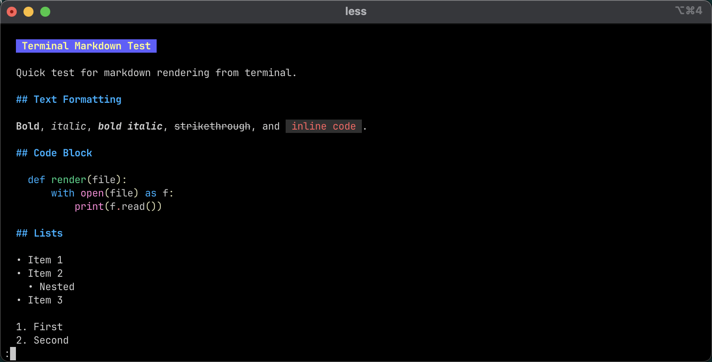
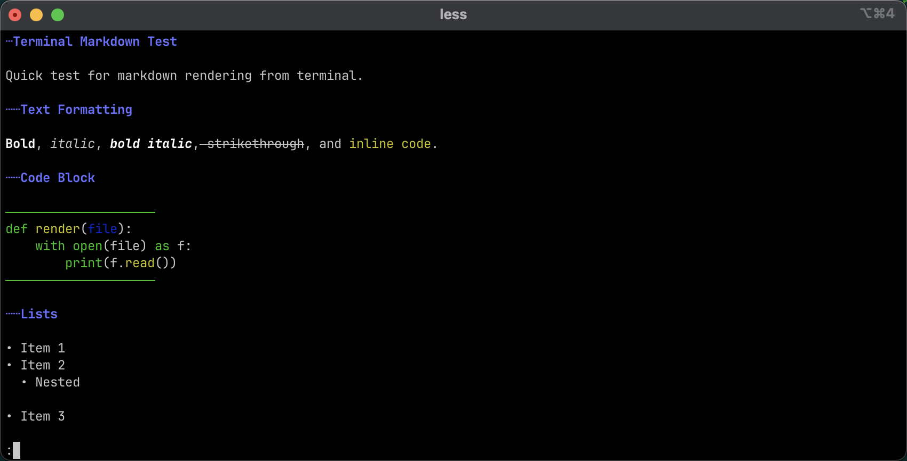
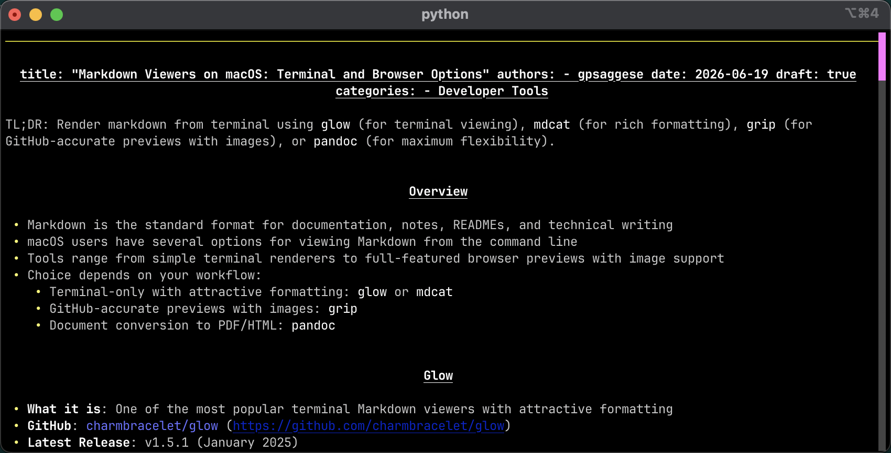
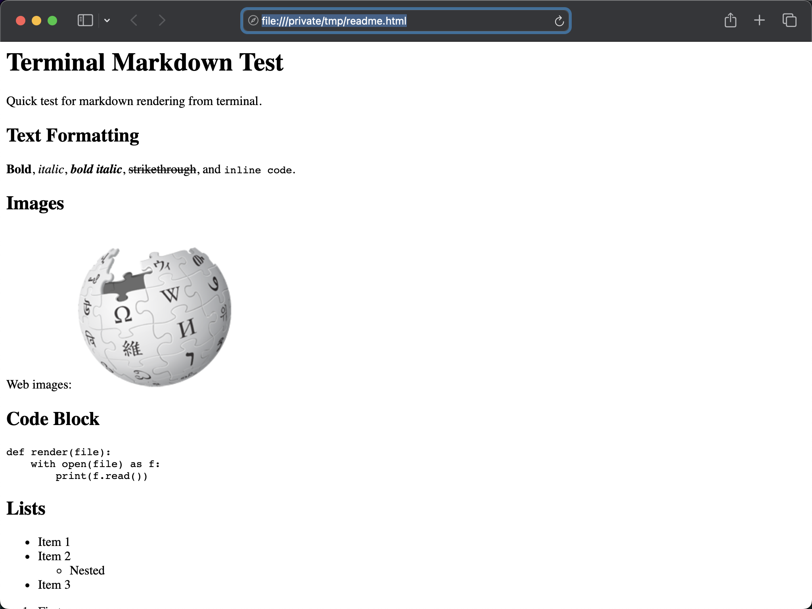

TL;DR: Render markdown from terminal using `glow` (for terminal viewing), `mdcat`
(for rich formatting), `grip` (for GitHub-accurate previews with images), or
`pandoc` (for maximum flexibility).

<!-- more -->

## Overview

- Markdown is the standard format for documentation, notes, READMEs, and
  technical writing
- macOS users have several options for viewing Markdown from the command line
- Tools range from simple terminal renderers to full-featured browser previews
  with image support
- Choice depends on your workflow:
    - Terminal-only with attractive formatting: `glow` or `mdcat`
    - GitHub-accurate previews with images: `grip`
    - Document conversion to PDF/HTML: `pandoc`

## Glow

- **What it is**: One of the most popular terminal Markdown viewers with
  attractive formatting
- **GitHub**: [charmbracelet/glow](https://github.com/charmbracelet/glow)
- **Latest Release**: v1.5.1 (January 2025)
- **Installation**:
    ```bash
    > brew install glow
    ```
- **Usage**:
    ```bash
    > glow README.md
    ```

<!-- capture_iterm_command.py --command "glow -p $GIT_ROOT/website/docs/blog/posts/draft.how_to.Render_md_from_terminal.md.figs/test_markdown.md" --output_file $GIT_ROOT/website/docs/blog/posts/draft.how_to.Render_md_from_terminal.md.figs/fig1.glow_demo.png -->



- **Advantages**:
    - Fancy terminal interface with multiple themes
    - Fast and lightweight
    - Excellent for reading documentation
    - No dependencies beyond the binary
- **Disadvantages**:
    - Does not display images inline
    - Primarily focused on terminal viewing only
- **Best for**: Everyday terminal documentation reading

- **Tips and tricks**:

- Disable pager
    ```
    > more /Users/saggese/Library/Preferences/glow/glow.yml
    # style name or JSON path (default "auto")
    style: "auto"
    # mouse support (TUI-mode only)
    mouse: true
    # use pager to display markdown
    #pager: true
    # word-wrap at width
    width: 80
    # show all files, including hidden and ignored.
    all: false
    # line-numbers: true
    ```

    ```
    > glow -l --tui website/docs/blog/posts/draft.how_to.Render_md_from_terminal.md
    ```

**TUI vs Pager modes**:
- **TUI** (Terminal User Interface): Interactive full-screen mode with keyboard
  navigation. Glow enters full-screen, lets you scroll, search, and navigate with
  arrow keys and hotkeys. Best for exploring long documents.
- **Pager**: Pipes output through a pager like `less`, streaming content
  progressively. Familiar if you're used to `less`, `more`, or `man` pages.

## mdcat

- **What it is**: Rich Markdown renderer written in Rust with advanced
  formatting support
- **GitHub**: [swsnr/mdcat](https://github.com/swsnr/mdcat)
- **Latest Release**: v0.32.1 (October 2024)
- **Installation**:
    ```bash
    > brew install mdcat
    ```
- **Usage**:
    ```bash
    > mdcat README.md
    ```

<!-- 
> capture_iterm_command.py --command "mdcat -p $GIT_ROOT/website/docs/blog/posts/draft.how_to.Render_md_from_terminal.md.figs/test_markdown.md" --output_file $GIT_ROOT/website/docs/blog/posts/draft.how_to.Render_md_from_terminal.md.figs/fig2.mdcat_demo.png
-->



- **Advantages**:
    - Excellent formatting quality
    - Handles tables and syntax highlighting well
    - Supports hyperlinks
    - Can display inline images in compatible terminals
- **Disadvantages**:
    - Image support depends on terminal capabilities
    - More complex than Glow
- **Best with**: Modern terminal emulators that support advanced image protocols
  for inline image rendering
    - Kitty (native image protocol support)
    - WezTerm (sixel and image support)
    - iTerm2 (inline image support)
    - Other terminals supporting modern image protocols
- **Best for**: Users with modern terminal emulators seeking rich formatting

## Grip

- **What it is**: Renders Markdown exactly as GitHub would, served locally
  through a web browser
- **GitHub**: [joeyespo/grip](https://github.com/joeyespo/grip)
- **Latest Release**: v4.6.1 (January 2024)
- **Installation**:
    ```bash
    > pip install grip
    ```
- **Usage**:
    ```bash
    > grip README.md
    ```
    Then open `http://localhost:6419`
   - Using `uvx`
    ```
    > uvx grip website/docs/blog/posts/draft.how_to.Render_md_from_terminal.md -b --quiet
    ```

<!-- 
> uvx grip -b --quiet $GIT_ROOT/website/docs/blog/posts/draft.how_to.Render_md_from_terminal.md.figs/test_markdown.md
> ./helpers_root/dev_scripts_helpers/system_tools/capture_browser_screenshot.py --url "http://localhost:6419" --output /Users/saggese/src/umd_classes2/website/docs/blog/posts/draft.how_to.Render_md_from_terminal.md.figs/fig3.grip_browser.png
-->


- **Advantages**:
    - GitHub-flavored Markdown rendering
    - Full image support
    - Excellent table rendering
    - Matches GitHub appearance exactly
- **Disadvantages**:
    - Requires a web browser
    - Runs a local web server
- **Best for**: Previewing work before pushing to GitHub

## mdless

- **What it is**: Pager-like interface for reading Markdown with familiar
  navigation
- **GitHub**: [ttscoff/mdless](https://github.com/ttscoff/mdless)
- **Latest Release**: v2.1.17 (March 2025)
- **Installation**:
    ```bash
    > brew install mdless
    ```
- **Usage**:
    ```bash
    > mdless README.md
    ```

<!--  -->

- **Advantages**:
    - Simple and lightweight
    - Familiar pager interface (`less`-like)
    - Good for large documents
- **Disadvantages**:
    - Limited styling compared to alternatives
    - No image rendering
- **Best for**: Reading long documents with familiar pager shortcuts

## rich-cli

- **What it is**: Colorful terminal rendering built on Python's Rich library
- **GitHub**: [Textualize/rich-cli](https://github.com/Textualize/rich-cli)
- **Latest Release**: v1.8.1 (December 2024)
- **Installation**:
    ```bash
    > pip install rich-cli
    ```
- **Usage**:
    ```bash
    > rich README.md
    ```

```
> uvx --from rich-cli rich website/docs/blog/posts/draft.how_to.Render_md_from_terminal.md --pager
```

<!-- 
> capture_iterm_command.py --command "uvx --from rich-cli rich $GIT_ROOT/website/docs/blog/posts/draft.how_to.Render_md_from_terminal.md --pager" --output_file $GIT_ROOT/website/docs/blog/posts/draft.how_to.Render_md_from_terminal.md.figs/fig6.richcli_demo.png
-->



- **Advantages**:
    - Attractive formatting with color support
    - Easy installation via pip
    - Good Unicode support
- **Disadvantages**:
    - No image rendering
    - Less feature-rich than mdcat
- **Best for**: Quick terminal previews with minimal setup

## Pandoc

- **What it is**: The Swiss Army knife of document conversion with multiple
  output formats
- **GitHub**: [jgm/pandoc](https://github.com/jgm/pandoc)
- **Latest Release**: v3.1.12.2 (April 2025)
- **Installation**:
    ```bash
    > brew install pandoc
    ```
- **Usage examples**:
    ```bash
    > pandoc README.md -o /tmp/readme.html
    > open /tmp/readme.html
    ```
    ```bash
    > pandoc README.md -o README.pdf
    > open README.pdf
    ```

<!--
> pandoc $GIT_ROOT/website/docs/blog/posts/draft.how_to.Render_md_from_terminal.md.figs/test_markdown.md -o /tmp/readme.html; open /tmp/readme.html
> ./helpers_root/dev_scripts_helpers/system_tools/capture_browser_screenshot.py --url "file:///private/tmp/readme.html" --output /Users/saggese/src/umd_classes2/website/docs/blog/posts/draft.how_to.Render_md_from_terminal.md.figs/fig4.pandoc_html_output.png
-->



- **Advantages**:
    - Full image support
    - Multiple output formats (HTML, PDF, DOCX, etc.)
    - Highly customizable with templates
    - Industry-standard converter
- **Disadvantages**:
    - More complex than dedicated viewers
    - Primarily a converter rather than a real-time viewer
- **Best for**: Document conversion and maximum flexibility

## Comparison Table

| Tool     | Terminal | Images  | GitHub Style | Browser |
| :------- | :------- | :------ | :----------- | :------ |
| Glow     | Yes      | No      | No           | No      |
| mdcat    | Yes      | Limited | No           | No      |
| mdless   | Yes      | No      | No           | No      |
| rich-cli | Yes      | No      | No           | No      |
| Grip     | No       | Yes     | Yes          | Yes     |
| Pandoc   | Optional | Yes     | Varies       | Yes     |

- _For everyday terminal viewing_: Use `glow`
- _For richer terminal rendering_: Use `mdcat`
- _For GitHub-accurate previews_: Use `grip`
- _For document conversion_: Use `pandoc`
- _For image rendering_: Browser-based solutions (`grip` or `pandoc` to HTML)
  remain most reliable on macOS

<!-- TODO(gp): Finish this -->
- My favorite is Grip

<!-- TODO(gp): Add open_md_on_github.sh open_md.sh -->
