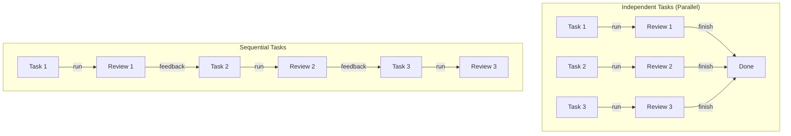
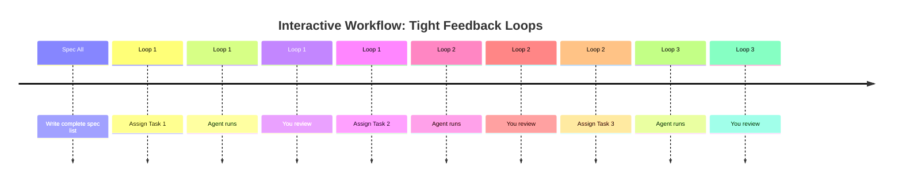
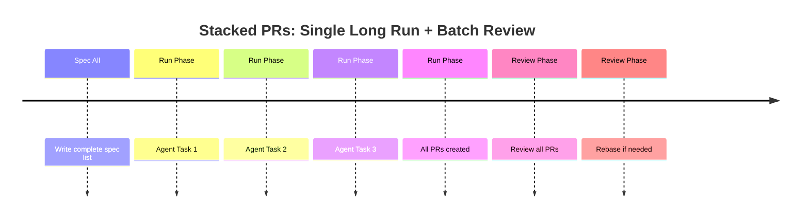

TL;DR: Use stacked PRs to let AI agents work longer without frequent context
switches, balancing productivity gains against review complexity.

<!-- more -->

## The Challenge

When working with AI agents, two competing goals create tension:

- **Goal 1**: Let agents run longer on extended task sequences (ideally full-day
  runs)
- **Goal 2**: Review work frequently without losing context or making expensive
  mistakes

As humans, we avoid constant context switching. We prefer continuous blocks of
similar work: reviewing five related changes feels more productive and
error-resistant than alternating between running tasks, reviewing, running
again, reviewing again.

## Understanding Your Workflow

The right approach depends on how tasks relate to each other:

- **Independent tasks**: Agents run in parallel on separate paths, and you
  review all results when complete
- **Sequential tasks**: Each task must complete before the next begins, and
  feedback between steps shapes future work



Independent tasks run in parallel without affecting each other. Sequential tasks
depend on feedback from previous steps, forcing a linear progression.

## Strategy 1: Interactive Workflows

An interactive workflow runs fast feedback loops:

- Write all task specifications upfront (single spec session)
- Assign one task to the agent
- Review the result
- Assign the next task based on what you learned

This approach minimizes divergence: feedback is frequent and specific. The
trade-off is constant context switching between review and dispatch.

**Optimization**: Use a precompiled task list. This removes spec-writing time
from the loop, leaving only: run → review → repeat. Faster feedback and lower
cognitive load per cycle.



Each cycle completes quickly, but your attention alternates between agent and
review work.

## Strategy 2: Stacked PRs

Stacked PRs reduce interruptions by letting the agent work longer:

- Write all task specifications once, upfront
- Agent completes multiple tasks in sequence
- Agent creates multiple PRs automatically (one per task or logical change)
- You review all PRs together when the agent finishes

This creates a single uninterrupted work block for the agent. The trade-offs:

- **Divergence risk grows**: longer task sequences without feedback increase the
  chance the agent misunderstands requirements
- **Compound complexity**: later tasks depend on earlier ones, so review becomes
  interconnected
- **Expensive corrections**: fixing mistakes mid-sequence requires rebasing all
  downstream changes



Agent works uninterrupted; your review happens once at the end. Fewer context
switches, but higher stakes when corrections are needed.

## When to Use Each Strategy

- **Use interactive workflows** when:
    - Tasks are exploratory or uncertain
    - Feedback shapes future work
    - Costs of divergence are high
    - You want to steer the agent frequently

- **Use stacked PRs** when:
    - Tasks are well-defined and independent
    - Agent can work with clear, complete specifications
    - You prefer focused review sessions over frequent interruptions
    - Tasks fit a logical sequence (e.g., modular features or refactoring
      stages)

## Implementing Stacked PRs

Both examples below implement the same feature split into three sequential
tasks:

- **Task 1**: Add the database schema
- **Task 2**: Add the API endpoint (depends on Task 1)
- **Task 3**: Add the UI component (depends on Task 2)

### GitHub Stacked PRs

GitHub now offers native stacked PR support, allowing multiple PRs to stack on a
single branch with automatic dependency tracking. Each PR links to the previous
one, and merging happens in order.

**Creating the stack**: branch each task off the previous one and open a PR
against that parent branch:

```bash
> git checkout -b feature/step-1-schema main
# ... agent adds database schema ...
> git add -A && git commit -m "Step 1: add database schema"
> git push -u origin feature/step-1-schema
> gh pr create --base main --head feature/step-1-schema \
    --title "Step 1: add database schema"

> git checkout -b feature/step-2-api feature/step-1-schema
# ... agent adds API endpoint ...
> git add -A && git commit -m "Step 2: add API endpoint"
> git push -u origin feature/step-2-api
> gh pr create --base feature/step-1-schema --head feature/step-2-api \
    --title "Step 2: add API endpoint"

> git checkout -b feature/step-3-ui feature/step-2-api
# ... agent adds UI component ...
> git add -A && git commit -m "Step 3: add UI component"
> git push -u origin feature/step-3-ui
> gh pr create --base feature/step-2-api --head feature/step-3-ui \
    --title "Step 3: add UI component"
```

GitHub renders the three PRs as a linked stack. When `feature/step-1-schema`
merges into `main`, GitHub automatically retargets Step 2's PR base to `main`.

**Updating an earlier PR**: if review feedback lands on Step 1, every downstream
branch needs a manual rebase:

```bash
> git checkout feature/step-1-schema
# ... apply fix ...
> git add -A && git commit -m "Fix: address review comment"
> git push

> git checkout feature/step-2-api
> git rebase feature/step-1-schema
> git push --force-with-lease

> git checkout feature/step-3-ui
> git rebase feature/step-2-api
> git push --force-with-lease
```

Refer to
[GitHub's stacked PRs documentation](https://docs.github.com/en/pull-requests/collaborating-with-pull-requests/proposing-changes-to-your-work-with-pull-requests/about-stacked-pull-requests)
for setup and workflow details.

### Git-Spice

`git-spice` is a CLI tool designed specifically for managing stacked PR
workflows. It automates:

- Creating and managing branch stacks
- Rebasing dependent changes
- Syncing multiple PRs in batch

**Creating the stack**: `gs branch create` stacks a new branch on top of the
current one and, with `-m`, commits the staged changes in the same step. There
is no need to name a base branch by hand: `gs` tracks it automatically.

```bash
> gs repo init

# ... agent adds database schema ...
> git add -A
> gs branch create feature/step-1-schema -m "Step 1: add database schema"

# ... agent adds API endpoint ...
> git add -A
> gs branch create feature/step-2-api -m "Step 2: add API endpoint"

# ... agent adds UI component ...
> git add -A
> gs branch create feature/step-3-ui -m "Step 3: add UI component"

> gs stack submit
```

Each `gs branch create` call stacks on top of the branch you were on, so Step 2
lands on Step 1 and Step 3 lands on Step 2 automatically. `gs stack submit`
opens (or updates) all three PRs in one command, setting each PR's base to its
parent branch.

**Updating an earlier PR**: `gs commit amend` restacks every downstream branch
by default, so there is no manual rebase chain:

```bash
> gs branch checkout feature/step-1-schema
# ... apply fix ...
> git add -A
> gs commit amend

> gs stack submit
```

`gs commit amend` amends the fix into Step 1 and automatically rebases Step 2
and Step 3 on top of it. `gs stack submit` then pushes the updated branches and
refreshes all three PRs.

Refer to the [git-spice documentation](https://github.com/abhinav/git-spice) for
installation and usage.

### Comparing the Two Workflows

| Operation                      | GitHub CLI (`gh` / `git`)                        | `git-spice` (`gs`)                                           |
| :----------------------------- | :----------------------------------------------- | :----------------------------------------------------------- |
| Create one branch in the stack | `git checkout -b` (name parent manually)         | `gs branch create` (parent tracked automatically)            |
| Open all PRs                   | One `gh pr create` per branch, base set manually | One `gs stack submit` for the whole stack                    |
| Fix an earlier task            | Rebase each downstream branch by hand            | `gs commit amend` restacks downstream branches automatically |
| Push fixes to all PRs          | One `git push --force-with-lease` per branch     | One `gs stack submit`                                        |

`git-spice` trades a bit of setup (`gs repo init`) for automation that scales
better as the stack grows: a 6-task stack means 6 manual rebases with plain
`git`, but the same `gs commit amend` call regardless of stack length.

## Key Takeaways

- **Balance runtime against interruption**: longer agent runs save context
  switches but increase divergence risk
- **Predefine all task specifications**: this is essential for both strategies
- **Stacked PRs work best for predictable sequences**: clear scope reduces
  surprises
- **Use tooling to manage complexity**: GitHub stacked PRs or `git-spice` handle
  the mechanical details

When in doubt, start with interactive workflows. Use stacked PRs once task
sequences are stable and well-understood.

#

i git_branch_diff --target master
