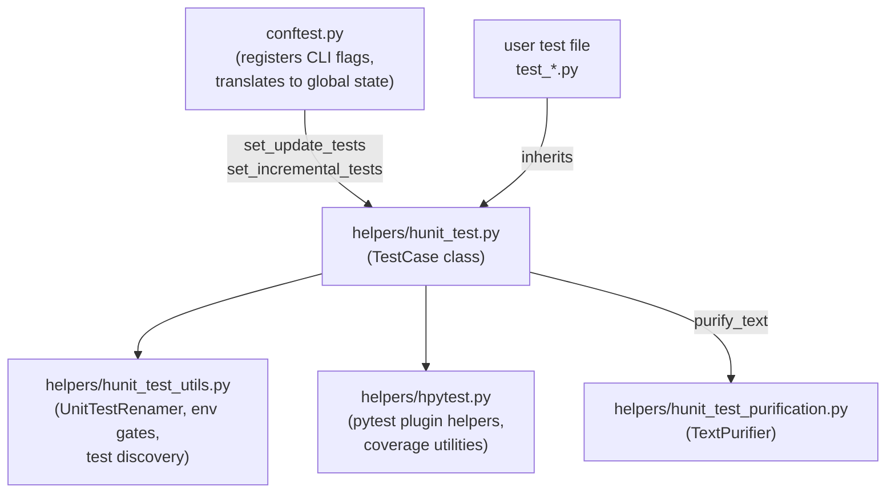
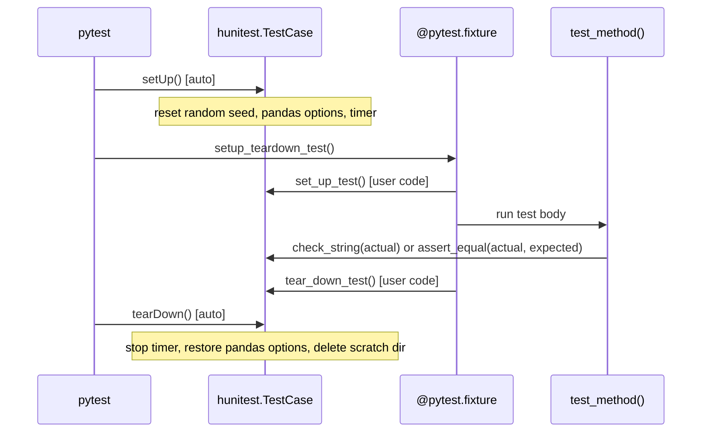
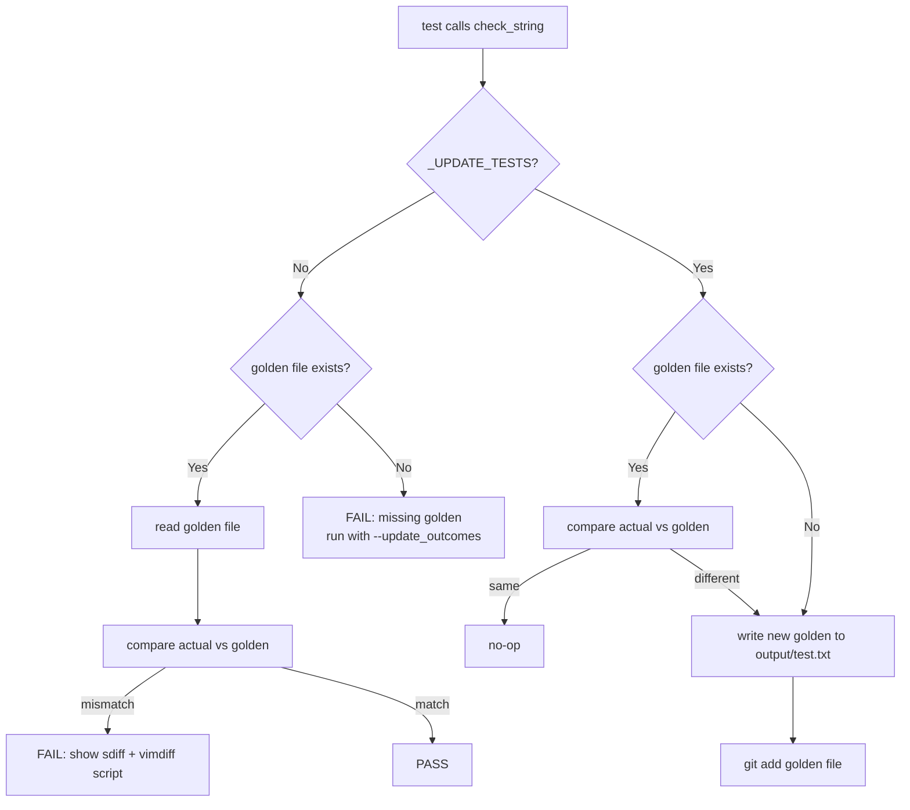

TL;DR A golden file testing framework built on `unittest` and `pytest` that
makes test output easy to update, diff, and review by storing expected results
on disk instead of inline in test code.

<!-- more -->

# Introduction

## What Is `hunit_test`?

- `hunit_test` is a Python testing framework built on top of `unittest` and
  `pytest` that adds three critical capabilities:
    - **Reproducibility by default**: fixed random seeds, known pandas display
      options, timer measurement — all set automatically before each test
    - **Golden file testing**: test output is compared against a reference file
      stored in the repo, not an inline expected string in the code
    - **Standard directory layout**: every test class gets predictable `input/`,
      `output/`, and `scratch/` directories derived from its class and method
      name

- The framework lives across several modules:
    - [`helpers/hunit_test.py`](https://github.com/causify-ai/helpers/blob/master/helpers/hunit_test.py):
      Core `TestCase` base class — golden files, directory helpers, comparison
      methods
    - [`helpers/hunit_test_utils.py`](https://github.com/causify-ai/helpers/blob/master/helpers/hunit_test_utils.py):
      Utilities — `UnitTestRenamer`, environment gates, test file discovery,
      `capture_system_calls()`
    - [`helpers/hunit_test_purification.py`](https://github.com/causify-ai/helpers/blob/master/helpers/hunit_test_purification.py):
      `TextPurifier` — strips machine-specific noise (paths, usernames) when
      `purify_text=True`
    - [`helpers/hpytest.py`](https://github.com/causify-ai/helpers/blob/master/helpers/hpytest.py):
      Pytest plugin helpers and coverage utilities

## When To Use `hunit_test`

- **Any Python project** that wants reproducible, reviewable test output
- **Teams** where multiple developers need to update expected test output and
  review each other's changes in PRs — golden files make the diff explicit
- **Data-intensive projects** where expected output is a DataFrame, a config
  object, or a multi-line report — things too large to inline in test code
- **Projects with environment-specific output** — the `TextPurifier` normalizes
  paths, usernames, git refs, and Docker image names before comparing

## When NOT To Use `hunit_test`

- **Simple unit tests** where the expected string is short and stable — use
  plain `self.assertEqual()` instead
- **Projects already using `pytest` with `snapshottest`** — same concept,
  different conventions
- **Tests that never change** — if the expected output is permanent (like
  `1 + 1 = 2`), a hard-coded assertion is clearer

# How It Works

## Architecture

- The framework wires together `conftest.py`, `hunit_test.TestCase`, and the
  `pytest` runner:



## Test Lifecycle

- Every test method goes through a fixed lifecycle:



## Golden File Testing Design

- Instead of writing `self.assertEqual(actual, long_expected_string)` with
  hard-to-read inline strings, the framework stores expected output in a file:

| Inline expected string                               | Golden file                                               |
| ---------------------------------------------------- | --------------------------------------------------------- |
| Inline in test code — hard to read for large outputs | Stored as `output/test.txt` — easy to open and inspect    |
| Must be updated manually by editing the test file    | Updated automatically by running with `--update_outcomes` |
| Diff shown only in pytest output                     | Full diff available via the auto-generated vimdiff script |
| Hard to review in a PR for large outputs             | Easy to review a separate `.txt` file change              |

## How `--update_outcomes` Works

1. Developer changes code that affects a test's output
2. Running `pytest` without flags → test fails with a diff
3. Developer confirms the new output is correct
4. Developer runs `pytest --update_outcomes`
5. `conftest.py` calls `hunitest.set_update_tests(True)`
6. In `check_string()`: the actual output is written to `output/test.txt` and
   staged via `git add`
7. Developer commits the updated golden file as part of the PR



## Directory Layout

- Every test class gets a predictable directory structure:

```
module/test/
├── outcomes/
│   └── TestFooBar1.test_method_a/
│       ├── input/              <- get_input_dir()  [static fixtures]
│       └── output/
│           └── test.txt        <- check_string() golden file
├── scratch/
│   └── TestFooBar1.test_method_a/  <- get_scratch_space() [deleted after test]
└── test_foo.py                 <- test file
```

# Real-World Scenarios

## Scenario 1: Catching a Regression with `check_string`

- Imagine you have a function that formats a market data report as a string:

```python
import helpers.hunit_test as hunitest

class TestReportGenerator1(hunitest.TestCase):
    def test_generate_report1(self) -> None:
        # Prepare inputs.
        data = {"BTC": 45000.0, "ETH": 3200.0}
        # Run.
        actual = generate_report(data)
        # Check.
        self.check_string(actual)
```

- On the first run, the golden file is missing → the test fails with
  instructions to run with `--update_outcomes`
- After running with `--update_outcomes`, the file
  `outcomes/TestReportGenerator1.test_generate_report1/output/test.txt` is
  created
- If a code change alters the output format, the test fails with a `sdiff` diff
  and a vimdiff script — the developer reviews the diff, confirms correctness,
  and runs `--update_outcomes` again

## Scenario 2: Text Purification for Environment-Specific Output

- When test output contains absolute paths, usernames, or git refs, use
  `purify_text=True`:

```python
class TestConfig1(hunitest.TestCase):
    def test_config_str1(self) -> None:
        config = {"path": "/home/alice/project/data.csv"}
        # Purify replaces machine-specific strings.
        self.check_string(str(config), purify_text=True)
        # The golden file will contain $GIT_ROOT and $USER_NAME placeholders,
        # not the actual values from the developer's machine.
```

- The `TextPurifier` normalizes:
    - Git root paths → `$GIT_ROOT`
    - Current working directory → `$PWD`
    - Usernames → `$USER_NAME`
    - Docker image hashes → `xxxxxxxx`
    - Object memory addresses → `at 0x`
    - Parquet file UUIDs → `data.parquet`
    - Today's date → `YYYYMMDD`

## Scenario 3: Testing DataFrame Outputs

- For pandas DataFrames, use `check_dataframe()` which stores CSV files and
  compares with a configurable numerical tolerance:

```python
class TestDataFrame1(hunitest.TestCase):
    def test_df_output1(self) -> None:
        actual = compute_prices()
        # Compares element-wise with 5% relative error tolerance.
        self.check_dataframe(actual, err_threshold=0.05)
```

- Or use `assert_dfs_close()` for comparing two DataFrames in memory:

```python
def test_close_match1(self) -> None:
    actual = compute_prices()
    expected = pd.DataFrame({"price": [100.0, 101.5]})
    # Uses np.allclose internally.
    self.assert_dfs_close(actual, expected, rtol=1e-5)
```

- For structured validation of DataFrame shape, columns, and unique values, use
  `check_df_output()`:

```python
def test_structured_df1(self) -> None:
    self.check_df_output(
        actual_df,
        expected_length=10,
        expected_column_names=["open", "high", "low", "close"],
        expected_column_unique_values={"exchange_id": ["binance"]},
        expected_signature="__CHECK_STRING__",
    )
```

## Scenario 4: Capturing System Calls Without Running Them

- When testing code that spawns shell commands, use `capture_system_calls()` to
  intercept every call without actually running anything:

```python
import helpers.hunit_test_utils as hunteuti

class TestRunner1(hunitest.TestCase):
    def test_no_real_shell1(self) -> None:
        with hunteuti.capture_system_calls() as calls:
            my_function_that_runs_shell_commands()
        # Check the calls that would have been made.
        self.assert_equal(str(len(calls)), "2")
```

# Advanced Features

## Text Comparison Modes

- The framework provides several comparison modes through `check_string()` and
  `assert_equal()`:

| Mode               | Parameter                 | When to use                                         |
| ------------------ | ------------------------- | --------------------------------------------------- |
| Exact match        | (default)                 | Stable output that must match exactly               |
| Fuzzy match        | `fuzzy_match=True`        | Output where spacing varies                         |
| Sorted match       | `sort=True`               | Lines in any order should match                     |
| Ignore line breaks | `ignore_line_breaks=True` | Wrapping differences should not matter              |
| Dedent expected    | `dedent=True`             | Expected string is indented for readability in code |
| Text purification  | `purify_text=True`        | Output contains machine-specific values             |

## Environment Gates for Test Skipping

- Sometimes a test only makes sense on a specific platform or repo:

```python
import helpers.hunit_test_utils as hunteuti

class TestPlatform1(hunitest.TestCase):
    def test_ci_only1(self) -> None:
        hunteuti.execute_only_on_ci()
        # Only runs in CI — skips on dev machines.

    def test_mac_only1(self) -> None:
        hunteuti.execute_only_on_mac()
        # Only runs on macOS.

    def test_target_repo1(self) -> None:
        hunteuti.execute_only_in_target_repo("helpers")
        # Only runs when the short repo name matches.
```

## UnitTestRenamer

- Renaming a test class or method means updating both the Python source and the
  corresponding `outcomes/` directories

- `UnitTestRenamer` automates this:

```python
import helpers.hunit_test_utils as hunteuti

renamer = hunteuti.UnitTestRenamer(
    old_test_name="TestFooBar1",
    new_test_name="TestBazQux1",
    root_dir=".",
)
renamer.run()
```

- Renames occurrences in every Python file under `root_dir` and renames the
  `outcomes/TestFooBar1.*/` directories to match

## Test Speed Tiers

- Tests are classified by expected execution time using pytest markers:

| Tier      | Marker                   | Timeout | When to run       |
| --------- | ------------------------ | ------- | ----------------- |
| Fast      | (no marker)              | 5 s     | Every commit / PR |
| Slow      | `@pytest.mark.slow`      | 30 s    | Before merging    |
| Superslow | `@pytest.mark.superslow` | 3600 s  | Scheduled CI      |

- Plus infrastructure requirement markers:
    - `@pytest.mark.requires_ck_infra` — needs CK cloud infra
    - `@pytest.mark.requires_ck_aws` — needs AWS connection
    - `@pytest.mark.requires_docker_in_docker` — needs Docker-in-Docker

## S3 Storage for Test Data

- When test fixtures are too large for Git, store them on S3:

```python
# S3 scratch space — cleaned up after the test.
scratch_dir = self.get_s3_scratch_dir()
# E.g., s3://bucket/tmp/cache.unit_test/user.server.project.TestClass.test_method

# S3 input dir — mirrors get_input_dir() on S3.
input_dir = self.get_s3_input_dir()
```

## `QaTestCase` for Host-Only Tests

- Use `QaTestCase` for tests that must run on the host machine (not inside
  Docker):

```python
class TestDockerInvoke1(hunitest.QaTestCase):
    def test_bash1(self) -> None:
        rc, _ = hsystem.system("invoke docker_bash --cmd 'echo hello'")
        self.assert_equal(str(rc), "0")
```

- Automatically skipped when running inside a Docker container

## `Obj_to_str_TestCase` for `__repr__` and `__str__`

- Standardize testing of object string representations:

```python
import helpers.hunit_test_utils as hunteuti

class TestMyClass1(hunitest.TestCase, hunteuti.Obj_to_str_TestCase):
    def test_repr1(self) -> None:
        obj = MyClass(value=42)
        self.run_test_repr(obj, expected_str="MyClass(value=42)")
```

# Comparison with Alternatives

| Feature              | `hunitest.TestCase`                                            | Plain `unittest.TestCase` | `pytest` alone              |
| -------------------- | -------------------------------------------------------------- | ------------------------- | --------------------------- |
| Golden file testing  | Built-in via `check_string()`                                  | Not available             | Needs `snapshottest` plugin |
| Output purification  | `purify_text=True`                                             | Not available             | Not available               |
| Directory management | `get_input_dir()`, `get_output_dir()`, `get_scratch_space()`   | Manual                    | Manual                      |
| Update outcomes      | `--update_outcomes` flag                                       | Not available             | Not available               |
| DataFrame comparison | `check_dataframe()`, `assert_dfs_close()`, `check_df_output()` | Manual                    | Manual                      |
| System call capture  | `capture_system_calls()`                                       | Not available             | Not available               |
| Speed tiers          | Built-in markers                                               | Manual marking            | Manual marking              |
| Git integration      | Auto `git add` of golden files                                 | Not available             | Not available               |

- **Use plain `unittest`** when you have simple, stable tests and don't need
  golden file workflows
- **Use `pytest` alone** when you want its fixtures and plugins but don't need
  the directory layout and purification
- **Use `hunitest.TestCase`** when you need all of the above plus a
  team-friendly workflow for updating, reviewing, and diffing test output

# References

- Source code:
  [`helpers/hunit_test.py`](https://github.com/causify-ai/helpers/blob/master/helpers/hunit_test.py)
- Utilities:
  [`helpers/hunit_test_utils.py`](https://github.com/causify-ai/helpers/blob/master/helpers/hunit_test_utils.py)
- Text purification:
  [`helpers/hunit_test_purification.py`](https://github.com/causify-ai/helpers/blob/master/helpers/hunit_test_purification.py)
- Pytest helpers:
  [`helpers/hpytest.py`](https://github.com/causify-ai/helpers/blob/master/helpers/hpytest.py)
- S3 mock testing:
  [`helpers/hmoto.py`](https://github.com/causify-ai/helpers/blob/master/helpers/hmoto.py)
- Documentation — explanation:
  [`helpers/test/docs/all.unit_test_framework.explanation.md`](https://github.com/causify-ai/helpers/blob/master/helpers/test/docs/all.unit_test_framework.explanation.md)
- Documentation — write tests:
  [`helpers/test/docs/all.write_unit_tests.how_to_guide.md`](https://github.com/causify-ai/helpers/blob/master/helpers/test/docs/all.write_unit_tests.how_to_guide.md)
- Documentation — run tests:
  [`helpers/test/docs/all.run_unit_tests.how_to_guide.md`](https://github.com/causify-ai/helpers/blob/master/helpers/test/docs/all.run_unit_tests.how_to_guide.md)
- Test file:
  [`helpers/test/test_hunit_test.py`](https://github.com/causify-ai/helpers/blob/master/helpers/test/test_hunit_test.py)
