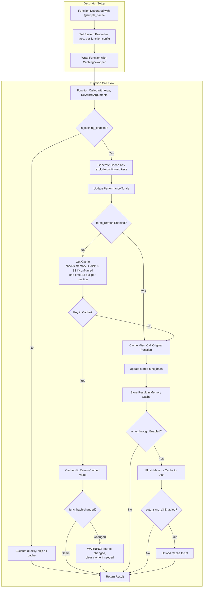

TL;DR: `hcache_simple` is a decorator-based caching module that stores function
results across three layers (memory, disk, and S3). Add caching to any function
with a single `@simple_cache` decorator and optionally share results across your
team via S3

<!-- more -->

## Introduction

- Every data scientist and ML engineer has faced the same problem:
    - An expensive function that takes seconds (or minutes) to run
    - An API call that costs money every time

- The standard solution is ad-hoc caching code:
    - Save results to a file, check if the file exists before running, add a
      dictionary to remember past results
    - This is repetitive, error-prone, and hard to maintain across projects

- `hcache_simple` is a Python module from the `helpers` library that provides
  decorator-based caching with minimal boilerplate

## References

- Source code:
  [`helpers/hcache_simple.py`](https://github.com/causify-ai/helpers/blob/master/helpers/hcache_simple.py)
- Test code:
  [`helpers/test/test_hcache_simple.py`](https://github.com/causify-ai/helpers/blob/master/test/test_hcache_simple.py)
- Full documentation:
  [`helpers/docs/tools/helpers/all.hcache_simple.explanation.md`](https://github.com/causify-ai/helpers/blob/master/docs/tools/helpers/all.hcache_simple.explanation.md)
- Tutorial notebook:
  [`helpers/notebooks/hcache_simple.tutorial.ipynb`](https://github.com/causify-ai/helpers/blob/master/notebooks/hcache_simple.tutorial.ipynb)

### What Is `hcache_simple`?

- `hcache_simple` is a caching module built around the `@simple_cache`
  decorator, defined in
  [`helpers/hcache_simple.py`](https://github.com/causify-ai/helpers/blob/master/helpers/hcache_simple.py)

- Key features:
    - **Three storage layers**: Memory (fastest), disk (persistent), and S3
      (shared across team)
    - **One decorator**: Add `@simple_cache()` to any function and caching works
      automatically
    - **Per-function configuration**: Each function can have its own cache
      directory, S3 bucket, or storage format
    - **Different storage formats**: Use JSON or pickle to trade off speed
      with easiness to inspect the data
    - **Performance tracking**: See hit rates and identify optimization
      opportunities
    - **Source-change detection**: Warns when a function's source code has
      changed since its value was cached
    - **Mock support**: Test cached functions without running expensive
      operations
      - TODO(gp): Easily create a unit test from cache values
    - **Work with Notebooks**
    - **Flexible way to specify which parameters needs to be used to cached**
    - **Flexible policy on a per function basis**
      - E.g., assert on cache miss, disable only one function, refresh one
    - **Flexible global management of cache** (disable all caches)

### The Three Cache Layers

- `hcache_simple` uses three storage layers, checked in order:
    1. **Memory cache**: A Python dictionary that returns cached results.
       Results are not persistant across Python sessions
    2. **Disk cache**: Stores results as JSON or pickle files on your
       filesystem. Results persist across Python sessions
    3. **S3 cache**: Stores results in an S3 bucket. Enables sharing across
       machines and team members. This is optional

- When a function is called, the system checks layers in order:
  ```
  memory -> disk -> S3
  ```
- A cache miss only occurs if the key is not found in ANY layer

### When To Use `hcache_simple`

- **Expensive computations**: Mathematical simulations, data processing, model
  inference that takes noticeable time
- **API calls**: LLM completions, database queries, or any paid API where
  results are deterministic for the same inputs
- **Development workflows**: Repeatedly calling the same function while
  debugging or iterating on code
- **Team environments**: Share cached results across team members via S3 to
  avoid redundant computation
- **CI/CD pipelines**: Cache results between pipeline runs to speed up execution

### When NOT To Use `hcache_simple`

- **Highly dynamic data**: Functions whose outputs change frequently or depend
  on external state (e.g., stock prices, sensor readings)
- **Non-deterministic functions**: Functions with randomness, time-based logic,
  or side effects
- **Large-scale distributed caching**: For multi-node distributed systems,
  consider dedicated solutions like Redis or Memcached

## How It Works

- `hcache_simple` is built around a `@simple_cache` decorator that wraps any
  function with automatic caching logic

- When a decorated function is called, the system:
    1. Generates a cache key from the function's arguments (excluding any
       parameters marked as session-specific)
    2. Checks the three storage layers in order (memory -> disk -> S3)
    3. Returns the cached value on a hit; computes, stores, and returns on a
       miss

- The decorator supports several parameters:
    - `cache_type`: Choose `"json"` (human-readable, basic types) or `"pickle"`
      (any Python object, including DataFrames)
    - `write_through`: Whether to immediately flush cache to disk after each
      update (default `True`)
    - `exclude_keys`: Parameter names to ignore when building the cache key
      (useful for API clients, database connections, or loggers)
    - `auto_sync_s3`: Automatically upload cache to S3 after each update (default
      `False`)

- Each function can also have its own cache directory, S3 bucket, S3 prefix, and
  AWS profile, overriding global defaults

- For the complete API reference, decorator parameters, and usage examples, see
  the full explanation document at
  [`helpers/docs/tools/helpers/all.hcache_simple.explanation.md`](https://github.com/causify-ai/helpers/blob/master/docs/tools/helpers/all.hcache_simple.explanation.md)

// TODO(ai_gp): If it's the same add a pointer to https://github.com/causify-ai/helpers/blob/master/docs/tools/helpers/all.hcache_simple.explanation.md#execution-flow-diagram
### Execution Flow Diagram

- The following diagram shows the complete flow from decoration through function
  call, cache lookup, and optional S3 sync:



## Real-World Scenarios

### Scenario 1: Caching LLM Calls

- LLM API calls are expensive and highly repetitive. `hcache_simple` lets a team
  cache LLM responses with automatic S3 sharing

- A team configures a shared S3 bucket and adds the `@simple_cache` decorator
  with `auto_sync_s3=True`
    - The first call on any machine executes the LLM call and uploads the result
      to S3
    - Subsequent calls on any machine hit the cache and return instantly

- This reduces API costs significantly while improving response times

### Scenario 2: Binary Data Caching with Pickle

- Machine learning workflows often involve loading and transforming large
  datasets. `hcache_simple` supports pickle caching for complex objects like
  DataFrames, NumPy arrays, or trained models
    - Set `cache_type="pickle"` on the decorator
    - The transformed dataset is cached to disk
    - On the next run, loading takes much less than computing

### Scenario 3: Per-Function Cache Organization

- Different projects or security levels may need separate cache locations.
  `hcache_simple` allows each function to specify its own cache directory and S3
  bucket

- A public API function and a confidential analysis function can coexist in the
  same codebase, each storing its cache in a different directory and S3 bucket
  with different access controls

## Advanced Features

### Performance Monitoring

- Track how effective your caching strategy is by enabling per-function
  performance tracking
    - The system records total calls, cache hits, and cache misses, and reports
      a hit rate
    - A high hit rate means caching is working well
    - A low hit rate suggests the function is called with too many unique
      inputs, or the cache key includes irrelevant parameters

- Example
  ```python
  import helpers.hcache_simple as hcacsimp

  hcacsimp.enable_cache_perf("expensive_function")

  @hcacsimp.simple_cache(cache_type="json")
  def expensive_function(x: int) -> int:
      return x * x

  # Use the function.
  for i in range(100):
      expensive_function(i % 10)

  # Get performance stats.
  stats = hcacsimp.get_cache_perf_stats("expensive_function")
  print(stats)
  # expensive_function: hits=90 misses=10 tot=100 hit_rate=0.90
  ```

### Source-Change Detection

- When a cached function's source code changes, `hcache_simple` warns on the
  next cache hit
    - Computes an MD5 hash of the function source at decoration time
    - Recomputes the hash on each cache hit and compares
    - Logs a WARNING if they differ, preventing subtle bugs from stale cached
      values

### Global Caching Controls

- **Global on/off switch**: Disable all caching globally for debugging sessions
  via `enable_caching(False)`

- **Clear-cache protection**: Protect against accidental cache deletion in
  production with a lock that makes `reset_cache()` raise a `RuntimeError`

- **Global cache mode**: Flip all cached functions into refresh, disable, or
  hit-or-abort mode from a single CLI switch using `set_global_cache_mode()` and
  the `--cache_mode` argument

### Mock Cache for Testing

- Test cached functions without running expensive operations by inserting known
  values into the cache
    - Makes tests fast, deterministic, and independent of external services
    - Requires using a temporary cache directory (not the main cache directory)

- Example
  ```python
  import helpers.hcache_simple as hcacsimp

  # Set up temporary cache directory.
  temp_dir = "/tmp/test_cache"
  hcacsimp.set_cache_dir(temp_dir)

  # Mock the cache with a known response.
  test_prompt = "Hello, world!"
  mock_response = "Mocked LLM response"
  hcacsimp.mock_cache_from_args_kwargs("call_llm", (test_prompt,), {}, mock_response)

  # Verify cache hit (function not actually called).
  result = call_llm(test_prompt, abort_on_cache_miss=True)
  assert result == mock_response
  ```

## Comparison with Alternatives

- **Ad-hoc dict caching**: Simple but no persistence, no S3 sharing, no
  source-change detection, no performance tracking
- **`functools.lru_cache`**: Built-in and memory-efficient but limited to
  memory, no disk persistence, no team sharing
- **Redis/Memcached**: Production-grade and distributed but requires server
  setup and is overkill for most single-machine or small-team use cases
- **`hcache_simple`**: One-decorator setup, three storage layers, per-function
  config, S3 sharing, performance tracking, and mock support
