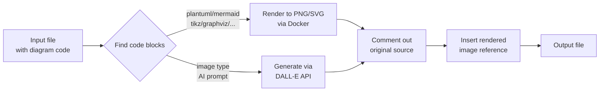

TL;DR: `render_images.py` converts diagram code blocks (PlantUML, Mermaid, TikZ,
Graphviz, SVG, LaTeX) inside Markdown and LaTeX files into rendered images,
commenting out the original source and inserting the resulting figures

<!-- more -->

## Introduction

- Documentation with diagrams is more effective than text alone, but keeping
  diagrams up-to-date is tedious
    - You write a PlantUML or Mermaid diagram, manually render it to PNG, and
      paste the image into your document
    - When the diagram changes, you repeat the entire process
    - Over time, the original source code gets lost and diagrams become
      unmaintainable

- The `render_images.py` tool solves this by treating diagram code as a
  first-class citizen in your documentation
    - You embed the diagram source directly in your Markdown or LaTeX file
    - The tool renders it into an image automatically
    - It comments out the original source code and inserts the rendered figure
    - The source stays in the file, version-controlled alongside your doc

### What Is `render_images`?

- `render_images.py` is a command-line tool located in
  [`dev_scripts_helpers/documentation/render_images.py`](https://github.com/causify-ai/helpers/blob/master/dev_scripts_helpers/documentation/render_images.py)
  that automates the rendering of embedded diagram code into image files

- Supported diagram formats include:
    - **PlantUML**: UML diagrams, sequence diagrams, activity diagrams
    - **Mermaid**: Flowcharts, sequence diagrams, Gantt charts, and more
    - **Graphviz**: Directed and undirected graphs, network diagrams
    - **TikZ**: Technical diagrams and scientific illustrations in LaTeX style
    - **LaTeX / raw_latex**: Rendered LaTeX expressions as images
    - **SVG**: Scalable vector graphics converted to PNG
    - **AI-generated images**: Images generated from text prompts via OpenAI's
      DALL-E API (the `image` type)

- The tool supports three output formats:
    - Markdown (`.md`)
    - LaTeX (`.tex`)
    - Plain text (`.txt`)

### When To Use `render_images`

- **Documentation with diagrams**: Any README, tutorial, or paper that includes
  diagrams that need to stay in sync with their source code

- **Collaborative documentation**: When multiple people maintain a document,
  having the diagram source embedded prevents the "where is the original file?"
  problem

- **LaTeX papers with figures**: Render TikZ and LaTeX diagrams directly from
  your `.tex` files without a separate compilation step

- **Automated documentation pipelines**: Run `render_images.py` as part of a CI
  or build step to regenerate all diagrams whenever source code changes

### When NOT To Use `render_images`

- **Static images with no source**: If you have a pre-rendered PNG or JPEG with
  no editable source, there is nothing for the tool to render

- **Diagrams that change frequently without versioning**: If your diagrams
  change on every render and you do not need to track the source, a dedicated
  diagram editor may be faster

- **Interactive diagrams** that need clickable links or animations: The tool
  produces static image files (PNG/SVG), not interactive web components

## How It Works

- The tool operates as a text processor with the following pipeline:



- The specific steps are:
    1. **Scan** the input file for fenced code blocks with recognized language
       identifiers (`plantuml`, `mermaid`, `tikz`, `graphviz`, `latex`,
       `raw_latex`, `svg`, `image`)
    2. **Extract** the diagram source code and determine its type
    3. **Render** the code into an image using a Docker container (PlantUML,
       Mermaid, TikZ, Graphviz, SVG) or an AI API (for `image` type)
    4. **Comment out** the original source block using format-appropriate
       comment syntax (`<!-- ... -->` for Markdown, `%` for LaTeX, `//` for
       text)
    5. **Insert** the rendered image reference using Markdown `` syntax or
       LaTeX `\includegraphics` syntax
    6. **Save** the result to the output file

- Image files are named systematically based on the source file name and block
  index, e.g., `figs/readme.1.png` for the first diagram block in `readme.md`
- This naming convention ensures stable image paths across re-renders

- Optional metadata (`label=`, `caption=`) after the code block is parsed and
  included in the inserted image reference

## Real-World Scenarios

### Scenario 1: Rendering a PlantUML Diagram in a README

- You have a README with a PlantUML sequence diagram:

    ````markdown
    ```plantuml
    Alice -> Bob: Authentication request
    Bob --> Alice: Access granted
    ```
    ````

- Run:

    ```bash
    > render_images.py -i README.md --action render
    ```

- The file is updated with the original code commented out and the rendered
  image inserted alongside it

### Scenario 2: LaTeX Paper with TikZ Figures

- You are writing a paper in LaTeX and have TikZ diagrams embedded:

    ```bash
    > render_images.py -i paper.tex --action render
    ```

- The tool wraps TikZ code in a `\documentclass{standalone}` template, renders
  it to PNG at 600 DPI, and inserts `\includegraphics` commands with proper
  figure environments

### Scenario 3: AI-Generated Images from Prompts

- You want to generate images from text descriptions for your documentation:

    ````markdown
    ```image
    A professional diagram showing a data pipeline architecture
    ```
    ````

- The tool generates images using the `generate_images.py` script (powered by
  DALL-E) and inserts the resulting images into your document

## Advanced Features

### Multi-File Processing

- The tool supports three ways to process multiple files at once:
    - **Comma-separated list**: `--files="doc1.md,doc2.md"`
    - **File of file paths**: `--from_files="list.txt"`
    - **Repeated argument**: `--input doc1.md --input doc2.md`

- Progress is shown via a `tqdm` progress bar

### Caching for Performance

- Image rendering uses `@simple_cache` from `helpers/hcache_simple.py` to cache
  rendered results and AI-generated images
- If a diagram's source code has not changed, the cached image is reused,
  avoiding redundant rendering

### Remove Rendered Images

- Use the `--remove_figs` flag to reverse the process:
    - Removes all rendered image blocks
    - Uncomments the original diagram source code
    - This allows editing the source and re-rendering cleanly

### Preview Mode

- Use `--action open` to render diagrams as SVG and open the result as HTML in
  your browser for quick previewing

## Comparison with Alternatives

| Feature          | `render_images.py`                                | Manual rendering | Dedicated tools (draw.io) |
| :--------------- | :------------------------------------------------ | :--------------- | :------------------------ |
| Source in doc    | Yes, embedded and versioned                       | No               | No                        |
| One command      | Yes                                               | No (multi-step)  | N/A                       |
| Multi-format     | PlantUML, Mermaid, TikZ, Graphviz, SVG, LaTeX, AI | Depends on tool  | One format                |
| Automated        | Yes (CI-ready)                                    | No               | No                        |
| Commented source | Yes                                               | No               | N/A                       |

## References

- Source code:
  [`dev_scripts_helpers/documentation/render_images.py`](https://github.com/causify-ai/helpers/blob/master/dev_scripts_helpers/documentation/render_images.py)
- Tests:
  [`dev_scripts_helpers/documentation/test/test_render_images.py`](https://github.com/causify-ai/helpers/blob/master/dev_scripts_helpers/documentation/test/test_render_images.py)
- Documentation:
  [`docs/tools/documentation_toolchain/all.render_images.explanation.md`](https://github.com/causify-ai/helpers/blob/master/docs/tools/documentation_toolchain/all.render_images.explanation.md)
- Related tools:
    - [Notes to PDF](https://github.com/causify-ai/helpers/blob/master/dev_scripts_helpers/documentation/notes_to_pdf.py):
      Converts Markdown notes to PDF/HTML/slides
    - [Generate Images](https://github.com/causify-ai/helpers/blob/master/dev_scripts_helpers/documentation/generate_images.py):
      AI-powered image generation from text prompts
    - [hcache_simple](https://github.com/causify-ai/helpers/blob/master/helpers/hcache_simple.py):
      Caching module used to cache rendered results
