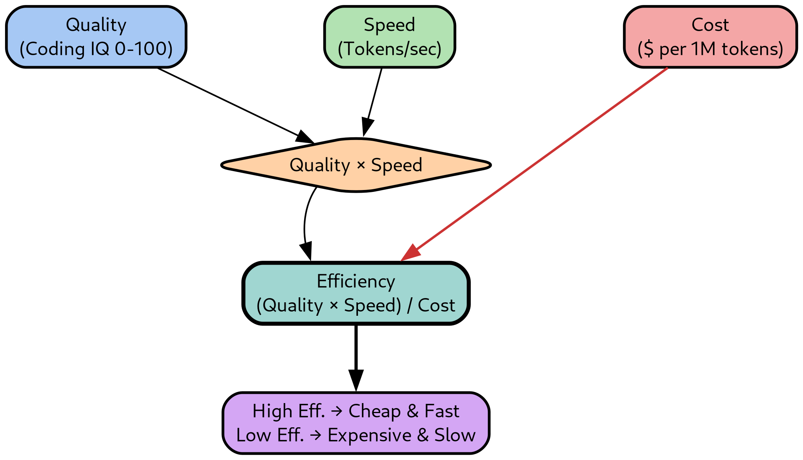

TL;DR Comparing LLMs across real benchmarks and use an _efficiency_ metric that
combines quality, cost, and speed to pick the right model for each task

<!-- more -->

# How to Compare LLM Models

## The Landscape of LLM Evaluation

- Choosing between 50+ available models is hard without a systematic framework
- Different models excel at different things:
    - Some are fast but are mediocre at reasoning
    - Some score highest on benchmarks but cost 100x more
    - Some are great for code but struggle with "creative" reasoning
- The goal is to pick the right model for your workflow at the minimum price

<!--  rendered_images:begin -->
<!--  ```mermaid -->
<!--  mindmap -->
<!--    root((LLM Model Selection)) -->
<!--      Quality -->
<!--        Benchmark Scores -->
<!--        Reasoning Ability -->
<!--        Code Generation -->
<!--        Task Fit -->
<!--      Cost -->
<!--        Input Tokens -->
<!--        Output Tokens -->
<!--        Provider Markup -->
<!--        Daily Budget -->
<!--      Speed -->
<!--        Latency -->
<!--        Tokens Per Second -->
<!--        Time To First Token -->
<!--        Throughput -->
<!--      Context -->
<!--        Window Size -->
<!--        Long Document Support -->
<!--        Memory / State -->
<!--  ``` -->
<!--  rendered_images:end -->
<!--  render_images:begin -->

<!--  render_images:end -->

<div style="text-align: center; font-style: italic;">
The four dimensions of LLM model selection: Quality, Cost, Speed, and Context
work together to determine the right model for any given task.
</div>

## Where to Find Reliable Benchmarks

- Multiple websites rank AI models, each with a different methodology:

| Site                              | Address                                            | Best For                                                                                                      |
| :-------------------------------- | :------------------------------------------------- | :------------------------------------------------------------------------------------------------------------ |
| Artificial Analysis               | https://artificialanalysis.ai                      | Comparing quality, cost, speed, latency, context window, and benchmarks. Best for production model selection. |
| Arena (formerly Chatbot Arena)    | https://arena.ai                                   | Human preference rankings from blind head-to-head evaluations. Measures real-world user preference.           |
| LiveBench                         | https://livebench.ai                               | Contamination-resistant benchmarking with frequently refreshed test sets and objective scoring.               |
| Hugging Face Open LLM Leaderboard | https://huggingface.co/spaces/open-llm-leaderboard | Comparing open-source and open-weight models with transparent evaluation.                                     |
| Vellum LLM Leaderboard            | https://www.vellum.ai/llm-leaderboard              | Quick comparison of frontier models across reasoning, coding, and general capabilities.                       |
| LiveCodeBench                     | https://livecodebench.github.io                    | Coding-focused benchmarking using fresh programming problems.                                                 |
| OpenRouter Rankings               | https://openrouter.ai/rankings                     | Real-world usage, popularity, and provider adoption metrics.                                                  |
| Stanford AI Index                 | https://hai.stanford.edu/ai-index                  | Industry trends, model ecosystem analysis, and AI market context.                                             |

- I find the most useful sites day-to-day are:
    - **OpenRouter Rankings**: Real-world usage data shows what others are actually
      using in production
    - **Artificial Analysis**: Combines benchmarks with pricing, speed, and latency
      in one place

## My Efficiency Metric

- Raw benchmark scores can be misleading because they ignore cost and speed
- A model that scores 90% but costs 50x more than an 85% model may not be the
  better choice for daily use
- I use an _efficiency_ metric that captures the trade-off:

    $$
    \text{Efficiency} = \frac{\text{Quality} \times \text{Speed}}{\text{Cost}}
    $$

<!--  rendered_images:begin -->
<!--  ```graphviz -->
<!--  digraph EfficiencyMetric { -->
<!--      splines=false; -->
<!--      nodesep=1.2; -->
<!--      ranksep=0.6; -->
<!--   -->
<!--      node [shape=box, style="rounded,filled", fontname="Helvetica", fontsize=12, penwidth=1.7]; -->
<!--   -->
<!--      // Input nodes -->
<!--      Quality [label="Quality\n(Coding IQ 0-100)", fillcolor="#A6C8F4"]; -->
<!--      Speed   [label="Speed\n(Tokens/sec)", fillcolor="#B2E2B2"]; -->
<!--      Cost    [label="Cost\n($ per 1M tokens)", fillcolor="#F4A6A6"]; -->
<!--   -->
<!--      // Operator nodes -->
<!--      Multiply [label="Quality × Speed", fillcolor="#FFD1A6", shape=diamond]; -->
<!--      Divide   [label="Efficiency\n(Quality × Speed) / Cost", fillcolor="#A0D6D1", shape=box, style="rounded,filled,bold", penwidth=2.5]; -->
<!--   -->
<!--      // Output -->
<!--      Decision [label="High Eff. → Cheap & Fast\nLow Eff. → Expensive & Slow", fillcolor="#D4A6F4", shape=box, style="rounded,filled"]; -->
<!--   -->
<!--      // Edges -->
<!--      Quality -> Multiply; -->
<!--      Speed -> Multiply; -->
<!--      Multiply -> Divide; -->
<!--      Cost -> Divide [color="#CC3333", penwidth=1.5]; -->
<!--      Divide -> Decision [penwidth=2.0]; -->
<!--   -->
<!--      // Force rank alignment -->
<!--      { rank=same; Quality; Speed; Cost; } -->
<!--      Multiply -> Divide [style=invis, weight=10]; -->
<!--  } -->
<!--  ``` -->
<!--  rendered_images:end -->
<!--  render_images:begin -->

<!--  render_images:end -->

<div style="text-align: center; font-style: italic;">
The efficiency metric combines Quality × Speed into a numerator representing
"useful work per second" and divides by Cost to find the value each model
delivers per dollar.
</div>

- The components are:
    - **Quality**: Artificial Analysis Coding Index (0-100), a benchmark composite
      for code generation tasks
    - **Speed**: Tokens per second (p50 throughput) from OpenRouter
    - **Cost**: Cost per 1M tokens (input + output) from OpenRouter

- Higher efficiency means more quality throughput per dollar
- The metric favors cheap, fast models while penalizing expensive slow ones

## Model Comparison by Category

- I organize models into three categories matching my daily use cases:
    - **Reasoning and planning**: Models for architecture, refactoring plans, and
      complex multi-step reasoning
    - **Agentic coding**: Models I use for code generation with AI coding
      assistants (`claude-code`, `pi-dev` are my favorite harnesses)
    - **Text processing**: Models for batch text tasks (summarization,
      classification, extraction)

- I wrote a little script to generate tables summarizing the characteristics of
  the models

    ```bash
    > openrouter_models_table.py --models_from_file models.txt
    ```

- The script lives at
  `helpers_root/dev_scripts_helpers/llms/openrouter_models_table.py` and
  supports more options:
    ```bash
    > openrouter_models_table.py --models_from_file models.txt -v DEBUG -a fetch_aa_benchmarks -a fetch_openrouter_throughput
    ```

<!--  rendered_images:begin -->
<!--  ```mermaid -->
<!--  quadrantChart -->
<!--      title Model Categories by Quality and Cost -->
<!--      x-axis "Low Cost" --> "High Cost" -->
<!--      y-axis "Low Quality" --> "High Quality" -->
<!--      quadrant-1 "Best Value (Sweet Spot)" -->
<!--      quadrant-2 "Premium Picks" -->
<!--      quadrant-3 "Budget Basics" -->
<!--      quadrant-4 "Avoid (Poor Value)" -->
<!--      deepseek-v4-flash: [0.15, 0.55] -->
<!--      deepseek-v4-pro: [0.25, 0.65] -->
<!--      mimo-v2-5-pro: [0.25, 0.60] -->
<!--      qwen3-7-max: [0.35, 0.68] -->
<!--      claude-sonnet-4-6: [0.50, 0.72] -->
<!--      claude-opus-4-7: [0.75, 0.80] -->
<!--      gemini-3-1-pro: [0.45, 0.78] -->
<!--      gpt-5-5: [0.85, 0.82] -->
<!--      gpt-oss-120b: [0.10, 0.38] -->
<!--  ``` -->
<!--  rendered_images:end -->
<!--  render_images:begin -->

<!--  render_images:end -->

<div style="text-align: center; font-style: italic;">
The quadrant chart clusters models into value groups. Models in the
upper-left quadrant deliver high quality at low cost — the efficiency
sweet spot for daily use. Premium models cluster in the upper-right,
while the lower-left holds budget-friendly options for simple tasks.
</div>

<!-- TODO(ai_gp): Add list of models -->

### Reasoning and Planning Models

```bash
> openrouter_models_table.py --models_from_file helpers_root/dev_scripts_helpers/llms/reasoning_models.txt
```

| AA_Slug                | In_Cost | Out_Cost | Context | Released   | Coding_IQ | General_IQ | Speed | Week_Toks | Month_Toks | Efficiency |
| :--------------------- | ------: | -------: | :------ | :--------- | --------: | ---------: | ----: | :-------- | :--------- | ---------: |
| claude-opus-4-7        |    5.00 |     25.0 | 1M      | 2026-04-16 |      52.5 |       57.3 |  90.0 | 1504.7B   | 7671.2B    |        158 |
| claude-sonnet-4-6      |    3.00 |     15.0 | 1M      | 2026-02-17 |      46.4 |       44.4 |  42.5 | 1849.1B   | 7614.3B    |        110 |
| deepseek-v4-pro        |   0.435 |    0.870 | 1M      | 2026-04-23 |      47.5 |       51.5 |  43.0 | 1861.1B   | 5387.6B    |       1565 |
| gemini-2-5-pro         |    1.25 |     10.0 | 1M      | 2025-06-17 |      32.0 |       34.6 |  84.0 | 0         | 9.8B       |        239 |
| gemini-3-1-pro-preview |    2.00 |     12.0 | 1M      | 2026-02-19 |      55.5 |       57.2 |  95.0 | 239.3B    | 1423.5B    |        377 |
| gemini-3-5-flash       |    1.50 |     9.00 | 1M      | 2026-05-19 |      45.0 |       55.3 | 170.0 | 492.7B    | 1371.3B    |        729 |
| kat-coder-pro-v2       |   0.300 |     1.20 | 256K    | 2026-03-27 |      45.6 |       43.8 |  16.0 | 0         | 0          |        486 |
| kimi-k2-6              |   0.680 |     3.41 | 262K    | 2026-04-20 |      47.1 |       53.9 |  43.0 | 342.0B    | 2818.1B    |        495 |
| gpt-5-2                |    1.75 |     14.0 | 400K    | 2025-12-10 |      48.7 |       51.3 |  41.0 | 67.6B     | 103.4B     |        127 |
| gpt-5-3-codex          |    1.75 |     14.0 | 400K    | 2026-02-24 |      53.1 |       53.6 |  41.0 | 81.4B     | 337.6B     |        138 |
| gpt-5-4                |    2.50 |     15.0 | 1M      | 2026-03-05 |      57.2 |       56.8 |  42.0 | 241.0B    | 1133.9B    |        137 |
| gpt-5-5                |    5.00 |     30.0 | 1M      | 2026-04-24 |      59.1 |       60.2 |  33.0 | 447.2B    | 1979.6B    |         56 |
| qwen3-7-max            |    1.25 |     3.75 | 1M      | 2026-05-21 |      50.1 |       56.6 |  45.0 | 178.3B    | 368.3B     |        451 |
| qwen3-7-plus           |   0.400 |     1.60 | 1M      | 2026-06-03 |      46.5 |       53.3 |  11.0 | 0         | 0          |        256 |
| mimo-v2-5-pro          |   0.435 |    0.870 | 1M      | 2026-04-22 |      45.5 |       53.8 |  29.0 | 519.0B    | 2467.9B    |       1011 |

### Agentic Coding Models

<!-- TODO(ai_gp): Re-run the benchmarks and rank the models by efficiency -->

```bash
> openrouter_models_table.py --models_from_file helpers_root/dev_scripts_helpers/llms/agentic_coding_models.txt
```

| AA_Slug                | In_Cost | Out_Cost | Context | Released   | Coding_IQ | General_IQ | Speed | Week_Toks | Month_Toks | Efficiency |
| :--------------------- | ------: | -------: | :------ | :--------- | --------: | ---------: | ----: | :-------- | :--------- | ---------: |
| claude-opus-4-7        |    5.00 |     25.0 | 1M      | 2026-04-16 |      52.5 |       57.3 |  90.0 | 1504.7B   | 7671.2B    |        158 |
| claude-sonnet-4-6      |    3.00 |     15.0 | 1M      | 2026-02-17 |      46.4 |       44.4 |  42.5 | 1849.1B   | 7614.3B    |        110 |
| deepseek-v4-flash      |   0.098 |    0.197 | 1M      | 2026-04-23 |      38.7 |       46.5 |  50.0 | 4066.7B   | 13216.4B   |       6562 |
| deepseek-v4-pro        |   0.435 |    0.870 | 1M      | 2026-04-23 |      47.5 |       51.5 |  43.0 | 1861.1B   | 5387.6B    |       1565 |
| gemini-2-5-pro         |    1.25 |     10.0 | 1M      | 2025-06-17 |      32.0 |       34.6 |  84.0 | 0         | 9.8B       |        239 |
| gemini-3-1-pro-preview |    2.00 |     12.0 | 1M      | 2026-02-19 |      55.5 |       57.2 |  95.0 | 239.3B    | 1423.5B    |        377 |
| kat-coder-pro-v2       |   0.300 |     1.20 | 256K    | 2026-03-27 |      45.6 |       43.8 |  16.0 | 0         | 0          |        486 |
| kimi-k2-6              |   0.680 |     3.41 | 262K    | 2026-04-20 |      47.1 |       53.9 |  43.0 | 342.0B    | 2818.1B    |        495 |
| qwen3-7-max            |    1.25 |     3.75 | 1M      | 2026-05-21 |      50.1 |       56.6 |  45.0 | 178.3B    | 368.3B     |        451 |
| mimo-v2-5-pro          |   0.435 |    0.870 | 1M      | 2026-04-22 |      45.5 |       53.8 |  29.0 | 519.0B    | 2467.9B    |       1011 |

### Text Processing Models

```bash
> openrouter_models_table.py --models_from_file helpers_root/dev_scripts_helpers/llms/text_models.txt
```

<!-- TODO(ai_gp): This table is messed up -->

| AA_Slug      | In_Cost | Out_Cost | Context | Released   | Coding_IQ | General_IQ | Speed | Week_Toks | Month_Toks | Efficiency |
| :----------- | ------: | -------: | :------ | :--------- | --------: | ---------: | ----: | :-------- | :--------- | ---------: |
| gpt-oss-120b |   0.039 |    0.180 | 131K    | 2025-08-05 |      28.6 |       33.3 |  10.0 | 424.1B    | 1746.0B    |       1306 |
| gpt-oss-20b  |   0.029 |    0.140 | 131K    | 2025-08-05 |      18.5 |       24.5 |  59.0 | 0         | 28.3B      |       6459 |

- Note: This category has fewer data points because smaller open-weight models
  are not always tracked by Artificial Analysis benchmarks (Coding_IQ and
  Speed may be missing)

## My Personal Workflow

- After comparing models across these categories, my daily setup has converged
  to the following

- **Reasoning and planning**: I use `Claude Opus 4.7-4.8` or `Sonnet 4.6` for
  architecture design, refactoring plans, and complex multi-step analysis
    - These are the most expensive models I use, but the quality is worth it for
      tasks where correctness and depth matter

- **Agentic coding**: I use `Deepseek-v4-flash` at max effort for most code
  generation
    - It is slightly slower and marginally worse than `Claude Haiku 4.5` in my gut
      benchmark, but it is almost 10x cheaper
    - The efficiency metric reflects this: it dominates the agentic coding table
      because its cost is so low and with a decent quality

- **Daily spend**: With this setup I spend around $10 per day on tokens

- **Quality principle**: My goal is to write code with AI that matches or
  exceeds what I write by hand
    - I review and edit every single line of generated code: the same way I have reviewed
      thousands of PRs from humans
    - I have measured a productivity increase of ~10x in terms of high-quality
      lines of code per day
        - Before AI: ~150 lines of new code per day
        - After AI: ~3000 lines of new code per day
    - The refactoring and gardening of code probably is at 100-1000x since I
      literally can leave it running and churn on boring operations (once I spent
      time writing a prompt and making sure it does 99% of the write things)

- **Key insight**:
    - The most expensive model is rarely the best choice for routine work
    - Efficiency metrics reveal that mid-range models (`Deepseek V4`, `Qwen`,
      `MIMO`) deliver 80-90% of the quality at 5-10% of the cost
    - Reserve premium models for tasks where the extra quality directly impacts the
      outcome
