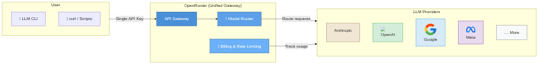
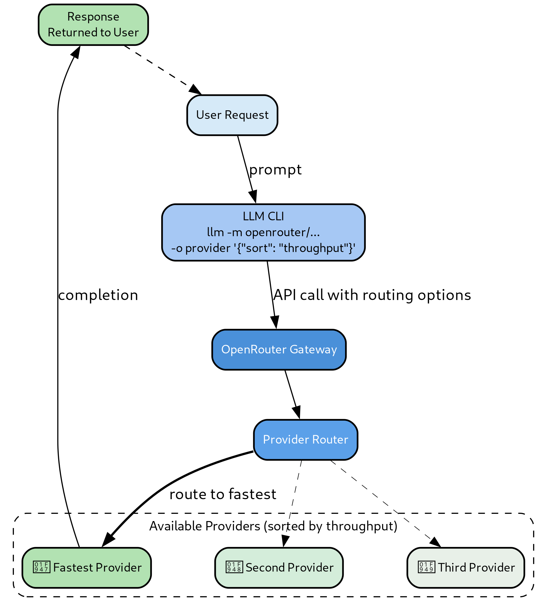

TLDR: A practical guide on using OpenRouter through Simon Willison's LLM CLI to
access dozens of LLM models from a single terminal, including free tier options.

<!-- more -->

e How to Use OpenRouter with LLM CLI

## What is OpenRouter

- **OpenRouter** is a unified API gateway that provides access to dozens of LLM
  models from different providers through a single endpoint
    - Instead of managing separate API keys for OpenAI, Anthropic, Google, and
      others, you use one key and one API format
    - OpenRouter handles routing, billing, and rate limiting across providers
    - Includes free tier models (e.g., Google Gemma 4) for testing and
      experimentation

<div style="text-align: center;">

<!--  rendered_images:begin -->
<!--  ```mermaid -->
<!--  graph LR -->
<!--      subgraph User["User"] -->
<!--          CLI[LLM CLI] -->
<!--          CURL[curl / Scripts] -->
<!--      end -->
<!--   -->
<!--      subgraph Gateway["OpenRouter (Unified Gateway)"] -->
<!--          OR[API Gateway] -->
<!--          KM[Model Router] -->
<!--          BP[Billing & Rate Limiting] -->
<!--      end -->
<!--   -->
<!--      subgraph Providers["LLM Providers"] -->
<!--          ANTH[ Anthropic] -->
<!--          OAI[ OpenAI] -->
<!--          GOOG[ Google] -->
<!--          META[ Meta] -->
<!--          MORE[⋯ More] -->
<!--      end -->
<!--   -->
<!--      User |Single API Key| OR -->
<!--      OR KM -->
<!--      KM |Route requests| Providers -->
<!--      BP |Track usage| Providers -->
<!--   -->
<!--      style OR fill:#4A90D9,stroke:#2C5F8A,color:#fff -->
<!--      style KM fill:#5BA0E9,stroke:#2C5F8A,color:#fff -->
<!--      style BP fill:#6BB0F9,stroke:#2C5F8A,color:#fff -->
<!--      style ANTH fill:#F0E6D3,stroke:#8B7355 -->
<!--      style OAI fill:#D4EDDA,stroke:#28A745 -->
<!--      style GOOG fill:#D6EAF8,stroke:#3498DB -->
<!--      style META fill:#E8DAEF,stroke:#7D3C98 -->
<!--      style MORE fill:#F8F9FA,stroke:#6C757D -->
<!--  ``` -->
<!--  rendered_images:end -->
<!--  render_images:begin -->

<!--  render_images:end -->

*Figure 1: OpenRouter acts as a unified API gateway: you manage one API key and one
integration point, and OpenRouter handles routing, billing, and rate limiting across
all supported LLM providers.*

</div>

## What is LLM CLI

- **LLM CLI** (by Simon Willison) is a command-line tool for interacting with
  LLMs:
    - Supports plugins for different backends (OpenAI, Anthropic, OpenRouter,
      etc.)
    - Provides a consistent interface regardless of the underlying model
    - Version 0.30 at the time of writing
    - Project page:
      [https://github.com/simonw/llm](https://github.com/simonw/llm)

## Installation

- Install the `llm-openrouter` plugin using the LLM CLI plugin system:

    ```bash
    > llm install llm-openrouter
    ```

- Verify the installation:

    ```bash
    > pip show llm-openrouter
    Name: llm-openrouter
    Version: 0.5
    Summary: LLM plugin for models hosted by OpenRouter
    Home-page: https://github.com/simonw/llm-openrouter
    ```

- The plugin depends on `httpx`, `llm`, and `openai` Python packages

## API Key Configuration

- Set your OpenRouter API key as an environment variable:

    ```bash
    > export OPENROUTER_KEY=$OPENROUTER_API_KEY
    ```

    - The plugin reads the `OPENROUTER_KEY` environment variable
    - You can obtain an API key from
      [openrouter.ai/keys](https://openrouter.ai/keys)
    - Some workflows also use `OPENROUTER_API_KEY` directly (e.g., for curl
      requests)

## Listing Available Models

- List all models available through OpenRouter:

    ```bash
    > llm openrouter models
    ```

- Each model entry includes useful metadata. For example:

    ```verbatim
    - id: anthropic/claude-opus-4.7
      name: Anthropic: Claude Opus 4.7
      context_length: 1,000,000
      architecture:
        modality: text+image->text
      supports_schema: True
    ```

- After installation, models appear in the main `llm models` list with an
  `OpenRouter:` prefix:

    ```bash
    > llm models | grep openrouter | head
    ```

    ```verbatim
    OpenRouter: openrouter/anthropic/claude-opus-4.7
    OpenRouter: openrouter/google/gemma-4-26b-a4b-it:free
    OpenRouter: openrouter/google/gemma-4-31b-it:free
    OpenRouter: openrouter/qwen/qwen3.6-plus
    ```

- Free models are marked with a `:free` suffix, making them easy to identify for
  cost-effective experimentation

## Making Requests

### Basic Usage

- Send a prompt to any model using the standard `llm -m` syntax:

    ```bash
    > llm -m openrouter/google/gemma-4-26b-a4b-it:free "Hello!"
    ```

    ```verbatim
    Hello! How can I help you today?
    ```

### Provider and Routing Options

- OpenRouter supports provider-level options, such as sorting by throughput for
  faster responses:

    ```bash
    > llm -m openrouter/anthropic/claude-opus-4.7 \
        -o provider '{"sort": "throughput"}' \
        "Explain recursion in 1000 words" | tee output.txt
    ```

    - The `-o provider` flag passes a JSON object that configures provider
      routing
    - `{"sort": "throughput"}` selects the fastest provider for the requested
      model
    - `tee output.txt` saves the response to a file while displaying it in the
      terminal

<div style="text-align: center;">

<!--  rendered_images:begin -->
<!--  ```graphviz -->
<!--  digraph Routing { -->
<!--      splines=true; -->
<!--      nodesep=0.8; -->
<!--      ranksep=0.6; -->
<!--   -->
<!--      node [shape=box, style="rounded,filled", fontname="Helvetica", fontsize=11, penwidth=1.5]; -->
<!--   -->
<!--      // Nodes -->
<!--      User    [label="User Request", fillcolor="#D6EAF8"]; -->
<!--      CLI     [label="LLM CLI\nllm -m openrouter/...\n-o provider '{\"sort\": \"throughput\"}'", fillcolor="#A6C8F4"]; -->
<!--      OR      [label="OpenRouter Gateway", fillcolor="#4A90D9", fontcolor="white"]; -->
<!--      Router  [label="Provider Router", fillcolor="#5BA0E9", fontcolor="white"]; -->
<!--   -->
<!--      subgraph cluster_providers { -->
<!--          label="Available Providers (sorted by throughput)"; -->
<!--          style="rounded,dashed"; -->
<!--          fillcolor="#F8F9FA"; -->
<!--          fontsize=12; -->
<!--   -->
<!--          Fastest [label="Fastest Provider", fillcolor="#B2E2B2"]; -->
<!--          Second  [label="Second Provider", fillcolor="#D4EDDA"]; -->
<!--          Third   [label="Third Provider", fillcolor="#E8F0E8"]; -->
<!--      } -->
<!--   -->
<!--      Response [label="Response\nReturned to User", fillcolor="#B2E2B2"]; -->
<!--   -->
<!--      // Edges -->
<!--      User -> CLI [label="prompt"]; -->
<!--      CLI -> OR [label="API call with routing options"]; -->
<!--      OR -> Router; -->
<!--      Router -> Fastest [label="route to fastest", style=bold, penwidth=2]; -->
<!--      Router -> Second [style=dashed, penwidth=0.5]; -->
<!--      Router -> Third [style=dashed, penwidth=0.5]; -->
<!--      Fastest -> Response [label="completion"]; -->
<!--      Response -> User [style=dashed]; -->
<!--  } -->
<!--  ``` -->
<!--  rendered_images:end -->
<!--  render_images:begin -->

<!--  render_images:end -->

*Figure 2: When you pass `-o provider '{"sort": "throughput"}'`, OpenRouter ranks
available providers hosting the requested model by response speed and routes to the
fastest one, improving latency.*

</div>

## Using the API Directly with curl

- For programmatic access or scripting, you can call the OpenRouter API
  directly:

    ```bash
    > curl -s https://openrouter.ai/api/v1/chat/completions \
      -H "Authorization: Bearer $OPENROUTER_API_KEY" \
      -H "Content-Type: application/json" \
      -d '{
        "model": "openrouter/nitro",
        "messages": [{"role": "user", "content": "Hello!"}]
      }'
    ```

    - The endpoint is `https://openrouter.ai/api/v1/chat/completions`
      (OpenAI-compatible)
    - Use `Authorization: Bearer $OPENROUTER_API_KEY` for authentication
    - The request body follows the same format as the OpenAI chat completions
      API

## Monitoring Usage

- Check your OpenRouter API usage and remaining credits:

    ```bash
    > curl -s https://openrouter.ai/api/v1/auth/key \
      -H "Authorization: Bearer $OPENROUTER_API_KEY" \
      | jq '.data.usage'
    ```

    - Returns JSON with usage statistics including credits used and remaining
      balance
    - Useful for tracking costs across different models and providers

## Key Benefits

- **Single API key**: Access dozens of models from different providers with one
  credential
- **Consistent interface**: LLM CLI provides the same commands regardless of
  backend model
- **Free tier available**: Test models like Google Gemma 4 at no cost before
  committing
- **Provider routing**: Route requests to the fastest available provider
- **OpenAI-compatible API**: Direct API calls follow the familiar chat
  completions format

## Conclusion

- Combining OpenRouter with LLM CLI gives you a powerful, flexible way to
  experiment with and use LLMs from the terminal
    - Install once, configure your API key, and you have access to dozens of
      models
    - Switch between models with a single flag change
    - Use the direct API for scripting and automation

- For more information:
    - LLM CLI: [https://github.com/simonw/llm](https://github.com/simonw/llm)
    - OpenRouter: [https://openrouter.ai](https://openrouter.ai)
    - LLM OpenRouter plugin:
      [https://github.com/simonw/llm-openrouter](https://github.com/simonw/llm-openrouter)
